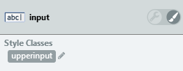

# How to change the case of input text

How can I change the letter case of input text as the end user types?

For example: I want to modify the text in an input to uppercase at runtime.

## Answer

To change the text of an Input Widget to uppercase at runtime follow these steps:

1. Add the following CSS snippet to the Style Sheet of the Screen/Block containing the Input Widget:

        .upperinput {
            text-transform: uppercase;
        }
        .upperinput:placeholder-shown {
            text-transform: none;
        }

    The first line in the snippet changes the text the end user sees to uppercase.  
    The second line ensures that the letter case of the placeholder text (defined as `Prompt` Property) is not modified. The `:placeholder-shown` pseudo-class is not supported in all browsers.

1. Add `"upperinput"` to the `Style Classes` of the Input Widget.

    

    After these two steps the end user sees the text inserted in the Input Widget as uppercase, but the text stored in the Variable associated with the Input Widget still has the original letter case (as the user typed it).

1. Add an **Assign** node to any Action that uses the inputted text and set the assignment `<variable>` = `ToUpper(<variable>)`, where `<variable>` is the source Variable of the Input Widget.

    

    This final step uses the built-in Function `ToUpper` to convert the letter case of the Text `<variable>` to uppercase whenever you use it in logic.