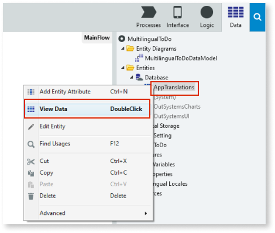
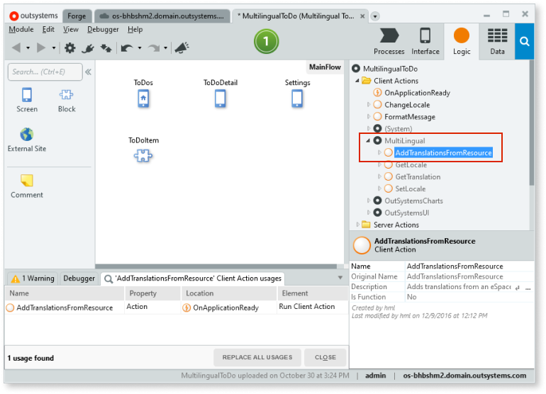
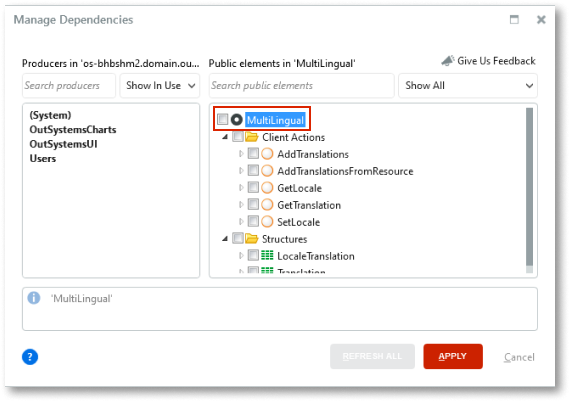

# How to reuse translations from Multilingual Forge component in Service Studio

You can use the [built-in translation tools](https://success.outsystems.com/Documentation/11/Developing_an_Application/Design_UI/Multilingual_Reactive_Web_and_Mobile_Apps) for adding and managing translations in Reactive Web Aps and Mobile Apps. You don't need to install the deprecated Multilingual Forge component. This document explains how to migrate translations from the Multilingual Forge component to the new multilingual feature in Service Studio.

Do the following to migrate your translations:

1. Ensure you're using Platform Server 11.12.0 or later and up-to-date Service Studio.
1. [Migrate the translations to the Translations Editor](#translations-editor)
1. [Delete the unnecessary logic](#delete-unnecessary-logic)
1. [Remove the dependency on the Multilingual module](#remove-dependencies)

## Migrating the translations to the Translations Editor { #translations-editor }

You have two ways to migrate the existing translations, depending on how you keep them: on a local resource or a list.

* If you are using a local resource see [Using a local resource file](#localresource).
* If you are using a list go to [Using a list](#migrateusinglist) (for example, an Entity).

### Translations on a local resource file { #localresource }

If you are using a local resource, follow the steps below. You only need to migrate locales and the translations. You don't need the translation IDs and the `isRightToLeft` locale property.

1. Open the resource file created when you used the Multilingual Forge component, for example:

        [{
            "locale": "pl",
            "isRightToLeft": false,
            "translations": {
                "08e142ce-dc09-4cbc-ad": "Nie masz zadań do wykonania. Możesz iść na kawę.",
                "0c0875e4-dba7-4a9e-a9": "Dodaj nowe zadanie", ...
            } 
        }, ... ]

1. Add locales to your app according. For instructions, see [Adding a new language and translating the text](https://success.outsystems.com/Documentation/11/Developing_an_Application/Design_UI/Multilingual_Reactive_Web_and_Mobile_Apps/Translate_your_app#Adding_a_new_language_and_translating_the_text).

1. Copy the translations from your resource file (for example, an Excel sheet) to the correspondent language on the **translations editor** that opened when you created the locales in the previous step.

1. Delete the old **data-trans** IDs of the translations, as you don't need them anymore. The figure below shows an example of one of these IDs.

    

### Migrating translations using a list { #migrateusinglist }

If you are using a list, check the translations on your list and manually copy the translations to the new Multilingual.

You have two ways to view the translated data on an entity:

* On Service Studio, by right-clicking the **AppTranslations** entity and selecting **View Data**.

    

* On an exported Excel file containing the translations. To export the translations to Excel follow the [How to export entity data to Excel](../../data/export-entity-data-excel/faq.md) document.

## Deleting the unnecessary logic { #delete-unnecessary-logic }

When using the Multilingual Forge component, you used the plugin to translate your apps, and added extra logic for loading the translations and to translate the elements. With the Multilingual for Reactive and Mobile apps, the OutSystems platform handles this for you.

To clean up your app's logic, delete all usages of the following Client Actions from your app:

* **GetLocale**
* **SetLocale**
* **GetTranslation**
* **AddTranslations**
* **AddTranslationsFromResource**

Before deleting the **GetLocale** and **SetLocale** Client Actions, ensure you placed the new **GetCurrentLocale** and **SetCurrentLocale** Client Actions, respectively, in your logic. 

You can also delete the **data-trans** attribute from the text widgets, as you don't need it anymore.

### Finding where the used actions are

To find where the used actions are, do the following steps:	

1. Go to the **Logic** tab and expand the **Client Actions** folder.

1. Click on the **MultiLingual** reference, and expand it.

1. Select a client action and click the F12 key on your keyboard. A search area appears with the usages of that client action on your application.

    

### Switching locales using the new Multilingual

For switching locales in your logic using the new Multilingual, use the new **SetCurrentLocale** client action available in your system module. For instructions, see [Creating a language switcher](https://success.outsystems.com/Documentation/11/Developing_an_Application/Design_UI/Multilingual_Reactive_Web_and_Mobile_Apps/Translate_your_app#Creating_a_language_switcher).

## Removing the dependency on the Multilingual module { #remove-dependencies }

The final procedure is to remove the Multilingual plugin reference from your app.

1. Click on the **Manage Dependencies** icon. The dependencies window opens.

1. Uncheck the Multilingual dependency.

    

1. Click **APPLY** to remove the Multilingual dependency.

