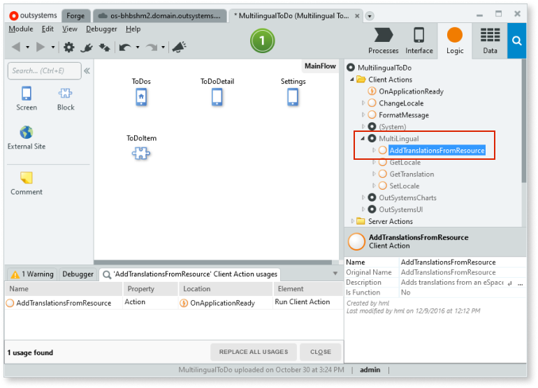

# How to reuse translations from Multilingual Forge component to Service Studio translation management

Starting with the Platform Server release 11.10, OutSystems has an integrated translations mechanism for adding and managing translations easily in Reactive Web and Mobile apps directly in Service Studio. You don't need to install the Multilingual Forge component as in previous versions.

<div class="info" markdown="1">

OutSystems discontinues the [Multilingual Forge component](https://www.outsystems.com/forge/component-overview/1784/multilingual-component) on July 5th, 2021.

</div>

OutSystems designed Multilingual to allow you to manage your translations fast and to have the possibility to work offline too.

This document explains how to migrate translations from the Multilingual Forge component to the new Multilingual on Service Studio.

Before proceeding, ensure you fill all the prerequisites. Refer to the Multilingual Reactive Web and Mobile Apps documentation.

Find below the instructions to migrate your translations successfully.

## Activating the Multilingual Technical Preview

The first step to proceed with the migration is to activate the Multilingual Technical Preview in your environment in LifeTime. Read the [Technical Preview features](https://success.outsystems.com/Support/Enterprise_Customers/Upgrading/Technical_Preview_features) for more information.


## Migrating translations to the Translations Editor.

You have two ways to keep your existing translations:

* [Using a local resource file](#localresource)
* [Using a list](#migrateusinglist) (for example, an Entity)


### Translations on a local resource file { #localresource }

If you are using a local resource, follow the steps below. You only need to migrate locales and the translations. You don't need the translation IDs and the `isRightToLeft` locale property.

1. Open the resource file, for example:

```
[{
    "locale": "pl",
    "isRightToLeft": false,
    "translations": {
        "08e142ce-dc09-4cbc-ad": "Nie masz zadań do wykonania. Możesz iść na kawę.",
        "0c0875e4-dba7-4a9e-a9": "Dodaj nowe zadanie", ...
    } 
}, … ]

```

1. Add locales to your app according to the Add a new language and translate the text section of the Multilingual Reactive Web and Mobile Apps documentation.

1. Copy the translations from your resource file to the correspondent language on the **translations editor** that opened when you created the locales in the previous step.

1. Delete the old IDs of the translations, as you don't need them anymore.

### Migrationg translations using a list { #migrateusinglist }

If you are using a list, check the translations on your list and manually copy the translations to the new Multilingual.

How to see the information on an Entity
:

You have two ways to view the translation data on an entity:

* on Service Studio, by right-clicking the **AppTranslations** entity and selecting **View Data**.

    

* on an exported Excel file containing the translations. To export the translations to Excel follow the [How to export entity data to Excel](../../data/export-entity-data-excel/faq.md) document.

## Deleting the unnecessary logic

When using the Multilingual Forge component, you used the plugin to translate your apps, and added extra logic for loading the translations and to translate the elements. With the Multilingual for Reactive and Mobile apps, the OutSystems platform handles this for you.

To clean up your app's logic, delete all usages of the following Client Actions from your app:

* **GetLocale**
* **SetLocale**
* **GetTranslation**
* **AddTranslations**
* **AddTranslationsFromResource**

You can also delete the **data-trans** attribute from the text widgets, as you don't need it anymore.

### Finding where the used actions are

To find where the use actions are, do the following steps:	

1. Go to the **Logic** tab and expand the **Client Actions** folder.

1. Click on the **MultiLingual** reference, and expand it.

1. Select a client action and click on the F12 key on your keyboard. A search area appears with the usages of that client action on your application.

    

### Switching locales in the new Multilingual

For switching locales in the new Multilingual, use the new **SetCurrentLocale** client action available in your system module. See the create a language switcher section of the [Multilingual Reactive Web and Mobile Apps](https://success.outsystems.com/Documentation/11/Developing_an_Application/Design_UI/Technical_Preview_-_Multilingual_Reactive_Web_and_Mobile_Apps) documentation for more information.

## Removing the dependency on the Multilingual module

The final procedure is to remove the Multilingual plugin reference from your app.

1. Click on the **Manage Dependencies** icon. The dependencies window opens.

1. Uncheck the Multilingual dependency to remove it.

    


