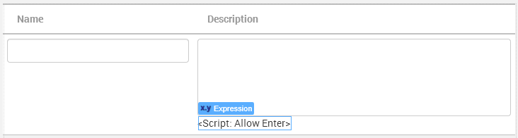

# How to have multiline inputs in Editable Table

## Question

How can I accept new lines in Editable Table with a textarea (input with >= 2 lines)?

When I press the `Enter` key, the row is automatically saved.

## Answer

Editable Table does not support inputs with new lines. However, you can use JavaScript code to work around the limitation.

1. Make sure the Text Area input has the **Name** property set (for example, `myTextArea`).

2. Right after this input, add an Expression with the **Escape Content** property set to `No`.

3. Change the Expression's **Example** property to something more meaningful, such as "`<Script: Allow Enter>`".

4. In the Expression value, enter the following JavaScript code, replacing `myTextArea` with the name of your input:

```
"<script language='javascript'>  
$('#" + myTextArea.Id + "').keyup(function (e) { 
    if (e.keyCode == 13) {
        var ta = this;  
        var caretPos = ta.selectionStart;   
        var textAreaTxt = $('#'+this.id).val();   
        var txtToAdd = '\n';  
        ta.selectionStart = caretPos + txtToAdd.length;   
        $('#'+this.id).val(textAreaTxt.substring(0, caretPos) + txtToAdd + textAreaTxt.substring(caretPos));
        ta.selectionStart = caretPos + txtToAdd.length;   
        ta.selectionEnd = caretPos + txtToAdd.length;   
        e.stopPropagation();  
    }
})
</script>"  
```

The script monitors the keys that the user presses in the input. If the script detects that the user pressed the `Enter` key, it inserts a new line and stops the propagation of the event. Therefore, the Editable Table won't see the key press.

In the end, you should have something similar to the example below:


