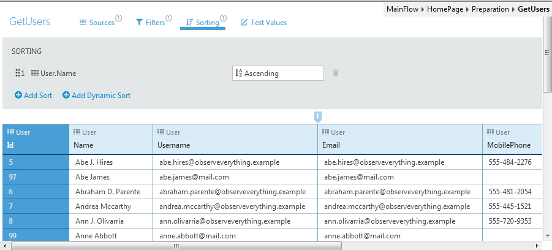
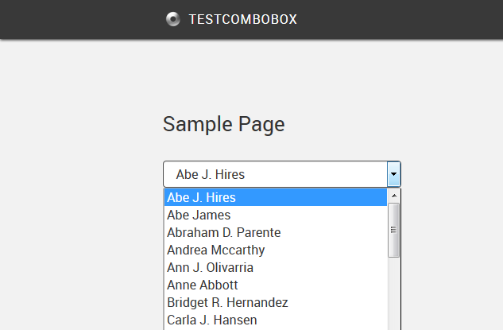
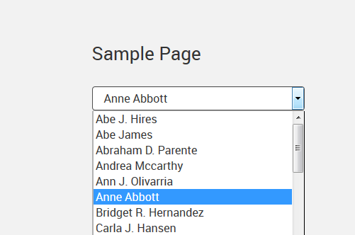

# How to order and set the default value in a combo box

## Question

How to order the list in a combo box?

How to set the default value in a combo box?

## Answer

The combo box list reflects the order of the **Source Record List**.

The default value of the combo box reflects the initial value of the destination **Variable**. If the destination variable is null, the combo box selects the first record in the list.

On the example below, the Preparation code used the aggregate 'GetUsers' to retrieve and sort records by 'Name'. Note that the user 'Anne Abbott' has the Id 99.

In general, a combo box does the following:

* Shows the records in the **Source Record List**. In the example below, the sorted records retrieved by 'GetUsers'.

* For each record, displays the **Source Attribute** of the record. In the example below, the `'User.Name'` of each record.

* When the user selects a line in the combo box, assigns the **Source Identifier Attribute** to the destination variable. In the example below, it should assign the `'User.Id'` to the local variable 'UserId'.

The example below shows the combo box displaying the sorted names.

On the example below, the Preparation code initializes the local variable 'UserId' with the desired default value.

1. Find the Id of the desired user. In the example, use the Id 99 for the user 'Anne Abbott'.

2. Assign the value to the destination Variable. Since the Source List Record is an aggregate, use the function **IntegerToIdentifier** to convert the identifier into an Entity Identifier. In the example, 'IntegerToIdentifier(99)'. In OutSystems versions previous to Bali 9, it would be 'IntegerToEntityRefInteger(99)'.

Your combo box should now display your default value, as shown below.

