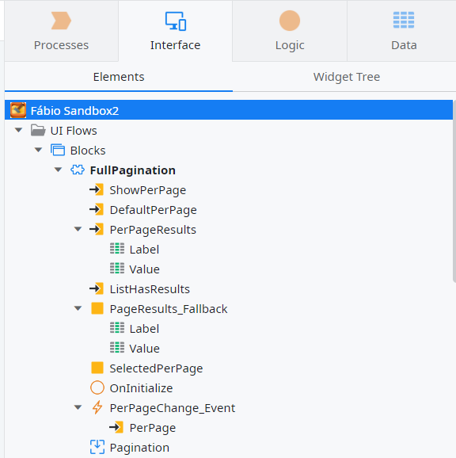
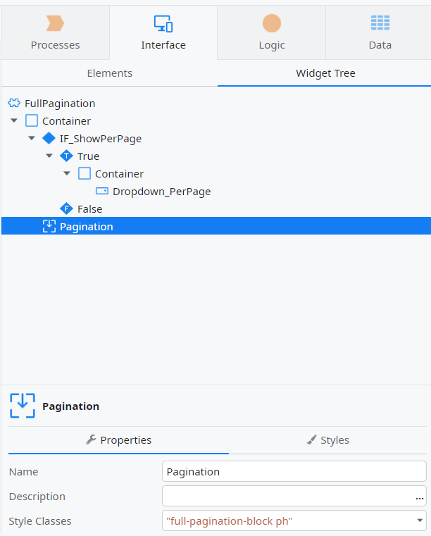
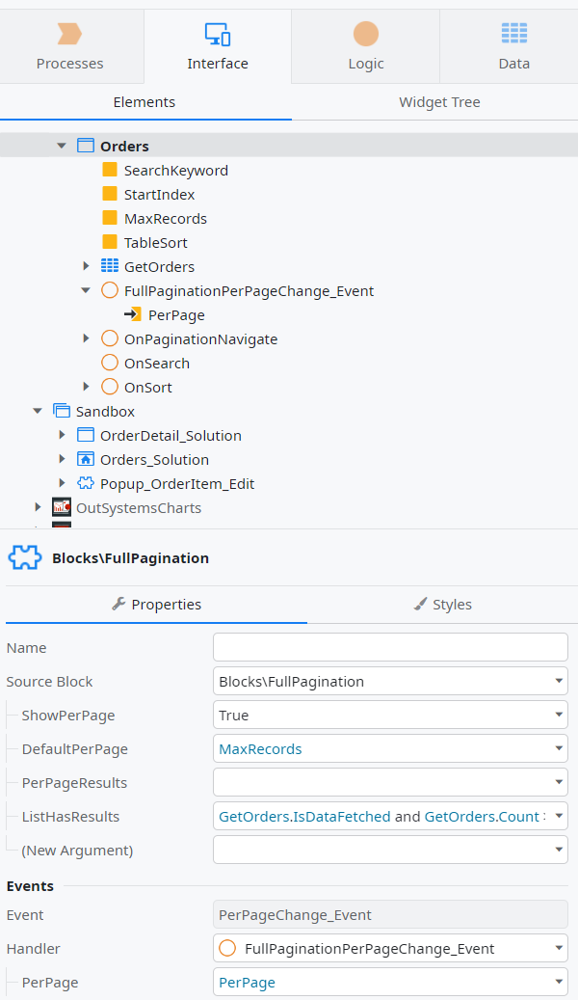
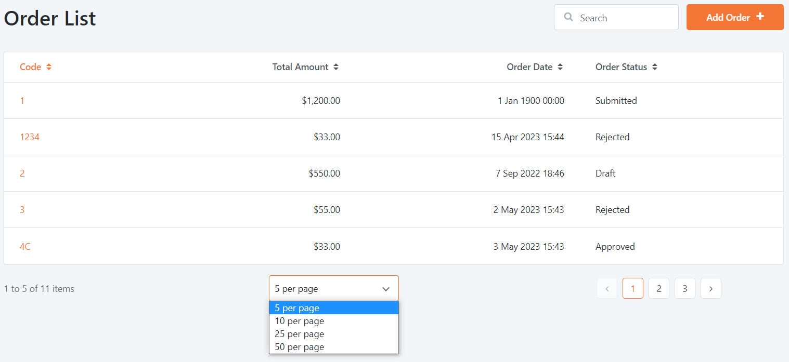

# How to customize number of records per page

We will show how to add a dropdown that will enable users to change at runtime the number of records per page.
The pattern created here should be combined with the [Pagination pattern](https://success.outsystems.com/documentation/11/developing_an_application/design_ui/patterns/using_mobile_and_reactive_patterns/navigation/pagination/) from OutSystems UI.

To create this pattern, follow these steps:

1. Inside an app, create a **Reactive Module** to store patterns in order to leverage reusability.
1. Create an **UI Flow** called `CustomPatterns`.
1. Add the `FullPagination` block and set the **Public** property to Yes so it is accessible from other modules.
1. Add the following input parameters as not mandatory:
    * A boolean called `ShowPerPage` to toggle this feature by showing or hiding a dropdown with options (default value set to `True`)
    * An integer called `DefaultPerPage` to store a default value (set default value to 10)
    * A `{label, value}` record list called `PerPageResults` to store the number of pages to show on the dropdown, such as:
        * A string called Label (example for using it later: "10 per page")
        * An integer called Value (example for using it later: 10)
    * A boolean called `ListHasResults` to prevent showing the dropdown if there are no results in the pagination (set default value to `True`)
1. Add the following local variables:
    * A `{label, value}` record list called `PageResults_Fallback` to be used as fallback if no `PerPageResults` list is given
    * An integer called `SelectedPerPage` to store user's selection
1. Add an event called `PerPageChange_Event` to be triggered when the dropdown has its value changed
    * Add an integer called `PerPage` as an input parameter of this event to store the value
    * There is no need to set the event as mandatory if you expect it to be turn off in some situations

Now you need to add some logic in the block.

1. Add an On Initialize event to this block and follow these steps.
1. Inside the event handler, drag an If to check if the `PerPageResults` input list is Empty and assign on the False branch the following:
    * Set `PageResults_Fallback` variable with the `PerPageResults` input parameter
    * Set `SelectedPerPage` variable with the `DefaultPerPage` input parameter
1. On the True branch, drag some list appends to initialize the `PageResults_Fallback` variable with the default options you want to provide if no list is provided, and make sure you have at least the "10 per page" / 10 record as we are using 10 as the default value. Example:
    * Label: "5 per page" and value: 5
    * Label: "10 per page" and value: 10
    * Label: "15 per page" and value: 15, and so on
1. After the list appends, set `SelectedPerPage` variable with the DefaultPerPage input parameter

Your screen should now look like this:



Finally, we need to place the elements on the block's widget tree, so follow these steps:

1. Start by inserting a container with the style class `"full-pagination"`
1. Add an If widget with the condition `ShowPerPage and ListHasResults`
1. In the True branch add a container with the style class `"full-pagination-per-page"`
1. Drag a Dropdown widget inside that container and do the following:
    * Set the variable as `SelectedPerPage`
    * Set the List as `PageResults_Fallback`
    * Set Option Text as Label
    * Set Options Value as Value
1. Use the `PerPageChange_Event` as the On Change event, with `SelectedPerPage` variable as the Per Page's input parameter.
1. Leave the False branch empty and outside the If widget add a Placeholder widget.
1. Give it the name Pagination with the style classes `"full-pagination-block ph"`

Your screen should look like this:



Be sure to include the following CSS in the Theme's module or this block's style sheet

```css
/* Pagination with "Per Pages" Dropdown */
.full-pagination {
  align-items: center;
  display: flex;
  position: relative;
  width: 100%; }
  .full-pagination .full-pagination-per-page {
    flex: 1;
    order: 2; }
    .full-pagination .full-pagination-per-page .dropdown-container {
      max-width: 200px;
      min-width: 125px; }
      .full-pagination .full-pagination-per-page .dropdown-container .dropdown-display,
      .full-pagination .full-pagination-per-page .dropdown-container .dropdown {
        padding: var(--space-s); }
  .full-pagination .full-pagination-block,
  .full-pagination .full-pagination-block > .OSBlockWidget,
  .full-pagination .full-pagination-block .pagination {
    display: contents; }
    .full-pagination .full-pagination-block .list.list-group,
    .full-pagination .full-pagination-block > .OSBlockWidget .list.list-group,
    .full-pagination .full-pagination-block .pagination .list.list-group {
      display: flex; }
  .full-pagination .full-pagination-block .pagination-counter {
    flex: 1;
    margin-right: var(--space-m);
    order: 1; }
  .full-pagination .full-pagination-block .pagination-container {
    flex: 1;
    margin-left: var(--space-m);
    order: 3; }
    .desktop .full-pagination .full-pagination-block .pagination-container {
      min-width: 280px; }
  .tablet .full-pagination,
  .phone .full-pagination {
    flex-direction: column; }
    .tablet .full-pagination .pagination-counter,
    .phone .full-pagination .pagination-counter {
      margin-bottom: var(--space-m);
      margin-right: var(--space-none); }
    .tablet .full-pagination .pagination-container,
    .phone .full-pagination .pagination-container {
      margin-left: var(--space-none);
      margin-top: var(--space-m); }
```

You can now publish your module.
To use the custom pattern you just created on app, follow these steps:

1. Since the block is public, start by selecting it from the Manage Dependencies.
1. Drag it to screen where a Pagination pattern already exists.
1. Move the system's Pagination widget into the "Pagination" placeholder
1. Set up the FullPagination block's input parameters with the following:
    * `ShowPerPage` as True.
    * `DefaultPerPage` as `MaxRecords` (the existing variable used in the Pagination pattern).
    * Leave `PerPageResults` empty to use the fallback values from the block - note: make sure you have the `MaxRecords` value (example 10) on your fallback list.
    * `ListHasResults` as the result of your data is fetched and if list has elements (example `GetOrders.IsDataFetched and GetOrders.Count > 0`).
1. Create an action called FullPaginationPerPageChange_Event to be the event handler of PerPageChange_Event and use its input parameter PerPage, with the following:
    * Set the existing MaxRecords variable with the PerPage input parameter.
    * Reset `StartIndex` to 0.
    * Refresh your data (example GetData aggregate).

Your screen should be like this:



When used, your pattern should behave like this:


