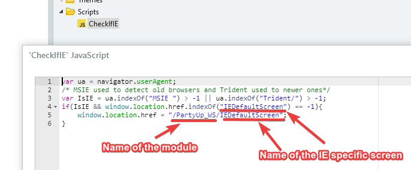
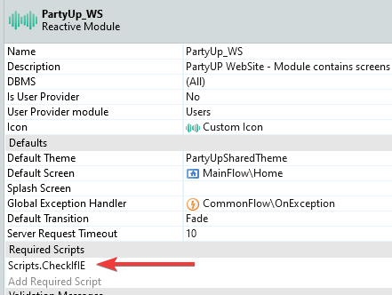
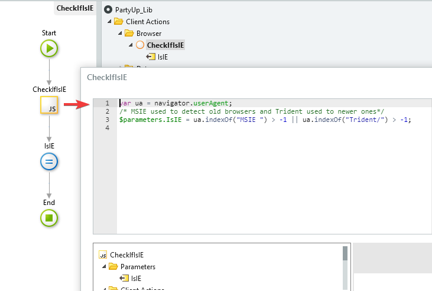
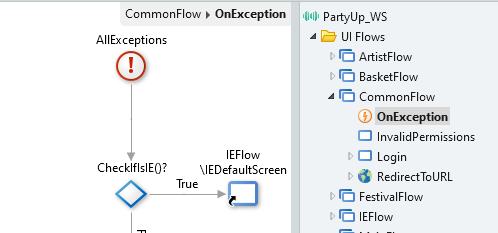

# How to Redirect a User to a Specific Page using IE in Reactive

How Do I redirect a user to a specific page if they are using Internet Explorer in a Reactive Web App?

## Issue

The issue encountered was using Internet Explorer for a Reactive application when trying to redirect the user to an Internet Explorer-specific screen. When loading the page that the user wanted to see, on some unknown occasions an error occurred (Not always the same because this was related to the load of the page).

To avoid occurring errors and not to have much-repeated code, the following solution was created.

## Resolution

1. In the end-user modules, create a script to check if the browser was an Internet explorer or not

1. Add the previously created script to the Required Scripts of the module

1. Create an action that also checks if the browser is an Internet Explorer (the code will be equal to the created previously) and make it a function

1. If not already created, create a global exception handler, OnException in the Common Flow

1. Add the AllExceptions handler, and use the action created before to check if the browser is an Internet Explorer browser. If yes, redirect the user to a specific screen

## Code Used

Inside the JS script

    var ua = navigator.userAgent;

    /* MSIE used to detect old browsers and Trident used to newer ones*/

     var IsIE = ua.indexOf("MSIE ") > -1 || ua.indexOf("Trident/") > -1;

     if(IsIE && window.location.href.indexOf("IEDefaultScreen") == -1){

         window.location.href = "/SampleForIEIssue/IEDefaultScreen";
    
     }

Inside the JS node of the CheckIFIE action

    var ua = navigator.userAgent;

     /* MSIE used to detect old browsers and Trident used to newer ones*/

     $parameters.IsIE = ua.indexOf("MSIE ") > -1 || ua.indexOf("Trident/")  > -1;

**Bolded text**
