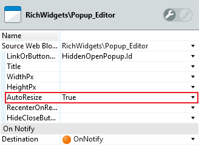
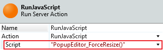

# How to dynamically resize a pop-up window

How can I make my **pop-up** window **automatically grow** and **shrink** at **runtime**?

For example: I created a pop-up window using Popup_Editor with a TableRecords; the contents of the TableRecords can be changed from the pop-up window and I want to automatically resize the pop-up window according to the size of the TableRecords.

## Answer

To make a pop-up **automatically grow** according to its contents, set the `AutoResize` property from the Popup_Editor to `True`.

The `AutoResize` property only affects the automatic growth of the pop-up window.
-To make the pop-up **automatically shrink** according to its contents, follow these steps:

1. Add the following **JavaScript snippet** to the `JavaScript` property of the **pop-up Web Screen**:
    
        function PopupEditor_ForceResize() {
            var popupDiv = window.top.$(".os-internal-ui-dialog-content");
            var popupDivOldHeight = popupDiv.height();
            // reduce iframe's div height to its contents
            popupDiv.height($(".MainPopup").innerHeight());
            // pop-up editor already auto-grows, so we just need to address auto-shrink
            if (popupDiv.height() >= popupDivOldHeight) {
                return false;
            }
            var result = window.top.RichWidgets_Popup_Editor_resize(popupDiv, -1, -1, false, {target: popupDiv});
            if (!result) {
                // something wrong happened in resize - reset iframe's div height
                popupDiv.height(popupDivOldHeight);
            }
        }

    This JavaScript snippet defines a function **PopupEditor_ForceResize()** that you will use to shrink the pop-up window during runtime.

1. Add the **RunJavaScript** action from the **HTTPRequestHandler** extension and set the `Script` property set as `"PopupEditor_ForceResize()"` to **every action** that makes your popup contents shrink.

     

     This will call the **PopupEditor_ForceResize()** JavaScript action. 
     
