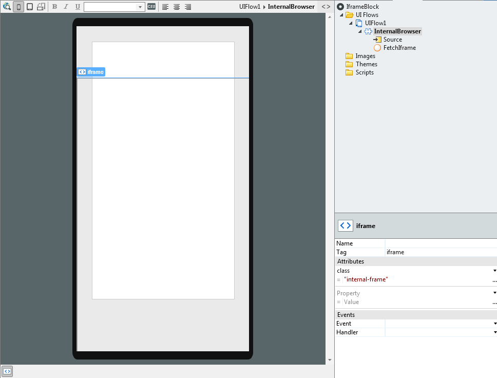
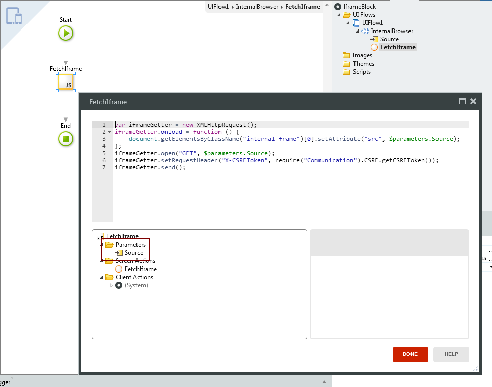
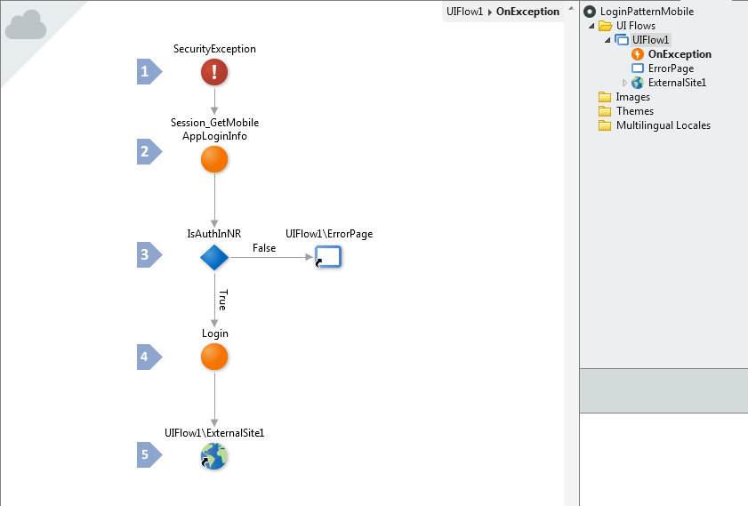
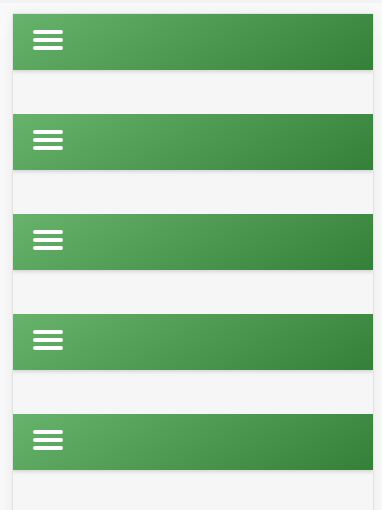

# How to Reuse Web Screens in Mobile Apps

## Question

Is there a way to reuse screens from web apps in mobile apps?

## Answer

We recommend trying to migrate the existing functionality by developing it directly in the mobile app.

However, because that’s not always an alternative, it is possible to integrate existing Web Screens in mobile apps using an iframe that embeds the Web Screens:

To achieve this result, you must do the following:

* Use an iframe in the mobile app that sends appropriate request headers when fetching the Web Screens; 
* Update the web app to automatically log in the end user of the mobile app. 

### Use an iframe in the Mobile App

Create a Block containing an iframe to display the Web Screens as follows:

1. Create a new Block called **InternalBrowser**, and add a Text input called **Source** to the Block; 
2. Add the following CSS class in the property Style Sheet of the Block: 

    
        .internal-frame {
            width: 100%;
            height: 100%;
            margin: 0;
            padding: 0;
            overflow: hidden;
            position: fixed;
            bottom: 0;
            left: 0;
            right: 0;
            top: 100px;
        }
    

    You might need to tweak the CSS class internal-frame depending on the specific Web Screens to embed in the mobile app.

3. Add an HTML Element to the Block, set the property Tag to `iframe` and add the attribute `class = “internal-frame”`; 

    

4. Add a Client Action **FetchIframe** to the Block. On the action **FetchIframe**, add a JavaScript node with a parameter **Source** and associate the parameter of the JavaScript to the input **Source** of the Web Block. Add the following code that fetches the web screen with the appropriate request headers to the JavaScript node: 

        var iframeGetter = new XMLHttpRequest();
        iframeGetter.onload = function () {
            document.getElementsByClassName("internal-frame")[0].setAttribute("src", $parameters.Source);
        };
        iframeGetter.open("GET", $parameters.Source);

        // OutSystems 11
        iframeGetter.setRequestHeader("X-CSRFToken", require("OutSystems/ClientRuntime/Communication").CSRF.getCSRFToken());

        // In OutSystems 10, use this line of code for setRequestHeader:
        // iframeGetter.setRequestHeader("X-CSRFToken", require("Communication").CSRF.getCSRFToken());
        //

        iframeGetter.send();
    
    The **FetchIframe** action sends correct HTTP headers that protect the request and that allow the **Session_GetMobileAppLoginInfo** action to validate the login information.

    

5. Define the action **FetchIframe** as the event handler for the events **On Ready** and **On Parameters Changed** of the Block **InternalBrowser**. 

    

    This ensures that the action **FetchIframe** runs when the Block is shown on the mobile app, as well as when the **Source** parameter changes.

6. Use the Block **InternalBrowser** in your mobile app and pass the URL of the Web Screen that you wish to embed in the **Source** input of the Block. 

### Automatically Log In the End User in the Web App

Add an **OnException** handler to the UI Flow that contains the Web Screens that will be embedded in the mobile app. The flow of the **OnException** will handle security exceptions and validate if the current end user is already authenticated in the mobile app. If so, it will automatically login the user in the web app. Add the following logic to the **OnException** handler:

1. Add a **SecurityException** handler to detect requests from end users that aren’t yet logged in; 
2. Reference the action **Session\_GetMobileAppLoginInfo** from the **PlatformRuntime\_API** extension and use the action to retrieve the login information of the end user from the mobile app; 
3. Test if `Session_GetMobileAppLoginInfo.userId <> NullIdentifier()`. If True, the end user is logged in and the web app will proceed to automatically log in the end user. If False, the end user is not logged in and the web app will redirect to an error page; 
4. In the True branch, use the system action **Login** with the following values obtained by the action **Session\_GetMobileAppLoginInfo** to automatically log in the end user: 
  

        UserId = IntegerToIdentifier(Session_GetMobileAppLoginInfo.userId)
        Persistent = Session_GetMobileAppLoginInfo.isPersistent

5. After the action **Login**, use an External Site to redirect to **GetExceptionURL()**, which returns the URL of the Web Screen that was requested. 

### Links in Web Screens Back to the Mobile App

If the Web Screen to display in the iframe of the mobile app has links back to the mobile app, make sure that the links have the attribute `target = “_top”`. Otherwise you might get a “cascade syndrome”, as shown below, because by default the link will open inside the iframe and not in the top window.

