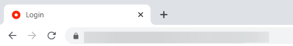
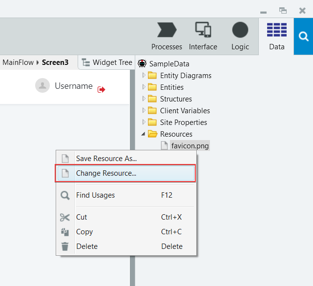
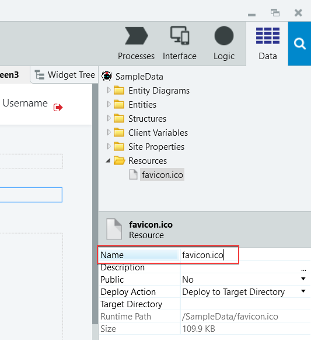

# How to change a favicon

This document explains how to change the default icon and replace it by your favicon. OutSystems apps use the OutSystems logo as the default favicon from Service Studio > **Data** > **Resources** > **favicon.png**.

When changing the favicon, keep in mind that you need to:

* Change the favicon file in **all modules** that expose screens in your app
* Reload the app data, to ensure the app loads the new favicon. If you are using Chrome, right-click the tab with your app and select **Reload**. You can also clear the entire browser cache.
* Make sure your icon [follows the guidelines](https://developers.google.com/search/docs/appearance/favicon-in-search) if you want the favicon to show on Google search results.

## Use a PNG image as a favicon

Follow these steps to change the favicon in your Reactive Web App to a different **PNG image**.

1. In Service Studio, go to the **Data** tab > **Resources**, right-click **favicon.png** and select **Change Resource**. A file dialog opens.

    

1. In the **Change Resource** file dialog, select a PNG image to set it as a new favicon. 

    

        Service Studio resizes the image to the favicon standard dimensions.

1. Publish your module and open it in the browser. You should see a new icon in the browser tab.

## Use an ICO image as a favicon

Follow these steps to change the favicon in your Reactive Web App to a different **ICO image**:

1. In Service Studio, go to the **Data** tab > **Resources**, select **favicon.png** and change its **Name** to `favicon.ico`.

    

1. Right-click **favicon.ico** and select **Change Resource**.

1. In **Change Resource**, select an ICO image with the new favicon.

1. Check if some elements in the module use the old icon and update them if needed. Press **Ctrl+F** or click the search icon, enter `favicon.png` and select **Search in this Module**.

    

    
    If you have just created your app, the **'favicon.png' occurrences in Module** search tab shows four occurrences of **favicon.png**, all in different **AddFavicon** actions.  
    <ins>Note</ins>: **AddFavicon** client action is **only** compatible with Chrome, Firefox and Edge.
   
    
    

1. In the **'favicon.png' occurrences in Module** search tab, select **REPLACE ALL OCCURRENCES**.

1. Enter `favicon.ico` and select **OK**.

1. Publish your app and open it in the browser. You should see a new icon in the browser tab.
