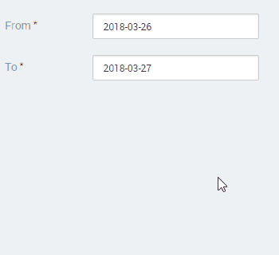

# How to dynamically set the values of inputs

How do I set the value of an Input when it depends on the value of another Input?

For example: I have a Form with two dates ("From" and "To") and I want my "To" date to automatically change to one day after the "From" date.

Both "From" and "To" dates are defined using Input Widgets (assigned to Variables `TestDate.From` and `TestDate.To`) associated with Input Calendar RichWidgets.

## Answer

To dynamically set the "To" date to one day after the "From" date follow these steps:

1. Enclose the "To" Input Widget and Input Calendar RichWidget in a Container and name it `ToWrapper`. 

    

1. Set the `On Change`>`Destination` property of the "From" date Input Widget to a newly created Action, in this case **UpdateToDate**.

    

1. Add an Assign node to the **UpdateToDate** Action with the assignment `TestDate.To=AddDays(TesDate.From,1)`.

    

    This assignment updates the "To" date and defines it as the "From" date plus one day.

1. After the Assign node, in the **UpdateToDate** Action, add an Ajax Refresh and set the `Widget` property to `ToWrapper`.

    The Screen Action will look similiar to the following image:

    

After these steps the "To" date will change to one day after the "From" date every time the end user modifies the "From" date.

