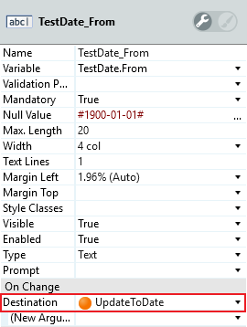

# How to dynamically set the values of inputs

In your Traditional Web app, you can set the value of an input depending on the value set in another input.

For example, a form can include two date inputs ("From" and "To") and the "To" date can automatically change to one day after the "From" date.

Both "From" and "To" dates are set using **Input** widgets (assigned to Variables `TestDate.From` and `TestDate.To`) associated with **Input Calendar** RichWidgets.

To dynamically set the "To" date to one day after the "From" date follow these steps:

1. Enclose the "To" **Input** widget and **Input Calendar** RichWidget in a **Container** and name it `ToWrapper`.

    

1. Set the **On Change**>**Destination** property of the "From" date **Input** widget to a newly created **Action**, in this case `UpdateToDate`.

    

1. Add an **Assign** node to the **UpdateToDate** action with the assignment `TestDate.To=AddDays(TesDate.From,1)`.

    

    This assignment updates the "To" date and defines it as the "From" date plus one day.

1. After the **Assign** node, in the **UpdateToDate** action, add an **Ajax Refresh** and set its **Widget** property to `ToWrapper`.

    The Screen Action should look similar to the following image:

    

After these steps the "To" date changes to one day after the "From" date every time the end user modifies the "From" date.

<iframe src="https://player.vimeo.com/video/1005756606" width="350" height="320" frameborder="0" allow="autoplay; fullscreen" allowfullscreen="">Video demonstrating the dynamic update of the 'To' date input when the 'From' date is changed.</iframe>
