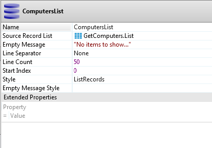

# How to show records side by side in a List Record widget

## Question

Is it possible to customize the layout to show records side-by-side, as follows?

| Record1 | Record3 | Record5 |
|---------|---------|---------|
| Record2 | Record4 |         |

In the standard table grid layout each record is on a separate line, as follows:

| Record1 |
|---------|
| Record2 |
| Record3 |
| Record4 |
| …       |

## Answer

Use the **List Records widget** to manipulate how information is displayed on your Web Screen.

After you select the **List Records widget** to use in your Web Screen you just need to go to the properties of the widget and set the **Line Separator** property to **None** so the records can be displayed side-by-side.

After you performed these configurations your layout may look similar to the following image. You can see more useful UI patterns by looking into  [OutSystems UI](https://www.outsystems.com/forge/component-overview/1385/outsystems-ui) component available on Forge.

