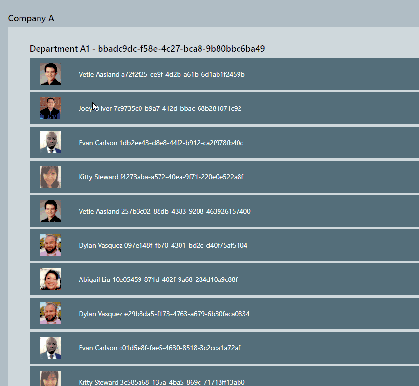
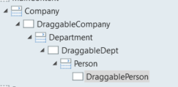
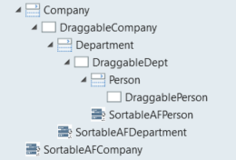
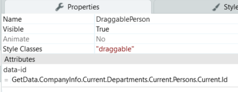
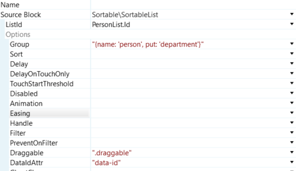
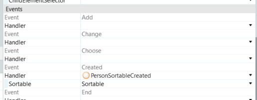
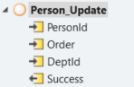

# How do you integrate a sortable plugin?

How to integrate a sortable plugin

## Issue

We want to render a tree view with +1000 records fetched from the database with every drag/move that should be saved on the database, and if the server gives an error we should revert back the element to the original position. For this example, we will use the [SortableAF plugin](https://www.outsystems.com/forge/component-overview/7688/sortable-af).

### Final Result

### The Data

In this example, we will use a company approach, this company has departments, and departments have persons so in total 3 levels on the tree. We will focus our how-to in the departments and persons but is applicable to all the structure.

### Widget Structure

We will create the most simple of use cases, this means we will have 3 lists nested. Take the image below as a reference.

### Plugin Usage and Configuration

#### Usage

Use the web block SortableList from the plugin into the screen, 1 for each list that we have at the same level as the list (can be all at the end, but this promotes more readability and less confusion).

#### Configuration

**For each container, Draggable<X> in the image above add**

1. a class that will be used for the elements for eg: “draggable”, this will enable these containers to be draggable

1. in the attributes of it add data-id and give it the id of the element, we will use this to identify the record that belongs to the element that is being dragged

**For each sortableAF**

1. Associate the correspondent list id

1. Extend the options

    1. In the group we will define the name and where can we drag it "{name: 'person', put: 'department'}", this means we only can drag our persons to departments. change the company and department group names and put accordingly.

    1. In the Draggable attribute add the class that we defined

    1. In the DataIdAttr attribute add data-id, that we defined in the container

Now everything is set up, and if you test it you can drag and drop the elements but is not saving anything to the database. Let’s take care of that now.

### Calling the server

First let us create a new action on the created sortable event

Now we will add the following javascript

    $parameters.sortable.option("onEnd", function(event) { 
        var parent = event.to.getAttribute('data-id'); //get the parent of the element
        /*next lines fetch the positions, they are more complex because using disable-virtualization=True in a list
        create a new script in the beginning and end of the childs in a list*/
        var newOrder = event.to.hasAttribute("data-virtualization-disabled") ? (event.newIndex+1) : event.newIndex; //get the new order of the element
        var oldOrder = event.from.hasAttribute("data-virtualization-disabled") ? (event.oldIndex+1) : event.oldIndex; //get the old order of the element
        var id = event.item.dataset.id; //get the id of the element
        $actions.Person_Update(id, newOrder, parent).then(function(result) { //call client side action asynchronous
            if(!result.Success && (event.from !== event.to || newOrder !== oldOrder)) { //check if need to change the element to the old state
                $public.FeedbackMessage.showFeedbackMessage("Sorry but not can do", 3, true, "", true);
                oldOrder > newOrder ? event.from.insertBefore(event.item, event.from.children[oldOrder+1]) : event.from.insertBefore(event.item, event.    from.children[oldOrder]); //change to the old position
            }
            $resolve(); //resolve the promise of asynchronous function
        });
    });
Let's break down the code!

The first line will override the original method “onEnd” of the sortable that receives the event. This event has all the information about the element that is being dragged that we need.

Then we get the new parent that the element was dropped on, the new and old parents are stored in the event.to and event.from. Has we can see we get the data-id that we previously inserted to know the new parent identifier of the element.

Before calling the server we check the orders of the elements, but we need to check if the list is using data-virtualization, to know more about data-virtualization here.

To call the server we need to encapsulate the call to that server action in a client action

this will allow us to call the action asynchronously returning a promise and take action on the result, so we will trigger a feedback message and revert the changes on the list. Check here to know more about it

And to finish we call the $resolve(); to close the async call and resolve the promise. Now we only need to replicate this for the other lists changing the client action that is being called.

### Considerations

Q: Why this and not just a simpler call to the server with the information that the event already provides without any Javascript?

A: In this way, we don’t need to update a local list or any local variable that we would need that would trigger the render that's why we have the data-id’s so we can identify a record and update it correctly on backend and frontend to maintain the coherence, and to revert back we needed javascript anyway to fetch the element and old parent to revert.

Q: This means the list on the screen is not updated anytime?

A: Correct, we are not updating the list in any circumstance! we don’t want to render the lists again and again.

### But I need multidrag!

That's not a problem! You just need to duplicate the SortableList and in the new web block, you need to activate it on the initialize multiDrag: true.

The code just used above for the example just need to be inside a cycle, and now we just need to use the new event attributes that have all the information.

    event.items //all the items being dragged
    event.newIndicies //all the new indexes for the elements
    event.oldIndicies //all the oldindexes for the elements

### Potential issues

#### 1 - Change an element up/down a parent

Imagine that a person could be dragged to a department or a below a company outside any department, if you have different classes for the draggable (eg: company - “draggable-company”, department - “draggable-dept” and person - “draggable-person”), you need to update the classes for the element that is being moved so he can be draggable inside of the new parent if the classes are not updated then the element will be considered as a normal div and can’t be dragged any more.
