# Migrating the patterns of the Silk web applications to OutSystems UI

This document outlines the instructions for the migration path where you upgrade the application UI framework by first modifying the structure and then changing the patterns. The path considers only the basic implementation of each pattern. Advanced implementations that include dynamic values for parameters are not covered in this version of the document. We do, however, guarantee the same level of customization for each pattern available.

The document is part of the migration path guide for customers of OutSystems 10 who want to continue developing their web application in OutSystems 11 Web UI Framework. Please refer to the table of content for the entire guide.

The documents in this section:

* [Migrating UI of the Silk Web applications to OutSystems UI Framework](intro.md)
* [Migrating the patterns of the Silk web applications to OutSystems UI](migrate-patterns.md)
* [Migrating the structure of the Silk web applications to OutSystems UI](migrate-structure.md)
* [Migration reference tables for Silk and OutSystems Web UI](migration-reference-tables.md)

## Accordion

The Accordion pattern is distributed as two separate patterns: Accordion and AccordionItem. The pattern enables you to have multiple items open, replicating the Section Expandable behavior.

Each AccordionItem provides you with two new options: IsOpen and IsDisabled, enabling you to control the pattern programmatically.

When replacing the Accordion usage with the new pattern, sample content will be added. You can either:

* Delete the sample content and move your content to the correct place, and subsequently, replace the usage of AccordionItem with the new AccordionItem pattern.
* Delete the sample content inside the new AccordionItem and move your content to the correct place, and then, delete the old AccordionItem blocks.
 
| Silk Web UI | OutSystems Web UI |
| -------|-------|
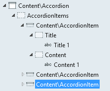 | 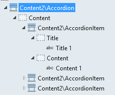 
 
## Alert
 
When replacing the Alert pattern, your content will automatically be in the correct place. However, you should update the AlertType parameter to match your selection to the new Alert entity.

A new option is available: ShowCloseButton, which enables the end-user to close the message. 

| Silk Web UI | OutSystems Web UI |
| -------|-------|
 | 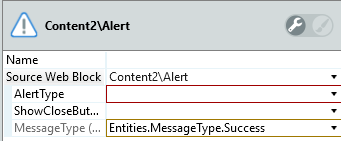 
 |  | 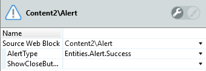 
 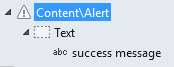 |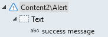 

## Align Center

When replacing the VerticalAlign pattern, the content from Cell1 and Cell2 will become unused content from non-existing placeholders. Move your content from the cells to the new Content placeholder.

Set the Orientation parameter as Horizontal to have the same behavior of VerticalAlign - Items align horizontally - or as Vertical to align the items on top of each other.

| Silk Web UI | OutSystems Web UI |
| -------|------- |
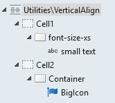 | 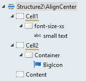 
|  | 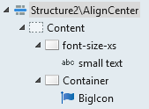 
|  | 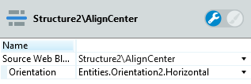 

## Badge

When replacing the Badge pattern, the assigned variable or value will become an unused argument. Reassign that value to the Content parameter.

| Silk Web UI | OutSystems Web UI |
| -------|------- |
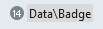 | 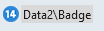 
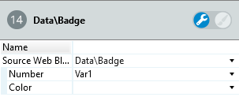 | 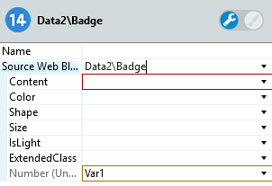 
|  | 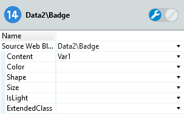 

## Balloon
 
When replacing the Balloon usage with the new pattern, your content will automatically be in the correct place. But, sample content will be added. You can either:

* delete the sample content
* change it to fit your application

You will have to map the Trigger parameter to match your selection with the new Trigger entity.

There are two new placeholders: Title and Footer. There is also a new parameter that enables you to choose where the Balloon pattern will appear in relation to the provided widget.

| Silk Web UI | OutSystems Web UI |
| -------|------- |
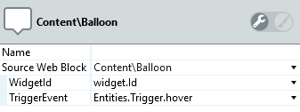 | 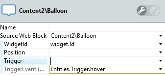 
|  | 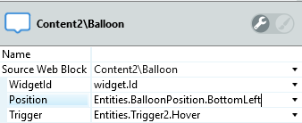 
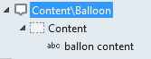 | 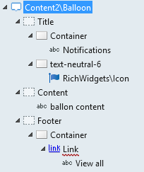 
| | 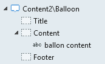 
 
## Blank Slate
 
When replacing the BlankSlate pattern, your content inside the Content placeholder will be in the correct place. But, your content inside the Actions placeholder will have to be moved. 
 
| Silk Web UI | OutSystems Web UI |
| -------|------- |
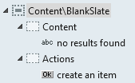 | 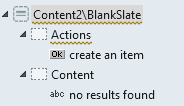 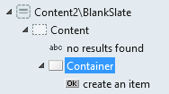
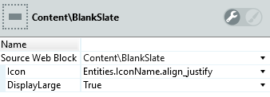 | 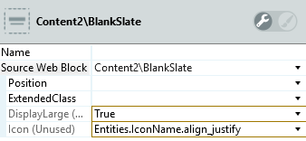
|  | 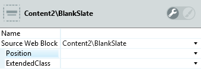

## Breadcrumbs

The new Breadcrumbs pattern is distributed as two separate patterns: Breadcrumbs and BreadcrumbsItem.

The new pattern provides sample content for you to customize. You can keep the sample links to navigate to other screens or actions and the icons can be different, depending on the level. The new pattern also enables for the Breadcrumbs to be built dynamically, with a list. 
 
When replacing the Breadcrumbs pattern, the previously static Levels, are now unused placeholders. Move your content from the Level placeholders to the Title placeholder on each level.

If you wish to keep the same Icon from the old pattern, make sure you set the new Icons IconName with to that value.

| Silk Web UI | OutSystems Web UI |
| -------|------- | 
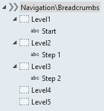 | 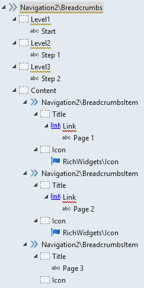 
 | 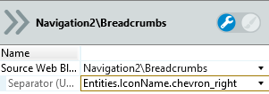 
|  | 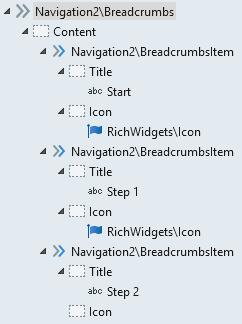  

## Button Group

The ButtonGroup pattern is distributed as two separate patterns: ButtonGroup and ButtonGroupItem. **The new ButtonGroup pattern requires the Text or Label to have the 'btn' class.** 

Dragging and dropping the ButtonGroup pattern in the screen will instantiate sample content, implementing the same behavior as the ButtonGroup3. 

When replacing the ButtonGroup pattern, sample content will be added and your content must be moved. Delete the content from each ButtonGroupItem and move your content to the matching placeholder.

IsJustified parameter makes items evenly distributed.

| Silk Web UI | OutSystems Web UI |
| -------|------- | 
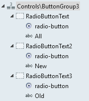 | 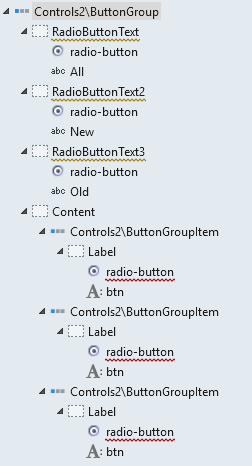 
|  | 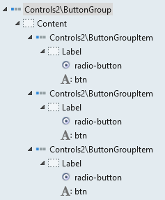 

## Card
 
When replacing the Card pattern, your content inside the Content placeholder will be in the correct place. But, you will have to move the content inside the Title and Actions placeholders.

| Silk Web UI | OutSystems Web UI |
| -------|------- |
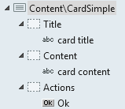 | 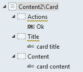 

## Card Background

When replacing the CardBackground pattern, your content inside the Content placeholder will be in the correct place. But, the values of the input parameter will have to be removed.

The BackgroundImage input parameter is now set by using an Image directly in the placeholder, giving you more control over the source of the image.

Color, Position, MinHeight and ExtendedClass input parameters are now available. Color determines the background overlay color that separates the content from the background image. The Position parameter sets the position of the content inside the Card. 

| Silk Web UI | OutSystems Web UI |
| -------|------- |
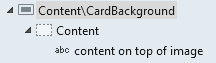 | 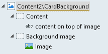 
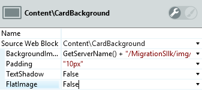 | 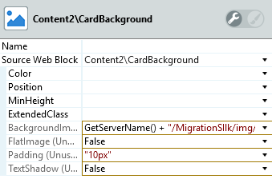 
|  | 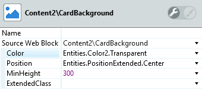 
 
 
## Card Sectioned
 
When replacing any Card pattern with the CardSectioned, your content inside the Title and Content placeholders will be in the correct place. But, content inside the Actions placeholder will have to be moved.

The new Footer placeholder replaces the old Actions and adds sample content. Delete the sample content and move your content from Actions to Footer.

The Orientation parameter sets the display of the Title in relation to the Content and Footer. Set it to Horizontal to have the same behavior of the old CardLeftImage pattern. The IsRight parameter works with the previous parameter, setting the Title alignment to the right or left side.

| Silk Web UI | OutSystems Web UI |
| -------|------- |
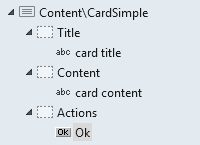 | 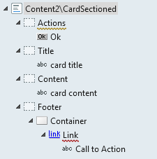 
|  | 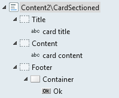 
|  | 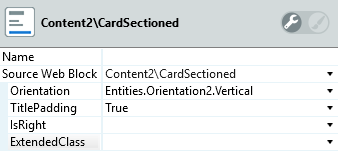

## Columns

When replacing the Columns pattern, the content will remain in the correct place.

 * TabletBehavior and PhoneBehavior parameters must be mapped to the new BreakColumns entity.
 * MarginBottom parameter is no longer available.
 * UseGutter (boolean) is replaced with Gutter that can be set with a different selection of sizes, from None to ExtraExtraLarge (0px - 48px).
 * UseBorder is deprecated. To replicate the behavior, the content of the columns must be inside a container with the border-size-s padding-s classes.
 * To change the color of the border, add the text-_color_ class to the container. With this class the color of the child content will change accordingly, so you need to add the text-_color_ to the child(ren) container to override the parent definition.
 
When replacing the Columns pattern, TabletBehavior and PhoneBehavior must be mapped to the new entity. The remaining parameters will become unused arguments, that you need to remove. You can now control the size of the Gutter, using the Gutter parameter.

| Silk Web UI | OutSystems Web UI |
| -------|------- |
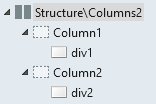 | 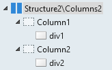 
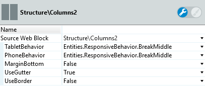 | 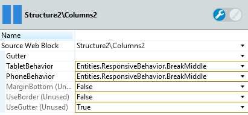 
|  | 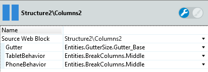 

## Counter

When replacing the Counter pattern, a sample content will be added. Move your Label content to the right container, in this case, the second one where "Counter title" text is. The same applies to the content inside Number. You have to move it to the container where "26" is.

An Icon was introduced as sample content. You can delete it or customize it if you wish to keep it.

| Silk Web UI | OutSystems Web UI |
| -------|------- |
 |  
 |  
|  |  

## File Upload

When replacing the FileUpload pattern, all your content will be in the correct place. Delete the unassigned ButtonText value.

| Silk Web UI | OutSystems Web UI |
| -------|------- | 
 |  
 |  
|  |   

## Gallery

When replacing the Gallery pattern, your content will be in an unused placeholder; you'll need to move it to the ListRecords placeholder.

The previous pattern relied on the parameters to set the number of items per row, while when using the new pattern, the width of the container inside the list will determine the number of items: Width 6 col = 2 items/row. Width 4 col = 3 items/row. And so on (assuming the 12 column grid is used).

| Silk Web UI | OutSystems Web UI |
| -------|------- |
 |  
 |  
|  | 
 

## Modal
 
When replacing the Modal pattern, your content inside the Title and Content placeholders will be in the correct place. But, the content inside the Actions placeholder will have to be moved. The new ToggleModal action now requires a WidgetId, which corresponds to the Modal you want to show/hide. This means that you can have multiple Modal patterns in the same page and show/hide each one individually.

About the placeholders:

* The new Footer placeholder replaces the old Actions and adds sample content. Delete the sample content and move your content from Actions to Footer.
* The new Icon placeholder can be used to house a link to close the Modal.

About the parameters:

* The pattern now has four new parameters: Position, HasOverlay, EnterAnimation and LeaveAnimation. Position lets you define where, in the screen, the Modal is shown.
* HasOverlay, if set to True, shows an overlay that darkens the background, otherwise, the background is not affected.
* EnterAnimation and LeaveAnimation, are used to set the animations when showing/hiding the Modal, respectively. 

| Silk Web UI | OutSystems Web UI |
| -------|------- |
 |  
|  |  
|  |  
|  |  
 |  
|  |  

## Panel
 
When replacing the Panel pattern, your content inside the Title, Actions, and Content placeholders will be in the correct place. But, your content inside the TitleFooter and ActionsFooter will have to be moved to the Footer placeholder, which will have sample content that you may use or delete. 

| Silk Web UI | OutSystems Web UI |
| -------|------- |
 |  
|  |  
 |  
|  |  

## Progress Bar

When replacing the ProgressBar pattern, Title and Value placeholders will be added with sample content. You can delete the sample content and the result will be only the progress bar; or you can customize it. If you're keeping the sample content, you should convert the value to an expression and set its Value with the same variable of the Percentage argument.

| Silk Web UI | OutSystems Web UI |
| -------|------- |
 |  
 | 
|  |  
|  |  
 
## Section
 
When replacing the Section pattern, all your content will be in the correct place. To implement the SectionExpandable behavior, refer to the Accordion pattern. 

| Silk Web UI | OutSystems Web UI |
| -------|------- |
 |  
 |  

## Toggle Button

When replacing the ToggleButton pattern, the check box will lose its variable. Reassign your variable to the check box.

| Silk Web UI | OutSystems Web UI |
| -------|------- |
 | 

## Tooltip

The Tooltip pattern has been changed in its structure and parameters.

The target widget is now placed inside the Widget placeholder instead of providing the id via input parameter. The same goes for the content, which is now placed directly in the Content placeholder instead of the Message parameter.

The Trigger and Position parameters must be mapped to the new Trigger and Position entities.

| Silk Web UI | OutSystems Web UI |
| -------|------- |
 |  
 |  
|  |  
|  |  

## Icon Badge

When replacing the IconBadge pattern, a new Icon placeholder will be added with an icon inside. You will need to set the new icon's IconName with the same value in the unused Icon argument. You will also need to set the Content parameter with the unused Number argument.

| Silk Web UI | OutSystems Web UI |
| -------|------- |
 |  
 |  
|  |  

 
## Input With Icon
 
When replacing the InputWithIcons the input will be in the correct place. The structure is slightly changed and you need to set the IconName to the one in the unused parameter. 

| Silk Web UI | OutSystems Web UI |
| -------|------- |
 |  
 |  

## Range Slider

The new RangeSlider is built using Block Events. Inputs to handle the variables are no longer needed.

When replacing the RangeSlider pattern, you will need to set an InitialValue (the starting position of the handler) and an OnChange event handler. This handler must have an input parameter of type Integer, that is the value returned by the RangeSlider.

If you already had an action to handle the input OnChange (for the old Rangeslider), you can use that action as the handler for the new RangeSlider, by adding an input parameter and manipulating the value according to your logic. If, otherwise, you have a screen action to handle your logic - and the input variable - you must create a new handler for the RangeSlider and set your variable with the returned value, as shown in the screenshot.

| Silk Web UI | OutSystems Web UI |
| -------|------- |
 |  
|  |  
|  |  
 |  
|  | 
|  |  

## Range Slider Interval

The new RangeSliderInterval is built using Block Events. Inputs to handle the variables are no longer needed.
 
When replacing the RangeSlider pattern, you will need to set an InitialIntervalStart, which is the starting position of the minimum handler, an InitialIntervalEnd, which is the starting position of the maximum handler, and an OnChange event handler. This handler must have an input parameter of type Integer, that is the value returned by the RangeSlider.

If you already had an action to handle the input OnChange (for the old Rangeslider), you can use that action as the handler for the new RangeSlider, by adding input parameters and manipulating the values according to your logic. If, otherwise, you have a screen action to handle your logic - and the input variables - you must create a new handler for the RangeSlider and set your variables with the returned values, as shown in the screenshot.

| Silk Web UI | OutSystems Web UI |
| -------|------- |
 |  
 |  
|  |  
|  |  
 
## Search

When replacing the Search pattern, a new input will be created. Delete the new input and move your input to the correct place holder.

| Silk Web UI | OutSystems Web UI |
| -------|------- |
 |  
|  |  

## Separator

When replacing the Separator pattern, you won't need to do anything. Instead, you will have more customization options:

* Color - Select the color of the separator. Default is Neutral-4 
* Space - Set the space around the Separator. Ranging from 0px to 48px. Default is 16px.
* IsVertical - Set to True to use a vertical separator. The default is False.

| Silk Web UI | OutSystems Web UI |
| -------|------- |
 |  
|  |  

## Tabs

Tabs is now distributed as three separate patterns: Tabs, TabsHeaderItem and TabsContentItem. 

Move your content to the matching place in each pattern: Tab1 content should be moved to the first TabsHeaderItem Title placeholder and the Content1 content to the first TabsContentItem Content placeholder; and so on, as shown in the screenshot.

The mapping between Header and Content is made using the DataTab argument in both TabsHeaderItem and TabsContentItem. Make sure the value is the same in each Header-Content pair, but unique between pairs.

The new Tabs pattern enables for the tabs headers to be displayed vertically and horizontally. You can set this in the Orientation parameter. he IsRight parameter determines which side the tabs headers are displayed: Left (false) or Right (true). IsJustified makes the TabsHeaderItems use the entire tabs width or height, if true, or use the minimum space, if false.

When replacing the Tabs pattern, sample content will be added. 

| Silk Web UI | OutSystems Web UI |
| -------|------- | 
 |  
|  |  
|  |  
 
## User Initials

UserInitials now has a few more options.
Your Name and Color argument values will map to the correct parameters, but you will need to map the Color value to the new Color entity.

| Silk Web UI | OutSystems Web UI |
| -------|------- |
 |  
 |  

## Wizard

Move your content from each WizardStep to the matching WizardItem. The content Title1 should be moved to the first WizardItem Label placeholder and so on, as shown in the screenshot.

The new WizardItem pattern relies on the new Status argument to set the Past, Active and Next statuses. Make sure you correctly replicate the logic implemented in the old pattern.

When replacing the Wizard pattern, sample content will be provided. 

| Silk Web UI | OutSystems Web UI |
| -------|------- |
 |  
|  |  
|  |  
 |  
 |  
 |  

