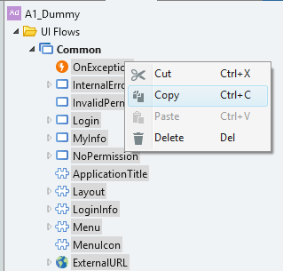
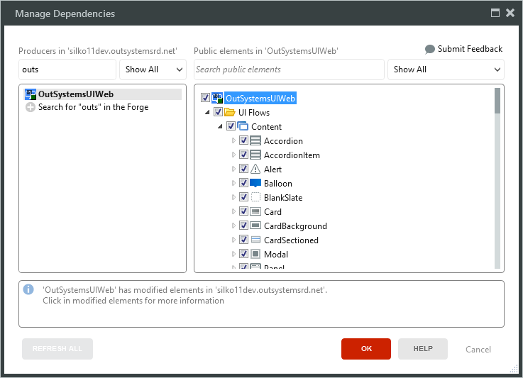
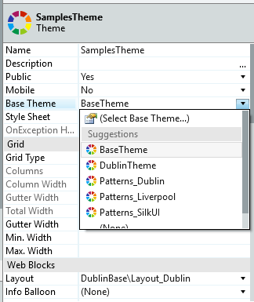
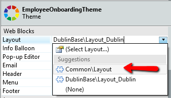
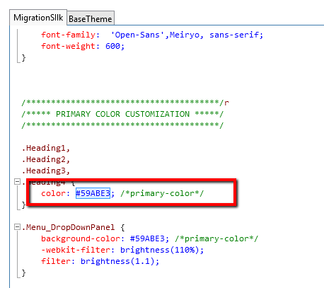
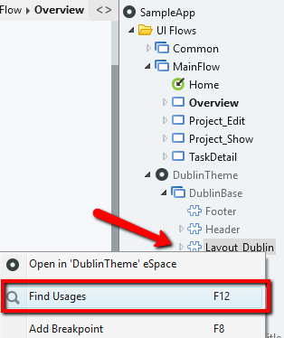
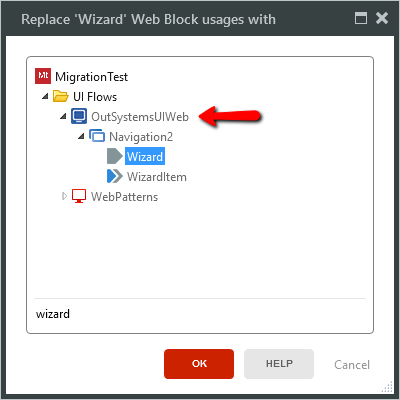

# Migrating the structure of the Silk web applications to OutSystems UI

This document outlines the instructions for the migration path where you upgrade the application UI framework by first modifying the structure and then changing the patterns. The document is part of the migration path guide for customers of OutSystems 10 who want to continue developing their web application in OutSystems 11 Web UI Framework. Please refer to the table of content for the entire guide.

The documents in this section:

* [Migrating UI of the Silk Web applications to OutSystems UI Framework](intro.md)
* [Migrating the patterns of the Silk web applications to OutSystems UI](migrate-patterns.md)
* [Migrating the structure of the Silk web applications to OutSystems UI](migrate-structure.md)
* [Migration reference tables for Silk and OutSystems Web UI](migration-reference-tables.md)

## Step A: Replace the Common folder

The phrase "your application" refers to the web application that is based on Silk Web Framework and being migrated to OutSystems Web UI Framework, while "temporary application" refers to the temporary OutSystems Web UI application used in the migration.

1. Create a temporary application based on one of the built-in Application Templates. If your application is based on the Dublin Theme, use the Side Menu template, otherwise use the Top Menu template.

    

1. Copy the content of the Common flow (UI Flow > Common) of the temporary application into the Common flow of your application. The repeated elements in your application now have "2" at the end of their names. For example, "LoginInfo2" is the block from the new framework, while "LoginInfo" is from the old framework.
1. Copy any custom logic from the original blocks of your application to the new blocks or screens of your application. For example, from "LoginInfo" to "LoginInfo2".
1. Delete the original blocks ("LoginInfo") and rename the new ones by deleting the number "2" in the name ("LoginInfo2" becomes "LoginInfo"). Now all blocks in Common UI Flow of your application are based on the new UI framework.
1. If your application doesn't have a default user picture, copy the "UserIcon" image from the new application and paste it in yours.
1. Update the "Logo" image. It is used in the new framework. If your application already has a logo image, name it "Logo". You may revert this after all the dependencies are updated (if, for example, you have a reference to the original image in the CSS).
1. Fix any remaining navigation errors by checking the TrueChange panel list. Note that the Common/OnException action might be redirecting to non-existing screens.

## Step B: Add the reference to OutSystems UI Web

Add the reference to the new framework. Open the **Manage Dependencies** window and search for **OutSystems UI Web**. Select it, together with all patterns, actions and entities.

## Step C: Change to the Base Theme

First, set the application's base Theme to use the OutSystems UI theme called **Base Theme**.

Then, set this new layout as the theme's layout.

## Step D: Update the CSS rules

After updating the CSS you should validate your customizations against the new CSS rules. Refer to the document _Migration reference tables_ for the cross-referenced information about the CSS classes.

### Copy custom rules

Double-click the Theme of your application to open the Theme Style Sheet. If there are any specific customizations done in the Theme Style Sheet, copy and save the rules.

### Copy primary color definitions

1. Find the definition of your application's primary color and save it.

    

1. Open the new application's Theme Style Sheet and copy the content.

    

1. In your application, paste the CSS at the top to replace the color definitions.

    

### Notes

* For the CSS classes from other themes to work with OutSystems UI, the rules need to be changed (e.g. Background_Red no longer exists in the new framework, having been replaced with 'background-red').
* Any custom CSS needs to be reviewed to match the new classes. This applies to both themes and patterns. For example, ".ListRecords .Counter label" no longer applies because ".Counter" was replaced (unless it is an explicit assign of the Counter class to an element).

## Step E: Change to the new layouts

1. Find the application's original Layout block and change all its uses to the new layout you pasted in the Common Flow in step _Step A: Replace the Common folder_.

1. Make sure blocks like Header, Footer, LoginInfo, etc. are in the correct place. Use the new application to see where each block should be placed.

    

## Step F: Migrate the patterns

What follows is a general overview of how you can manually replace the patterns from Silk. For more detailed descriptions of changes of the patterns refer to the document _Migrating the patterns of web applications_. The mapping of new patterns to the Silk patterns is outlined in the _Migration reference tables_.

1. Select a pattern and find all the places where it's used in your application (right-click + Find Usage or press F12).

    

1. Click **Replace All Usages**. Find and select a matching pattern from OutSystems UI Web.

    

1. Verify the variables are used properly. Most Silk patterns have a direct match in OutSystems UI, but in certain situations, placeholders or inputs have changed to provide additional options. Most patterns have a sample content which you need to remove or change to fit your application.
