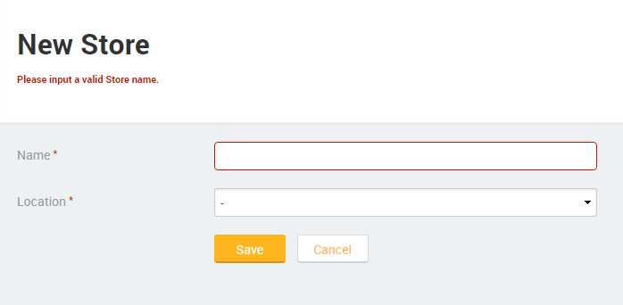

# How to display input validation messages in a custom location

By default, input validation messages are shown next or below the corresponding inputs.

How can I show these messages in another location to meet business or design requirements?

## Answer

To display input validation messages in a custom location, we must hide the default messages and display the `.ValidationMessage` runtime properties of the invalid inputs in the custom location.

Follow the steps below to display input validation messages in a custom location:

1. Depending on the type of application add one of the following CSS snippets to the Style Sheet of the Screen/Block: 

    For **Web Applications**:
    
        span.ValidationMessage {
            display: none;
        }

    For **Mobile Apps**: 

        span.validation-message {
            display: none; 
        }

    This will hide the default validation messages.

1. Assign `<input_name>.ValidationMessage` to the Value of an **Expression** Widget to display the validation message of the `<input_name>` Input in a custom location. 

    

    You may modify the look of the custom location validation messages by modifying the style of the **Expression** Widget.

    Note for **Web Applications**: If you are using the `Ajax Submit` Method to submit your Form don't forget to **Ajax Refresh** the Expression Widget.

After these steps the input validation messages will appear in a custom location at runtime:

