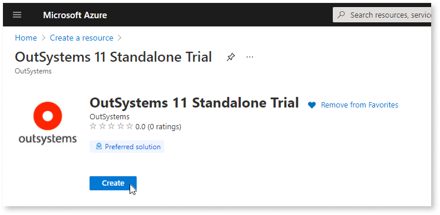
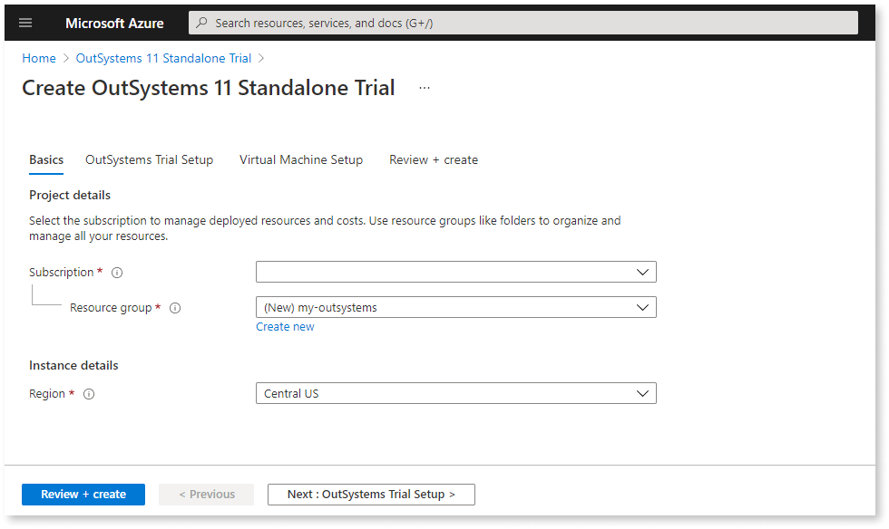
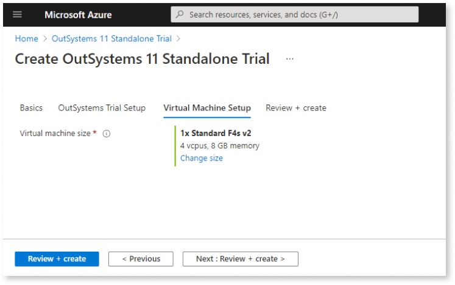
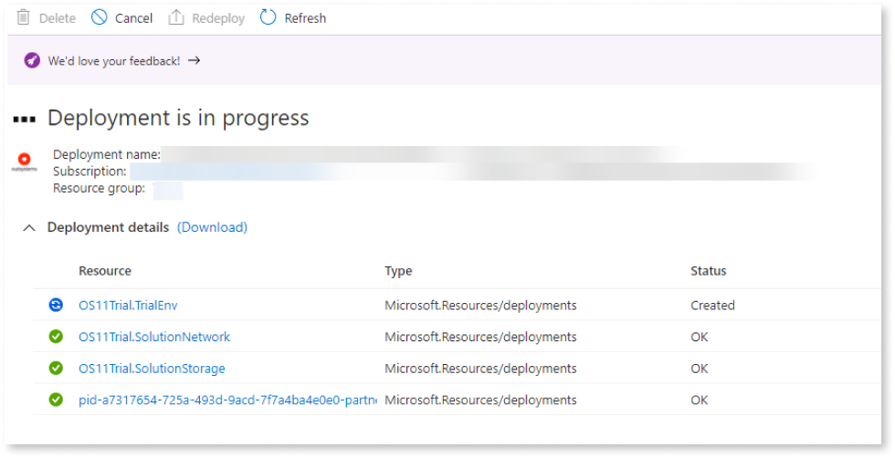
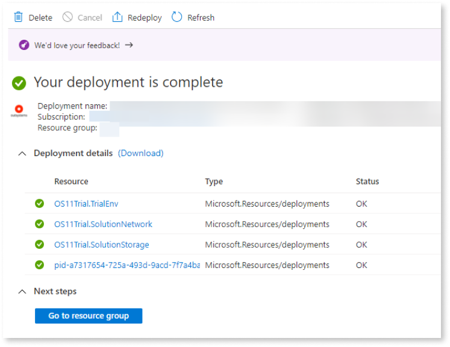
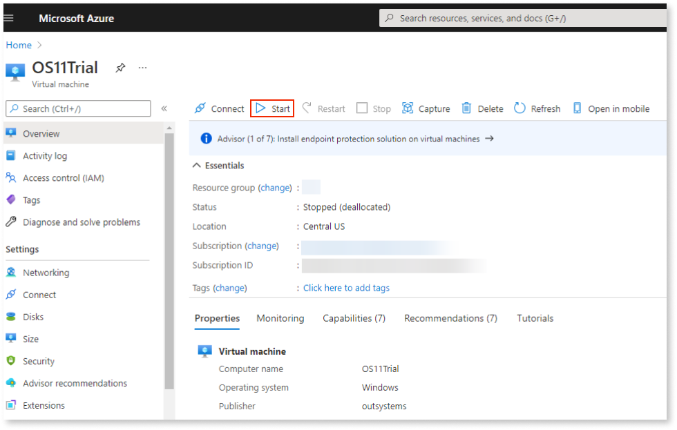
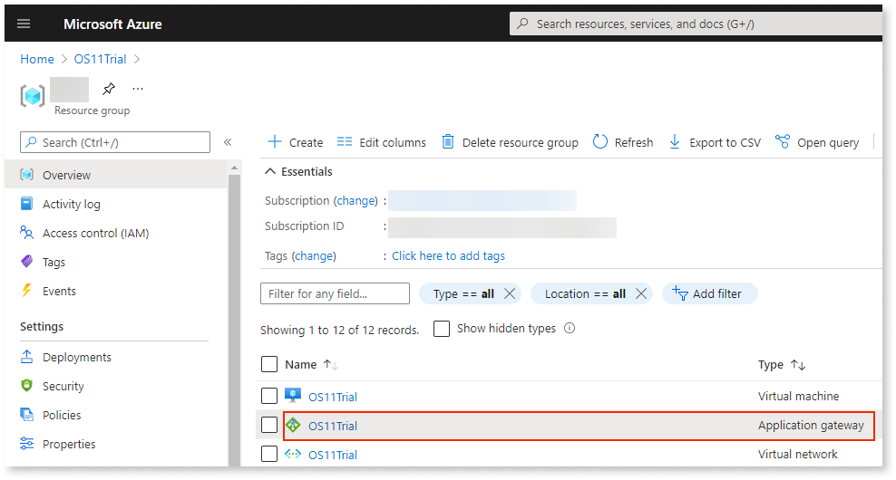
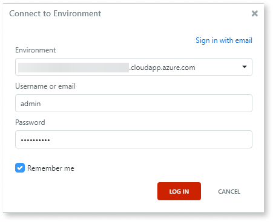
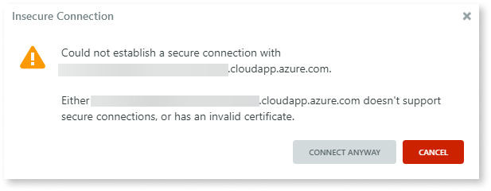

# Install OutSystems Trial on Azure

Are you ready to discover the joy that's developing with OutSystems on Microsoft Azure? Then let's get you started with the Trial. This article explains how to:

* [Launch the installation wizard](#launch)
* [Start your VM](#start-vm)
* [Create your OutSystems apps](#create-apps)

## Launch the installation wizard {#launch}

The first part of installing your trial is to launch the installation wizard:

1. Log in to the Azure portal with your Azure account and search for **OutSystems 11 Standalone Trial**.

1. Click **Create**. The Azure Portal starts a standard VM creation wizard.

    

1. The creation wizard starts on the **Basics** blade fill in the details:
    * On the **Resource group** choose **Create new** and name your resource.
    * Select your desired Azure region under **Region**.

        

1. Click **Next: OutSystems Trial Setup**.

1. On the **OutSystems Trial Setup** blade fill in the **Username** and **Password**. These will be the credentials:
    * to connect to the VM via remote desktop using the **Username** and **Password**;
    * to connect to the SQL server with the username `admin`and the **Password** you defined in this step;
    * to connect to your OutSystems trial using Service Studio and Service Center with the username `admin`and the **Password** defined.

1. Click **Next: Virtual Machine Setup**.

1. On the **Virtual Machine Setup** blade, accept the suggested VM size or change it to your preference.

    

1. You're almost done, click **Next: Review + create**.

1. Click **Create**. 

Your OutSystems trial starts to deploy. A complete OutSystems platform will be deployed and it can take a while, but you can check its progress:

Deployment completed, you can now access your new VM.

## Start your VM {#start-vm}

Next, make sure the new VM is started. First you'll need to locate the recently created VM. The Azure Portal offers several filtering options for your resources. 

1. You can, for example, click **Go to resource group** once the deployment has finished and look for the **OS11Trial** virtual machine.

1. Click **Start**.

    

    If the **Start** button is disabled your VM is already started and you can proceed.

## Create your OutSystems apps {#create-apps}

You OutSystems Azure Trial is ready to use, so go ahead and take it for a spin! But let's ensure you have all the necessary components first.

1. [Download and install the Development Environment 11](https://www.outsystems.com/downloads/) on your local computer. 

1. Connect [Service Studio](https://success.outsystems.com/Documentation/11/Getting_started/Service_Studio_Overview)  to your environment. 

    * You'll need the address of you VM to connect. It's the address associated with the **OS11Trial Application gateway** that can be found on the Azure Portal:

        

    * Click on the **OS11Trial Application gateway** to see the **Frontend public IP address**. You can use either the IP or the `<my_trial>.cloudapp.azure.com` address.

    * Launch Service Studio on your local computer. A **Connect to Environment** dialog box will appear. On the top right corner click **Sign in with environment URL**. The login box will look like this:

        

        Your Service Studio may already launch with this login box. No worries, you're in the right place, just follow to the next steps.
    
    * On the **Environment** field, fill in the address of the **OS11Trial Application gateway**. Use the username `admin`and the password you defined on **step 5** of the [installation wizard](#launch}).

    * Click **LOG IN**. This warning will appear:

        

        You'll see this warning because by default, the OutSystems 11 Standalone Trial doesn't have an SSL certificate installed. You can [add a valid certificate](https://success.outsystems.com/Documentation/11/Setting_Up_OutSystems/OutSystems_on_Microsoft_Azure/Set_Up_OutSystems_on_Microsoft_Azure#add-a-valid-certificate-to-the-environments) or click **CONNECT ANYWAY**.

1. You're almost ready to start creating OutSystems apps! One final step, let's [install the extended product components](https://success.outsystems.com/Documentation/11/Setting_Up_OutSystems/OutSystems_on_Microsoft_Azure/Set_Up_OutSystems_on_Microsoft_Azure#Install_the_extended_product_components).

### Need a hand?

If you want to learn more before creating your first OutSystems apps, we have a lot of available resources:

* Visit [OutSystems training](https://www.outsystems.com/training/).
* Check the guided introductions to [create your first Reactive Web app](https://success.outsystems.com/Documentation/11/Getting_started/Create_Your_First_Reactive_Web_App) and to [create your first mobile app](https://success.outsystems.com/Documentation/11/Getting_started/Create_Your_First_Mobile_App).
