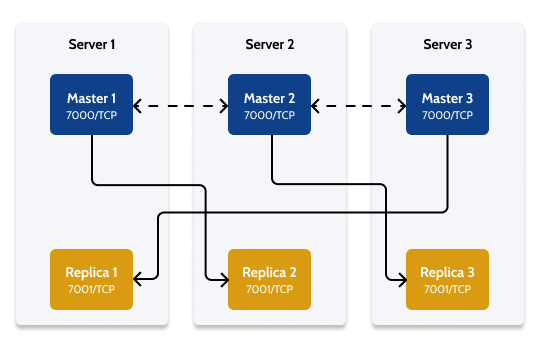
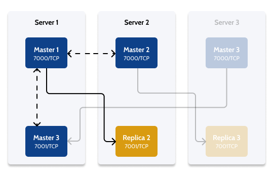

# Redis Cluster high availability architecture

Applies to OutSystems self-managed infrastructures.

The following diagram depicts the architecture of a 3-node Master/Replica Redis Cluster infrastructure:

In this infrastructure there are 3 cluster nodes, running on 3 server machines. Each server machine has two `redis-server` processes running, a Master process and a Replica process. Since there are two `redis-server` processes running, they must listen in different ports. In this article, we'll use port 7000 for the Master `redis-server` process, and port 7001 for the Replica `redis-server` process.

Additionally, cluster nodes communicate with each other using ports 17000 and 17001. To obtain these port numbers, add 10000 to each data port, as detailed in the [Redis documentation](https://redis.io/topics/cluster-tutorial).

Note that, in this architecture, the Replica processes monitoring the Master are crossed, meaning that they don't runn on the same server machine. With this setup, if a server machine fails completely, a Replica process running on a different machine takes over the Master process of the failed server. Redis handles this cross-node assigment automatically when creating the Redis Cluster.

For example, if Server 3 fails and becomes unavailable, the Replica process running on Server 1 takes over, becoming the new Master (blue) listening on port 7001.

