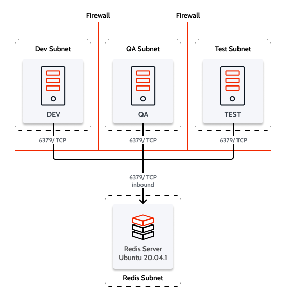

# Set up a Redis server for non-productive environments

Before you start, make sure you meet the [system requirements](requirements.md) for using Redis with OutSystems.

You can use a single Redis server for all non-productive environments (for example, for Development, QA, and Test), since the expected load of concurrent users is much lower than in the Production environment.

For a single Redis server, you can use the default TCP port 6379. You should deploy a Redis server in a dedicated virtual machine or Docker container running Ubuntu 20.04.1 LTS.

OutSystems recommends that you deploy the single Redis server in a subnet different from all the OutSystems platform environment front-end servers. Assuming that each environment (DEV, QA, etc.) has its own subnet for the environment's front-end servers, make sure that the deployed Redis virtual machine is reachable from all these subnets.

Additionally, your configuration must allow **inbound connections** on port 6379/TCP for the Redis virtual machine.

The following diagram depicts this network deployment:

### Install and configure Redis Server

The following instructions assume that you have a server running with Ubuntu 20.04.1 LTS where you wish to install Redis Server.

Do the following:

1. Connect to the Ubuntu server using SSH.

1. Run the following commands:

        sudo apt-get update
        sudo apt-get install redis-server
        sudo ufw allow 6379

1. Edit the `/etc/redis/redis.conf` file with your preferred editor (we'll use `nano`, which is already installed in Ubuntu), by running the following command:

        sudo nano /etc/redis/redis.conf

1. In the `redis.conf` file, perform the following changes:

    * Comment the line with the `bind` directive by adding a `#` character at the beginning of the line
    * Change `protected-mode` from `yes` to `no`
    * Uncomment the `requirepass` directive
    * In the `requirepass` line, define a strong password, replacing `[STRONG_PASSWORD]` with a password that's at least 16 characters long

    Here are the relevant file sections:

        # ~~~ WARNING ~~~ If the computer running Redis is directly exposed to the
        # internet, binding to all the interfaces is dangerous and will expose the
        # instance to everybody on the internet. So by default we uncomment the
        # following bind directive, that will force Redis to listen only into
        # the IPv4 loopback interface address (this means Redis will be able to
        # accept connections only from clients running into the same computer it
        # is running).
        #
        # IF YOU ARE SURE YOU WANT YOUR INSTANCE TO LISTEN TO ALL THE INTERFACES
        # JUST COMMENT THE FOLLOWING LINE.
        # ~~~~~~~~~~~~~~~~~~~~~~~~~~~~~~~~~~~~~~~~~~~~~~~~~~~~~~~~~~~~~~~~~~~~~~~~
        #bind 127.0.0.1
        
        (...)

        #
        # By default protected mode is enabled. You should disable it only if
        # you are sure you want clients from other hosts to connect to Redis
        # even if no authentication is configured, nor a specific set of interfaces
        # are explicitly listed using the "bind" directive.
        protected-mode no

        (...)

        # Require clients to issue AUTH <PASSWORD> before processing any other
        # commands.  This might be useful in environments in which you do not trust
        # others with access to the host running redis-server.
        #
        # This should stay commented out for backward compatibility and because most
        # people do not need auth (e.g. they run their own servers).
        #
        # Warning: since Redis is pretty fast an outside user can try up to
        # 150k passwords per second against a good box. This means that you should
        # use a very strong password otherwise it will be very easy to break.
        #
        requirepass [STRONG_PASSWORD]

After performing these steps, your server is ready to accept connections from OutSystems front-end servers.

## Next steps

* Follow the instructions in [Configure Platform Server to use Redis for sessions](setup-platform-server-redis.md) to configure your non-productive OutSystems environment to use Redis for in-memory session storage.
