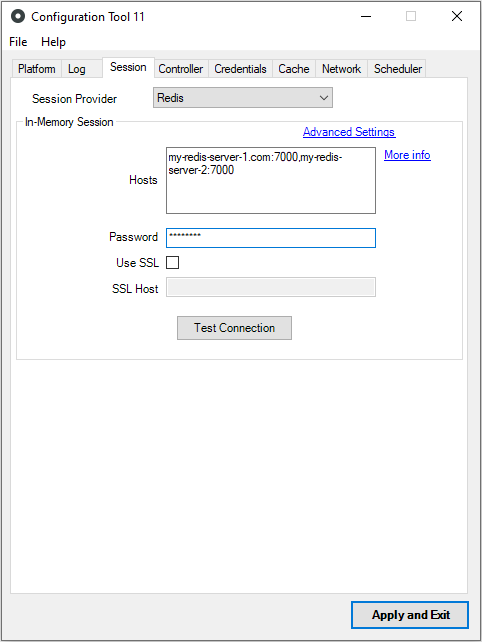
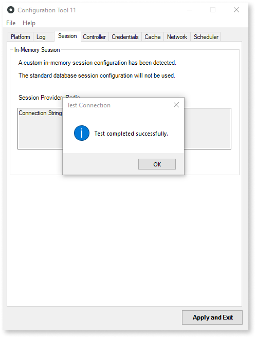

# Configure Platform Server to use Redis for sessions

Applies to OutSystems self-managed infrastructures.

You need **Platform Server version 11.23.0** to use Redis for in-memory session storage.

This article assumes that you have a Redis Cluster with three server machines, as described in [Set up a Redis Cluster for Production environments](setup-prod.md). However, the instructions are also applicable if you have a single server machine running Redis Server.

After making sure that you have a working Redis infrastructure, configure the OutSystems front-end servers of your OutSystems environment for in-memory session storage using Redis.

Do the following:

1. On each front-end server, edit the `server.hsconf` file and add the following XML content:

        <InMemorySessionConfiguration ProviderKey="Redis">
            <ConnectionString encrypted="false">172.31.6.35:7000,172.31.11.176:7000,172.31.3.184:7000,password=[ACCESSKEY]
            </ConnectionString>
        </InMemorySessionConfiguration>

    In the `ConnectionString` element, enter the addresses and ports of all Redis Master processes in the Redis Cluster, separated by commas. If you have just one server running `redis-server`, enter its address and port.

    Also in the `ConnectionString` element, replace `[ACCESSKEY]` with the password that you set in the Redis configuration file.

    

    The Redis password is **required** in Configuration Tool, which doesn't accept Redis connection strings without a password.

    

1. Run Configuration Tool as an Administrator and open the **Session** tab.

    

    Configuration Tool displays the connection string you configured in the previous step.

1. Click **Test Connection** to verify that the Redis server machines are reachable from the Platform Server machine and that everything works properly at runtime.

    

    If you get an error saying "It was not possible to connect to Redis server", review your firewall rules and network connections to make sure that ports 7000 and 7001 are reachable from the OutSystems front-end servers.

1. If the connection test is successful, click **Apply and Exit**.

1. Configuration Tool displays a popup  asking you to publish the latest version of Service Center and System Components. Accept by clicking **OK**.

    If you're configuring an existing installation, republish all modules so that they use Redis sessions.

Your front-end server is now configured to store sessions in Redis.

## Testing your configuration

When the Service Center installation finishes, test if the sessions are being saved in Redis by doing the following:

1. Log in to Service Center and perform some browsing in Service Center's UI.

1. To confirm that Platform Server is using Redis, open an SSH connection to one of the cluster server machines and connect to the Redis Cluster by running the following command:

        redis-cli -c -h 172.31.6.35 -p 7000 -a [ACCESSKEY]

    Alternatively, if you have a single machine running Redis Server, open an SSH connection to your Redis server machine and run the following command:

        redis-cli -h 127.0.0.1 -p 7000 -a [ACCESSKEY]

    Replace `[ACCESSKEY]` with the Redis Server password.

1. Run the command `KEYS *` on the `redis-cli` prompt to check if your session was effectively created. You should have two keys: `{....}_Data` and `{....}_Internal`.

    Sample output:

        redis 172.31.6.35:7000> keys *
        1) "{478870b9-2d60-4f73-9eb3-7cd8b994a737_amhe3zeho1eqp5h0p0gt31ha}_Internal"
        2) "{478870b9-2d60-4f73-9eb3-7cd8b994a737_amhe3zeho1eqp5h0p0gt31ha}_Data"
