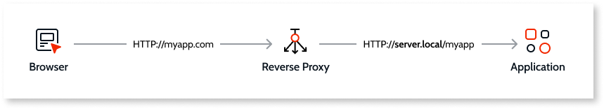
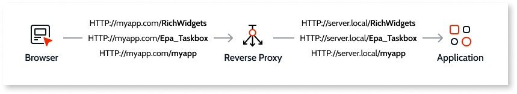
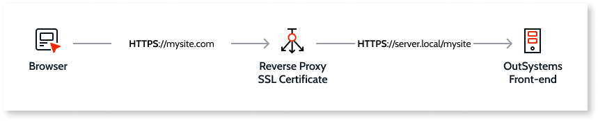
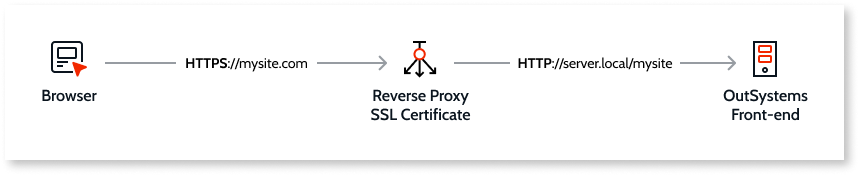
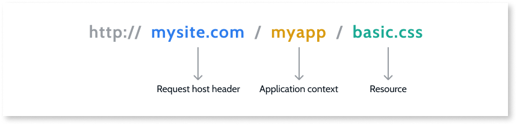
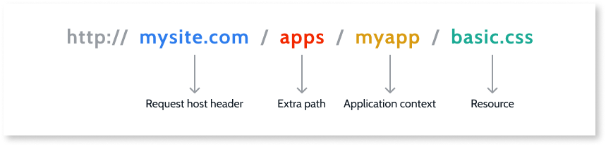

# OutSystems configurations in reverse proxy scenarios

These configurations are implemented in several layers through different technologies. These solutions have been internally tested.

<div class="warning" markdown="1">

Some of these configurations require direct manipulation of OutSystems system database tables. Do not manipulate these tables in any other form not described in this document or indicated by OutSystems official support. Unexpected changes in these tables may result in service disruption.

</div>

## A - Request Header Manipulation { #A }

<div class="info" markdown="1">

Applies only to **Traditional Web Apps**

</div>

This occurs at a reverse proxy level. It translates the Internet exposed address into the internal application address.



To the Internet, your application is known and reachable by the address `myapp.com`. However, it’s served as `server.local/myapp` by the application server.

There are several different ways to accomplish this task depending on your reverse proxy. Below is an example configuration using a reverse proxy with Apache HTTP Web Server serving an application. For other technologies, please check the appropriate documentation.

```
< VirtualHost *:80 >
ProxyRequests off
ProxyPreserveHost off 
ServerName myapp.com 
ProxyPass / http://server.local/
ProxyPassReverse / http://server.local/
< / VirtualHost > 
```

## B - Referenced Content Exposure { #B }

<div class="info" markdown="1">

Applies to **Mobile**, **Reactive Web** and **Traditional Web Apps**

</div>

OutSystems applications can reference content outside the application context URL path. An example of this are the resources in **RichWidgets**. These also need to be exposed by the reverse proxy the same way the main application is.

The image below shows the **myapp** application, and the **Richwidgets** and **EPA_Taskbox** references also exposed.



Depending on the level of URL manipulation, these references may also need the following:

* Rewrite resource URLs inside the code **(not supported for Mobile and Reactive apps)**
* Request Header Manipulation

## C - End-to-end SSL and SSL Offloading { #C }

<div class="info" markdown="1">

Applies to **Mobile**, **Reactive Web** and **Traditional Web Apps**

</div>

When serving secure applications through a reverse proxy, OutSystems supports the following setups:

* **End-to-End SSL**: Encrypting the communication end-to-end. This can be done by installing an SSL certificate in every OutSystems application server, and also in the reverse proxy. It can be the same certificate if it is multi-server or wildcard.

 

* **SSL Offload**: Install an SSL certificate in the reverse proxy. This keeps the traffic unencrypted between the reverse proxy and the internal application servers. It also removes the need to manage certificates in each application server. This technique is called SSL offloading.

    

In **SSL Offload** scenarios, two configurations need to be applied:

1. Add a custom HTTP header at the reverse proxy level. The header instructs OutSystems which was the protocol used in the request received by the reverse proxy.

    To do so, configure a rule in the reverse proxy that adds the parameter `X-Forwarded-Proto` with value of:
    
    * `https` if the received request by the reverse proxy was using the HTTPS scheme.
    
    * `http` otherwise.

1. In the OutSystems database, create the `OutSystems.HubEdition.HTTPtoHTTPSproxyHeader` parameter:

    `insert into OSSYS_PARAMETER (Name,Val) values ('OutSystems.HubEdition.HTTPtoHTTPSproxyHeader','X-Forwarded-Proto: https')`

    **Description:** Allows you to set a special header that, when present, allows the server to process the request as if it was secure.

    **Parameter:** `OutSystems.HubEdition.HTTPtoHTTPSproxyHeader`

    **Values:** `X-Forwarded-Proto: https`

    **Default:** (none)

Aditionally, make sure the IP address of the reverse proxy is configured in the Trusted proxy addresses in **Service Center** (Administration > Security > Network Security).

After applying the above configurations, the following must be executed:

1. Restart OutSystems services and application server.

1. Republish the application.

### Server.API and Server.Identity configurations

Server.API and Server.Identity only support the standard header names for protocol identification - `X-Forwarded-Proto` and originating IP address of a request - `X-Forwarded-For`. This means that the reverse proxy needs to set the necessary information in the HTTP headers using those header names, otherwise you might encounter errors. 

## D - Rewrite URLs in resources { #D }

<div class="info" markdown="1">

Applies only to **Traditional Web Apps**

</div>

Application resources, like HTML, JavaScript and CSS, include absolute and relative URLs.

Typical reverse proxies only manipulate HTTP headers. They don’t parse web resource code, therefore this code isn’t manipulated. The HTML received by the client will contain absolute URLs based on what the platform generates, not considering reverse proxy transformations.

In OutSystems applications, a resource URL like CSS or JavaScript is generated from the request host header plus the application context.



In the example below, the URL for the application is to be changed by adding an extra path “apps” after the request host header. This scenario is used when there is a requirement to serve several applications under a common path.



This change will invalidate all absolute URLs in the resources (HTML, CSS and JavaScript).

To implement this requirement, you need to rewrite all URLs in the resources. This must be done in a request post-processing step before it's sent to the client, preferably at the reverse proxy level.

You can access [here](reverse-proxy-apache-config.md) the configuration required on an Apache Web Server to implement this scenario.

This configuration covers both application runtime, development, and console administration (Service Center and LifeTime).

## E - Disable content compression { #E }

<div class="info" markdown="1">

Applies only to **Traditional Web Apps**

</div>

Application resources such as CSS, JavaScript, HTML and others are served compressed by the application servers. This feature reduces the payload and thus, the time to load the application.

In a reverse proxy scenario where the content requires a rewrite operation, the code cannot be compressed at the application server level.

To disable compression, follow the instructions below.

### Platform Level

Disable the platform's own AJAX compression by creating the `OutSystems.HubEdition.CompressHttpAjaxResponse` parameter in the OutSystems database, if it doesn't exist:

`insert into OSSYS_PARAMETER (Name,Val) values ('OutSystems.HubEdition.CompressHttpAjaxResponse','False')`

**Description:** If set to `False`, the AJAX responses will not be compressed by OutSystems (if IIS is configured to compress, AJAX responses will be compressed).

**Parameter:** `OutSystems.HubEdition.CompressHttpAjaxResponse`

**Values:** `True` / `False`

**Default:** `True`

### Application Server Level

#### Microsoft IIS 

1. Create the `IIS.SetHttpCompression` parameter in the OutSystems database, if it doesn't exist:

    `insert into OSSYS_PARAMETER (Name,Val) values ('IIS.SetHttpCompression','False')`

    **Description:** When set to `False`, instructs the Configuration Tool not to enable IIS compression settings.

    **Parameter:** `IIS.SetHttpCompression`

    **Values:** `True` / `False`

    **Default:** `True`

1. In IIS Management Console, [disable the static and dynamic content compression](https://www.iis.net/configreference/system.webserver/httpcompression).

#### JBoss AS 7.1.1

1. In the OutSystems servers, edit the file `/opt/jboss-as-7.1.1.Final/bin/standalone-outsystems.properties`.

1. Set `org.apache.coyote.http11.Http11Protocol.COMPRESSION` to `off`.
 
1. Restart JBoss.

#### Wildfly 8.2

1. In the OutSystems servers, edit the file `/opt/wildfly-8.2.0.Final/standalone/configuration/standalone-outsystems.xml`.

1. Comment the following line, to look like this:

   ```
   <!--filter-ref name="gzipFilter" predicate="exists['%{o,Content-Type}'] and regex[pattern='(?:text/javascript|text/css|text/html|text/xml|text/json|application/json|application/javascript)(;.*)?', value=%{o,Content-Type}, full-match=true]"/-->
   ```

1. Restart Wildfly.

## F - Adjust keep-alive connection timeout { #F }

<div class="info" markdown="1">

Applies only to **Mobile** and **Reactive Web Apps**

</div>

Some reverse proxy implementations, namely Apache and Apache-based ones, have the keep-alive feature (also known as HTTP persistent connection feature) enabled by default and define a default connection timeout value of 5 seconds, which can cause issues on OutSystems Mobile and Reactive Web apps.

If you are using the persistent connection functionality in your reverse proxy, make sure that either the reverse proxy is not setting any keep-alive connection timeout, or the connection timeout value is set to **at least 30 seconds**.

For example, to configure this setting in Apache-based software, use the `KeepAliveTimeout` directive in your server or virtual host configuration file:

    `KeepAliveTimeout 30`

Note that this change might have a performance impact in Apache, especially under heavy load. Check the Apache documentation on the [KeepAliveTimeout directive](https://httpd.apache.org/docs/2.4/mod/core.html#keepalivetimeout) for more information.
