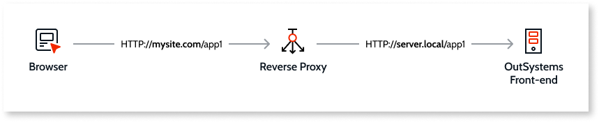
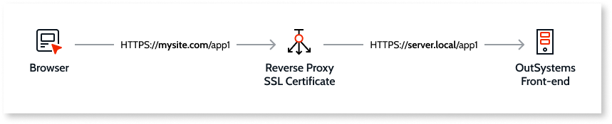
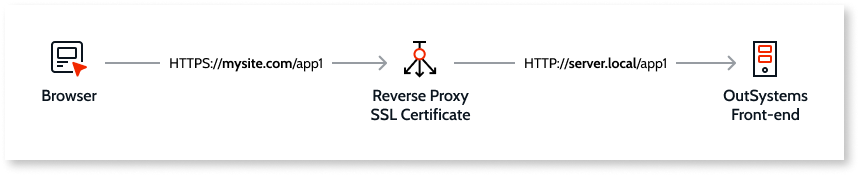
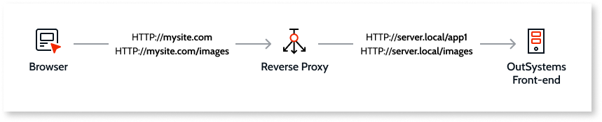
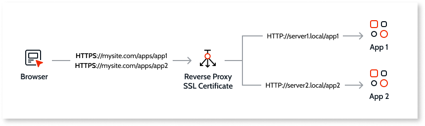

# Common use cases in reverse proxy scenarios

With many possible usages, some common use cases and the configuration to be performed to implement each scenario are detailed below.

## HTTP Redirection

Applies only to **Traditional Web Apps**

A website exposed on the Internet and served by an internal application server. The reverse proxy delivers all requests with `http://mysite.com` as a target to the internal application server.

This scenario prevents the application servers to be directly exposed to the internet.

Only standard reverse proxy configuration is required on this example. Please refer to your manufacturer documentation.

## HTTPS Redirection with End-to-end SSL

A website securely exposed on the Internet and served securely by an internal application server. The reverse proxy delivers all requests in HTTPS to the internal application server, which will also serve the content in HTTPS, keeping the HTTPS protocol end-to-end.

This scenario ensures encrypted communications from the internal application server to the user browser.

To implement this scenario, you have to perform the following configurations:

* [C1 - End-to-end SSL](reverse-proxy-config.md#C)
* [F - Adjust keep-alive connection timeout](reverse-proxy-config.md#F) (for Mobile and Reactive Apps)

## HTTPS Redirection with SSL Offload

A website securely exposed on the Internet and served by an internal application server.

The reverse proxy encrypts the communication to the Internet while keeping a standard HTTP communication with the internal application servers.

This configuration is called SSL offload. It centralizes the certificate management on the reverse proxy that also does all the encryption, easing the load from the application servers.

To implement this scenario, you have to perform the following configurations:

* [C2 - SSL Offload](reverse-proxy-config.md#C)
* [F - Adjust keep-alive connection timeout](reverse-proxy-config.md#F) (for Mobile and Reactive Apps)

## Request Header Manipulation and Referenced Content

Applies only to **Traditional Web Apps**

A website named `mysite.com` with references to an **Images** module on the server.

Both modules, **App1** and **Images** must be exposed requiring reverse proxy configuration for each.

This scenario is used when there’s a corporate reverse proxy for several other third party applications and services.

To implement this scenario, you have to perform the following configurations:

* [A - Request Header Manipulation](reverse-proxy-config.md#A)
* [B - Referenced Content Exposure](reverse-proxy-config.md#B)

## SSL Offload, Request Header Manipulation and Application Path Changes

Applies only to **Traditional Web Apps**

Serving multiple secure applications with URL and path alteration. This setup is used when the reverse proxy serves several websites and applications in a hierarchic path organization.

To implement this scenario, you have to perform the following configurations:

* [A - Request Header Manipulation](reverse-proxy-config.md#A)
* [B - Referenced Content Exposure](reverse-proxy-config.md#B)
* [C - End-to-end SSL and SSL Offloading](reverse-proxy-config.md#C)
* [D - Rewrite URLs in resources](reverse-proxy-config.md#D)
* [E - Disable content compression](reverse-proxy-config.md#E)

## More information

To learn more about how to set up OutSystems with a reverse proxy check the [Using OutSystems in Reverse Proxy Scenarios](intro.md) guide.
