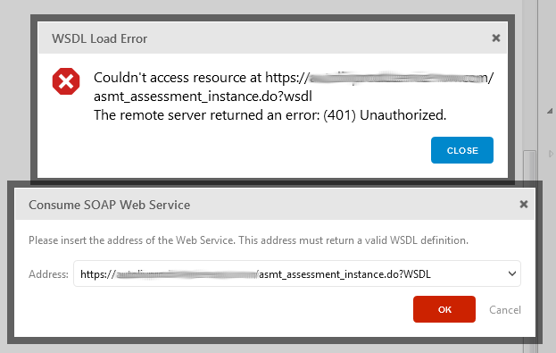
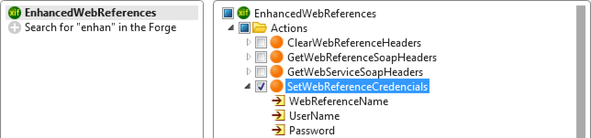

# How to call a SOAP web service with authentication

## Question

I am having some issues with a Soap Web Service I am trying to import to OutSystems.

After trying to use the option "Consume Soap Web Service…" I am getting the following error. The Web Service that I try to connect to has an authentication, but I don’t know where to add the user and password.

Can you please help me with this?

## Answer

if your web service requires authentication then what you need to do is first fetch the WSDL from your browser and save it locally on your disk. Then instead of pointing to the URL you have to put the path to the file in the filesystem (e.g `c:\\mysoap.wsdl`) and this should allow you to import the web service.

Also if your WS requires authentication when invoking you might have to set the proper credentials. For that you can use the **SetWebReferenceCredentials** from the **EnhancedWebReferences** extension to set the username and password.

