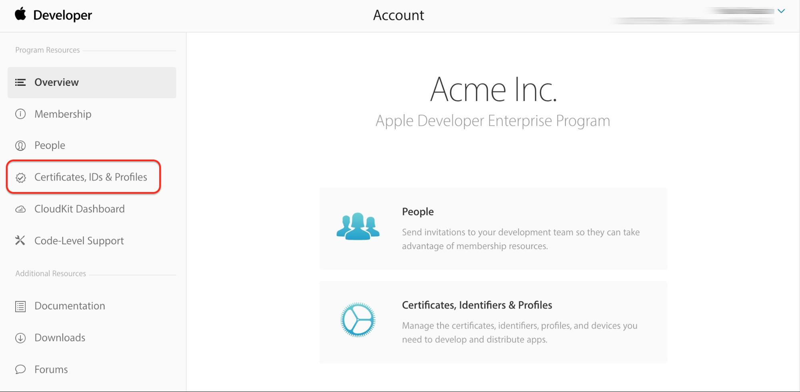
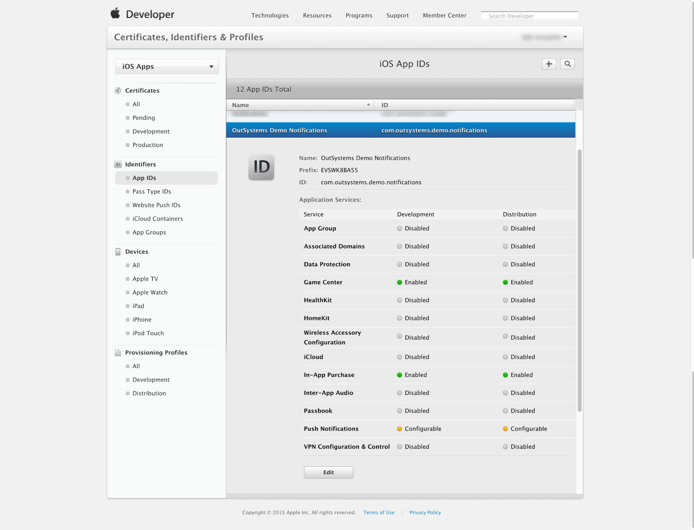
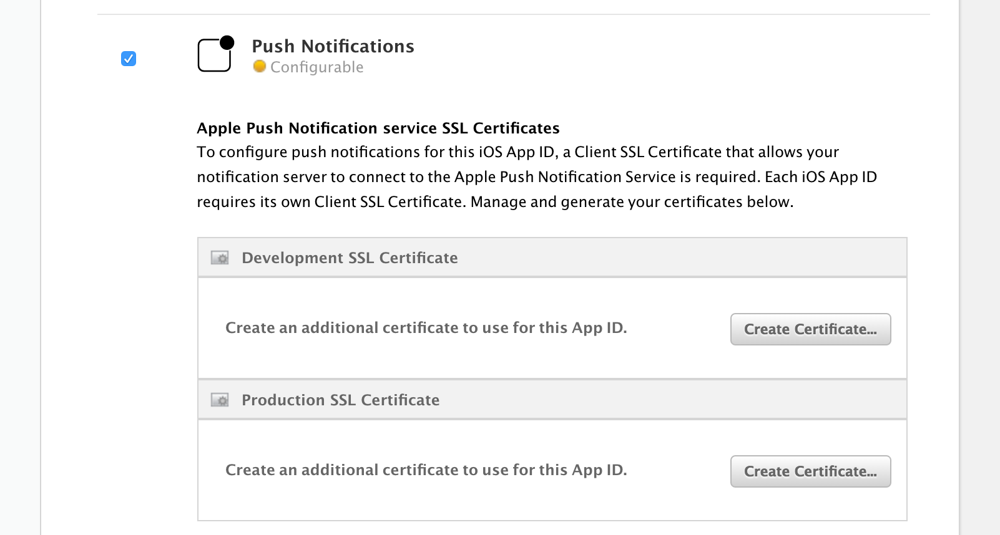
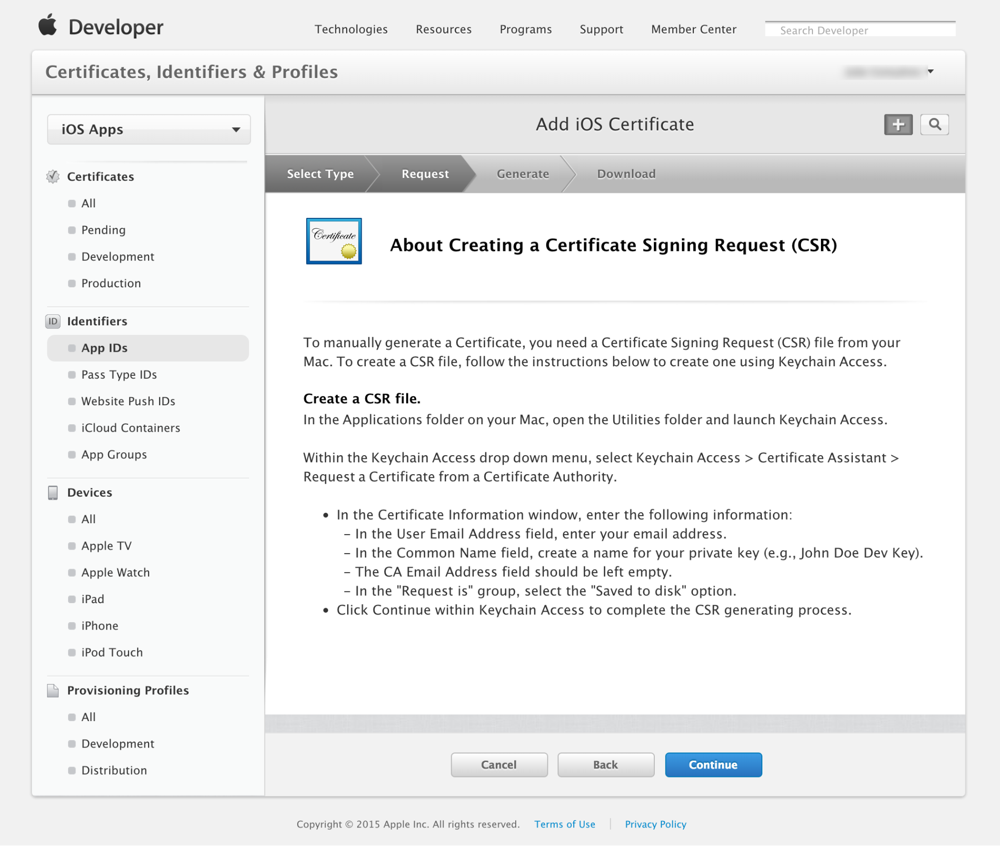
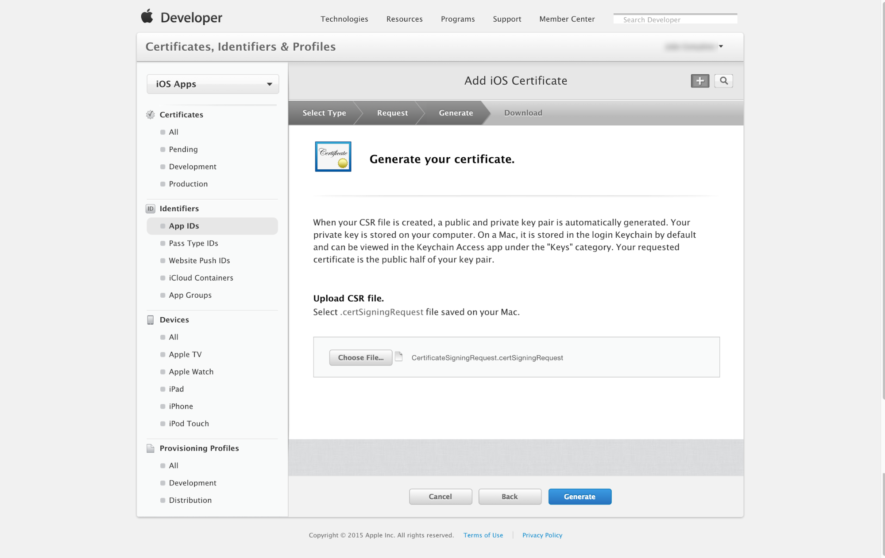
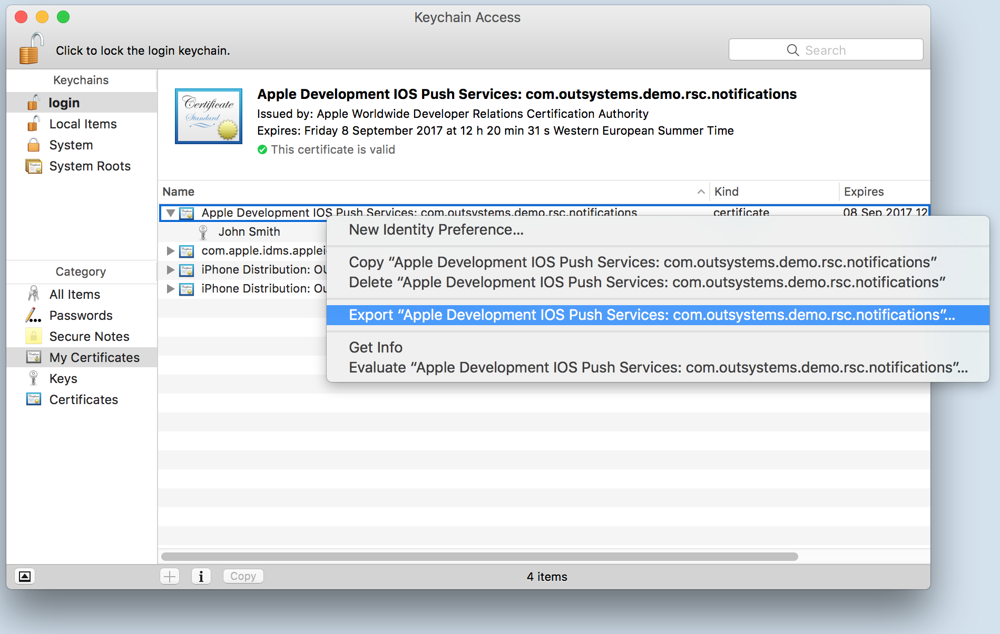
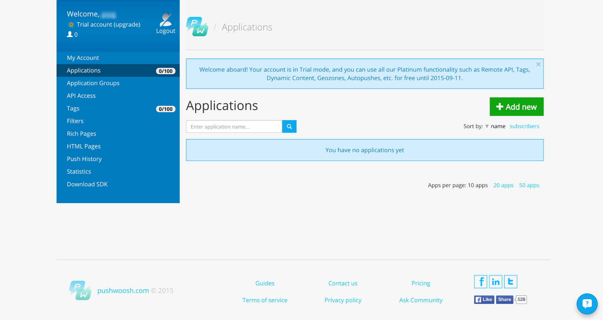
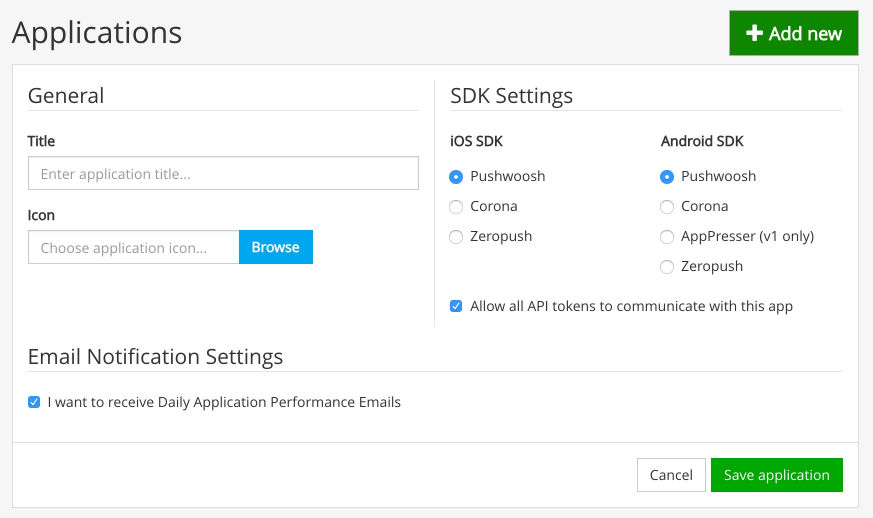

# How to Configure Pushwoosh for iOS

To configure Pushwoosh for iOS, follow these steps. 

You will need a Mac computer for this process.

## Creating an Application Identifier (App ID)

For an application, Apple Push Notification Service (APNS) requires a unique application identifier (App ID) configured with “Push Notifications” enabled. To create one, access your Apple developer account at: [https://developer.apple.com/membercenter/](https://developer.apple.com/membercenter/ "https://developer.apple.com/membercenter/") and enter **Certificates, Identifiers & Profiles**.

Select **App IDs** and the “+” on the right side of the page to create a new identifier:

Complete the form and select **Push Notifications** from “App Services”.

## Create an APNS Certificate

APNS Certificates are bound to one application ID. There are two application service configurations for each application ID:

* Development 
* Distribution 

Development APNS Certificates enable a developer to set up push notifications for an application in development. 

Push notifications do not work in the simulator.

Access **iOS App IDs** from the Apple Developer Member Center and locate the application identifier you wish to configure. Click the **Edit** button.

Scroll down to “Push Notifications” and click **Create certificate** for either Development or Distribution.

Follow the steps on the page to generate a certificate signing request.

If you don't have access to a Mac [here](<https://success.outsystems.com/Documentation/10/Delivering_Mobile_Apps/Generate_and_Distribute_Your_Mobile_App/More_Information_on_Generating_and_Distributing_Mobile_Apps#create-a-certificate>) is how you can generate a certificate signing request on a Windows machine.

Upload the newly created certificate signing request file and click the **Generate** button. Once that is done, download the created certificate and add it to your keychain.

## Export Certificates from Keychain

When configuring the iOS settings for an application in Pushwoosh, you must upload the public APNS certificate and its private key for a specific application ID. In step 2, we generated a certificate; now we will export it from the keychain.

Open Keychain, locate the desired certificate and export the public certificate. Usually APNS certificates have a “Apple Development IOS Push Services” prefix or “Apple Production IOS Push Services” prefix followed by the application identifier. Export it as “.cer”.

Export the associated private key. 

Remember the password you choose when exporting, because it’ll be needed later when setting up iOS on Pushwoosh.

## Create an Application in Pushwoosh

Access your Pushwoosh account at: [https://cp.pushwoosh.com/applications](https://cp.pushwoosh.com/applications "https://cp.pushwoosh.com/applications"). Create a new application by clicking the **Add new** button.

Pushwoosh recommends the setup of two applications: one for development and one for distribution.

In this example, we’ll create and configure an application using a development APNS certificate. The process is exactly the same for distribution.

Give the new application a name, an icon and choose **Pushwoosh** under iOS SDK and Android SDK. Click **Save application**.

## Configure iOS

In the screen that opens, you’ll see an application code. This code is unique to each Pushwoosh application and is used by your application. In the iOS ribbon on this screen, click **Configure**.

On the **Manual** tab, complete the required information. **Certificate file (.cer)** is the public certificate exported earlier. **Push Certificate (.p12)** is the private key that was exported. **Private key password** is the password picked in the export process for the private key. **Framework** should be set to Native.

Click **Save**. You've now configured Pushwoosh for iOS.
