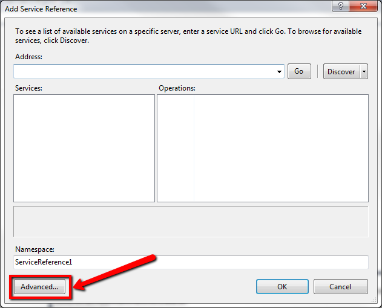
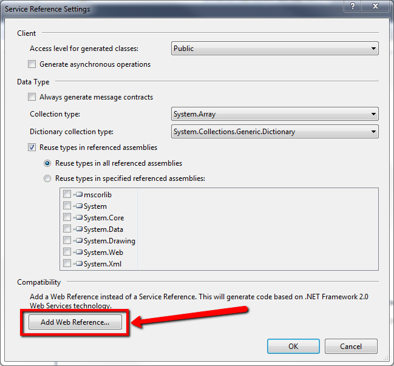
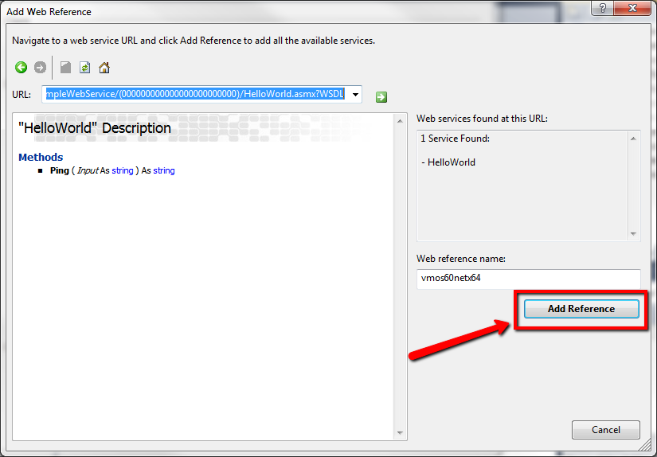

# How to consume a Web Service in Integration Studio

OutSystems includes a [feature to import Web Services](https://success.outsystems.com/Documentation/11/Extensibility_and_Integration/SOAP/Consuming_SOAP_Web_Services) and automatically create the code and data structures to be able to call Web Service methods, just like you were using actions built with Service Studio.

However, there are some patterns of Web Services which can't be natively consumed with this feature. For these cases, the alternative is to consume the Web Service in Integration Studio.

This article explains step by step how to create an Extension to consume a Web Service using Integration Studio. The basic layout of what you need to do is the following:

1. Create an Extension with one Action for every Web Service method you need to use.

1. Create a data model (structures) to represent the data types in your Web Service.

1. Import the Web Service in the Extension's code using Visual Studio.

1. In the Action implementation, call the Web Service method by mapping the inputs and outputs from the Web Service data types to your Extension data model.

This article cheats through steps 2 and 4 by having a very simple data model, but that's usually where you spend most development time.

## Consume a Web Service in Integration Studio

The example below shows a simple Web Service named HelloWorld that contains only one method, named Ping. This method returns the input Text with "pong: " prepended to it.

To consume this Webs Service, do the following:

1. Create an Action for the Ping method, and set up its inputs and outputs according to the data types defined in the Web Service. In this case, the types are simple Texts. Usually, this might get a bit more complex with structures to hold more complex data types.

    

1. Now you need to implement the Action. For that, open the extension's source code by clicking the "Edit Source Code .NET" button on the toolbar.

    

    This opens Visual Studio. Now you need to import the Web Reference in .Net.

1. Right Click on "Service References" and click "Add Service Reference..."

    

1. Click "Advanced..."

    

1. Click "Add Web Reference..."

    

1. Fill the URL Field with the path to your WSDL and click the little green arrow.

    

1. After the WSDL loads and all the information seems correct, click "Add Reference" to add it to your project.

    

    Now you only have to implement the Ping Action so that it calls the Web Service.

1. Edit the WebServiceConsume.cs file and add the following to the header:

        using  OutSystems.NssWebServiceConsume.vmos60netx64;

1. Implement the MssPing method with:

        HelloWorld webservice = new  HelloWorld();
        ssOutput = webservice.Ping(ssInput);

1. Close Visual Studio, Verify and Save the Extension, and publish it on the server.

Now, your modules can reference this Extension's Ping Action and use the HelloWorld Web Service.

With this you can import any Web Service supported by Visual Studio into OutSystems.

To inspect the code yourself, check out [this sample app](https://www.outsystems.com/forge/component-overview/7374/webservice-via-extension-sample-app) published by the OutSystems community.
