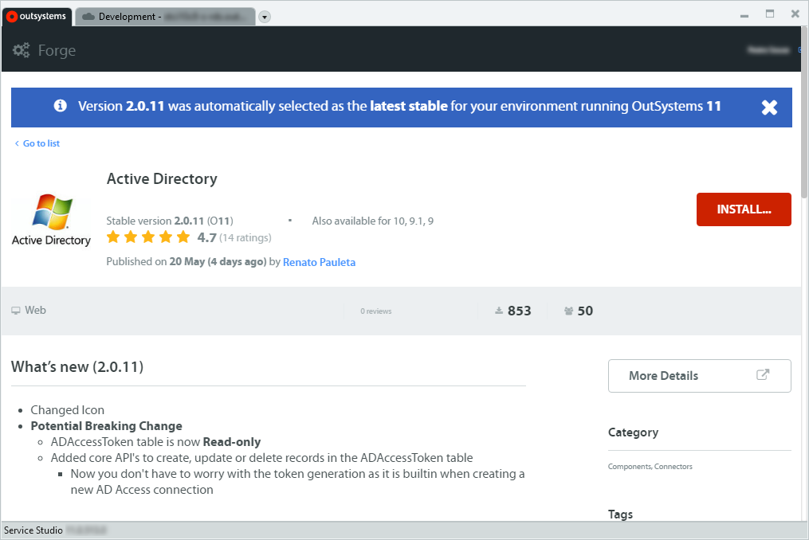
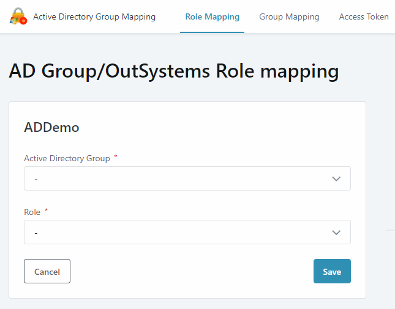
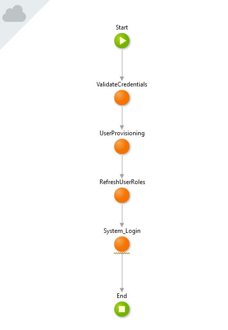

# How to map Active Directory Groups to OutSystems Roles

Many organizations use Active Directory (AD) to define groups, users, user rights and permissions. OutSystems supports a similar model of Groups, Users and Roles. However, this might mean that you need to make changes in both sides (Active Directory and OutSystems) when updating user rights, permissions and roles. 

This document presents a way of mapping Active Directory Groups to OutSystems Roles using two OutSystems Forge components: "Active Directory" and “Active Directory Group Mapping”. This allows you to manage your user rights and permissions model in only one place, i.e. in Active Directory Groups, and then map those Active Directory Groups to OutSystems Roles. The setup is only finished after defining when and how the synchronization happens between Active Directory and OutSystems.

Though this mapping is especially useful when you're authenticating the end users of your OutSystems applications using Active Directory, this is not a requirement. You can still map Active Directory Groups to OutSystems Roles even when using Internal Authentication or LDAP. Check [End Users Authentication](https://success.outsystems.com/Documentation/11/Developing_an_Application/Secure_the_Application/End_User_Management/End_Users_Authentication) for more information.

## Before you start 

Before starting the mapping procedure itself, there are a few concepts of Active Directory and OutSystems Roles that you should know. 

* The following section will introduce you to the essential Active Directory concepts that will allow you to follow the procedure. 

* For more information on OutSystems Roles, check [User Roles](https://success.outsystems.com/Documentation/11/Developing_an_Application/Secure_the_Application/User_Roles) in the OutSystems documentation.

### Active Directory Groups

Groups in Active Directory are used to collect user accounts, computer accounts, and other groups into manageable units. Working with groups instead of individual users helps simplify network maintenance and administration.

There are two types of groups in Active Directory:

* **Distribution groups** – Used to create email distribution lists. These groups are not security enabled, which means that they cannot be listed in discretionary access control lists (DACLs).

* **Security groups** – Used to assign permissions to shared resources. Security groups can provide an efficient way to assign access to resources on your network. You can assign user rights to security groups in Active Directory and assign permissions to security groups for resources.

For more information on Active Directory Groups, user rights and permissions check [Microsoft’s official documentation](https://docs.microsoft.com/en-us/windows/security/identity-protection/access-control/active-directory-security-groups).

The "Active Directory Group Mapping" from the OutSystems Forge that we will use in the following sections allows you to map the two types of Active Directory groups (Distribution Groups and Security Groups) to OutSystems Roles.

## Mapping Active Directory Groups to OutSystems Roles

The procedure of mapping Active Directory Groups to OutSystems roles can be summarized in the following steps:

1. Download and install the required Forge components

2. Create an Access Token to access Active Directory information

3. Define mappings between Active Directory Groups and OutSystems Roles in the Active Directory Group Mapping application

4. Adjust the login process in your OutSystems applications

**Note**: This mapping implements a specific use case where we want to directly map an Active Directory Group to an OutSystems Role. You can customize the instructions provided in the following sections to your own use case if you have different requirements.

### 1. Download and install the required Forge components

You will need to install the following components available in the Forge:

* [Active Directory](https://www.outsystems.com/forge/component-overview/1023/active-directory)

* [Active Directory Group Mapping](https://www.outsystems.com/forge/component-overview/6032/active-directory-group-mapping) 

To install the **Active Directory** component do the following:

1. Open Service Studio and connect to the development environment where you will install the Forge components.

2. In the application list screen click **Install Application**. Service Studio will open a tab with the Forge website.

3. Search for "active directory" and click the Active Directory component.

 

4. Click **Install…** and, when the component is ready to be installed, click **Install**.

To install the **Active Directory Group Mapping** component, follow the previous steps but searching for "active directory group mapping" instead in the Forge page.

### 2. Create an Access Token to access Active Directory information

1. In Service Studio, go to the application list screen and click the "Active Directory Group Mapping" application.

2. Click **Open in Browser**.

 

3. When you open the web application for the first time you will get a warning telling you to create an Active Directory Access Token. Before creating any mappings you will need to create this Access Token.
Provide the fields for creating the token: the name of the token record, the domain and the credentials of a user (username and password) with access to the Active Directory for that domain.

*(optional)* You can define the base context for searches performed in the Active Directory by filling in the "Container" field with the Distinguished Name of the base Active Directory node. This will narrow down all searches to a sub-tree starting in the provided base node. Example value: CN=Users,DC=dcserver,DC=mycompany,DC=com. This field is optional; if you don't fill it in, the Active Directory search operations will be less specific, but everything will work properly if the other fields are correct.

4. Click the **Save** button.

### 3. Define mappings between Active Directory Groups and OutSystems Roles

In this step we will use the Active Directory Group Mapping application to define the mappings between Active Directory Groups and OutSystems Roles. Only the Active Directory Groups included in these mappings will be considered when synchronizing information from Active Directory to OutSystems.

1. Navigate to the "Role Mapping" screen of the “Active Directory Group Mapping” application (it might take a few seconds).

2. Click **Create New Mapping**.

3. Select the Active Directory Group and OutSystems Role you wish to create a mapping for and click **Save**.

 

4. Repeat this process for all the desired mappings between Active Directory Groups and OutSystems Roles you wish to create.

After creating all the mappings, you can [start the synchronization process on demand](https://success.outsystems.com/Documentation/How-to_Guides/How_to_map_Active_Directory_Groups_to_OutSystems_Roles#Synchronizing_Active_Directory_data_on_demand) in Service Center or [configure the schedule of the SyncRoles timer](https://success.outsystems.com/Documentation/How-to_Guides/How_to_map_Active_Directory_Groups_to_OutSystems_Roles#Defining_the_schedule_of_the_SyncRoles.2FSyncGroups_timer) and wait for its next execution.

### 4. Change the login process in your OutSystems applications

To be able to refresh the roles before initiating a user session you will need to change the "Login" screen action (available in the Login screen in "Common" UI flow of your app) to include a call to the "Login\RefreshUserRoles" action of the ActiveDirectoryRolesCore module **before the user session is created**. 

When using Active Directory Group Mapping to map Active Directory Groups to OutSystems roles, the login flow of your OutSystems application should perform the following tasks:

1. Validate the users credentials in the external authentication provider.

2. Create the user in the local Users entity in the OutSystems database, if it doesn't exist.
**Note:** The Active Directory Group Mapping component assumes that the Username attribute of the Users entity (for AD users) is composed of the domain, a "\" (backslash) character and the "sAMAccountName" attribute of the Active Directory user object: `<domain> + "\" + <ADUser_sAMAccountName>`. 

3. *(optional) *Update attributes of the user in the OutSystems database with the data available in the external authentication provider (name, email, mobile phone, "Is_Active" flag).

4. **(new step) Refresh the authenticated user's OutSystems roles based on the mappings defined in the Active Directory Group Mapping application (using "Login\RefreshUserRoles" action).**

5. Log in the user in OutSystems application (silent login) creating a user session with the updated roles.

By default, your OutSystems application will just call the "User_Login" action (from the Users module) in the "Login" screen action. This action performs some of the steps outlined above. However, you might have already changed your "Login" screen action according to your needs.

Based on the current login flow of your application, follow the instructions according to your scenario: 

**Scenario A) You're still using the "User_Login" server action.**

You should **replace this call with your own custom logic** to fulfill the steps outlined above.

You shouldn't use the "User_Login" action in this case because you cannot add the role refreshing logic where needed, because many of these steps outlined above are performed inside the User_Login action.

**Scenario B) You might have changed the Login screen action already and you're not using the User_Login server action anymore.**

In this case, include the "Login\RefreshUserRoles" action of the ActiveDirectoryRolesCore module in your current login logic, making sure to include it at the right moment of the flow, as outlined above (after validating user credentials but before creating the user session in OutSystems).

In both cases you will need to [add a reference to the RefreshUserRoles action](https://success.outsystems.com/Documentation/11/Developing_an_Application/Reuse_and_Refactor/Expose_and_Reuse_Functionality_Between_Modules#reuse-functionality-from-other-modules) from the ActiveDirectoryRolesCore module using the Manage Dependencies dialog.

Here’s an example of a revised Login flow:

Check the ADAuthenticationSample module in the "Active Directory Group Mapping" application for an example of a revised "Login" flow.

The sample implementation does the following in each node:

* **ValidateCredentials**: Authenticates the user in the Active Directory using the "ADUsers\AD_UserValidateLogin" action of the ActiveDirectoryCore module.

* **UserProvisioning**: Creates the user in the local OutSystems database if it doesn't exist. Syncs the user attributes with the data from the Active Directory using the "SyncADUser" action from the ActiveDirectoryRolesCore module.

* **RefreshUserRoles**: Refreshes the roles assigned to the user according to the mappings between Active Directory Groups and OutSystems Roles. Calls the "Login\RefreshUserRoles" action of the ActiveDirectoryRolesCore module.

* **System_Login**: Performs the login of the user in the OutSystems application, creating a user session. Calls the "Login" action of the (System) module.

#### About the RefreshUserRoles action of the ActiveDirectoryRolesCore module

The "Login\RefreshUserRoles" action of the ActiveDirectoryRolesCore module checks the Permissions (Active Directory Groups) of the User being logged in and grants/revokes OutSystems Roles according to the mappings for the Active Directory Groups.

The value of the Username input parameter should be the value of the "sAMAccountName" attribute of Active Directory users. If you are using LDAP to log in, you should already be using this attribute to access your account and you can use it as the Username value when calling the Login action.

## Synchronization between Active Directory and OutSystems

The synchronization between the Active Directory Groups and the roles assigned to OutSystems users occurs in several moments:

* **When the user logs in successfully.** After validating the credentials in the Active Directory, the roles associated with the user that is logging in are updated based on its associated Active Directory Groups and on the mappings defined in the "Active Directory Roles Mapping" application.

* **When one of the provided synchronization timers runs.** The "Active Directory Roles Mapping" application provides several timers for regularly synchronizing data from Active Directory. Check the next section for more information.

### Available Timers

The "ActiveDirectoryRolesCore" module of the “Active Directory Roles Mapping” application provides 3 timers that you should configure according to your synchronization needs:

* **SyncRoles**— Updates the roles assigned to every user of the Active Directory Groups present in active mappings.
If you deactivate a mapping in the "Active Directory Roles Mapping" application, the next execution of this timer will remove the OutSystems role associated with the AD Group (in the mapping record) from the users that belong to that AD Group.

* **SyncGroups**— similar to the SyncRoles timer, but for synchronizing user Roles based on the defined mappings between Active Directory Groups and OutSystems Groups. Check the [Synchronizing Active Directory Groups with OutSystems Groups](https://success.outsystems.com/Documentation/How-to_Guides/How_to_map_Active_Directory_Groups_to_OutSystems_Roles#Synchronizing_Active_Directory_Groups_with_OutSystems_Groups) section below for more information.

* **SyncUsers**— this timer executes a placeholder action named "SyncADUser" for each OutSystems user. To set up user data synchronization you must implement the logic of this action yourself, since it’s heavily dependent on each use case. 
For example, you can use this action to activate/deactivate users according to their status in the Active Directory.

### Defining the schedule of the SyncRoles/SyncGroups timer

You should configure the schedule of the SyncRoles or SyncGroups timer (depending on the type of mappings you’re using) according to the update rate of your Active Directory. These timers have no schedule defined by default. If your Active Directory Groups change often you will probably want to run the OutSystems Role/Group timer often. 

We recommend that you set the timer to run every 20/30 minutes. 

You can set the timer schedule in Service Center by doing the following:

1. In Service Center, available at `http://<environment_address>/ServiceCenter`, navigate to Factory > Applications and click "Active Directory Roles Mapping" in application list.

2. In the Modules tab, click "ActiveDirectoryRolesCore" and select the “Timers” tab.

3. Click the link with the name of the timer you wish to configure (either "SyncRoles" or “SyncGroups”) to define or edit its schedule.

 

4. Define the timer schedule in the "Time" field. You can either input specific times when the timer should run, separated by spaces (e.g. entering 00:00 07:00 would run the timer at 12am and 7am every day) or set the interval in the “Generate time with intervals of“ field and click **Generate** to generate all the specific times in a day based on that interval.

**Note**: The Roles of a User that are updated during a synchronization operation will not be applied while the user has a valid session. Check the [Session Timeouts and Persistent Logins](https://success.outsystems.com/Documentation/How-to_Guides/How_to_map_Active_Directory_Groups_to_OutSystems_Roles#Session_Timeouts_and_Persistent_Logins) section below for more information.

### Synchronizing Information about the Users (SyncUsers)

The SyncUsers executes a **placeholder action** named "SyncADUser" that can be used to update each existing OutSystems user according to changes in the corresponding user in the Active Directory. To set up user data synchronization you must implement the logic of this action yourself, since it’s heavily dependent on each use case. 

For example, you may want to activate/deactivate users based on their status in the Active Directory. Note that if the user is deactivated in the Active Directory and some sort of user activation/deactivation sync process is executed, the same user will not be able to log in when the session times out.

Our recommendation is that this timer runs once per day (overnight). The timer is scheduled to run everyday at midnight, by default.

### Synchronizing Active Directory data on demand

Besides setting a schedule for the provided timers, you can also run them on demand using Service Center. This allows you to synchronize the data between the Active Directory Groups and the OutSystems Roles/Groups outside the timer schedule. Check [Run a Timer in Service Center](https://success.outsystems.com/Documentation/11/Developing_an_Application/Use_Timers/Create_and_Run_Timers#run-a-timer-in-service-center) for more information.

**Note**: Performing an on-demand synchronization using Service Center does not guarantee that the new Roles will be effective immediately. Check the [Session Timeouts and Persistent Logins](https://success.outsystems.com/Documentation/How-to_Guides/How_to_map_Active_Directory_Groups_to_OutSystems_Roles#Session_Timeouts_and_Persistent_Logins) section for more information.

### Synchronizing Active Directory Groups with OutSystems Groups

In addition to mapping Active Directory Groups to OutSystems Roles, the Active Directory Group Mapping application also allows you map Active Directory Groups to OutSystems Groups. This mapping is defined in the "Group Mapping" screen of the application.

However, we do not recommend that you configure both mapping types (both to OutSystems Roles and to OutSystems Groups), since this can cause inconsistent data.

### Session Timeouts and Persistent Logins

The session timeout defined for your OutSystems environment should be carefully considered. 

New roles synchronized from the Active Directory Group information will not become effective until the user logs out from OutSystems applications and starts a new session or until his current session times out. The session timeout can be defined [in the machine.config file](https://success.outsystems.com/Documentation/11/Developing_an_Application/Use_Data/Sessions_in_Web_Applications#session-timeout) or [using Factory Configuration](https://www.outsystems.com/forums/discussion/34866/how-to-change-the-session-timeout-in-factory-configuration/).

Also, make sure you turn off [Persistent Login](https://success.outsystems.com/Documentation/11/Developing_an_Application/Secure_the_Application/End_User_Management/End_Users_Authentication/Persistent_Login) if you have this setting configured. When using persistent logins, the user session only ends if the user logs out or after 10 days of inactivity. This behavior would also prevent any new roles from being applied in a timely fashion.

## Known Limitations

The Active Directory Group Mapping component currently requires that the OutSystems front-end servers belong to the domain configured in the Active Directory Access Token. 

