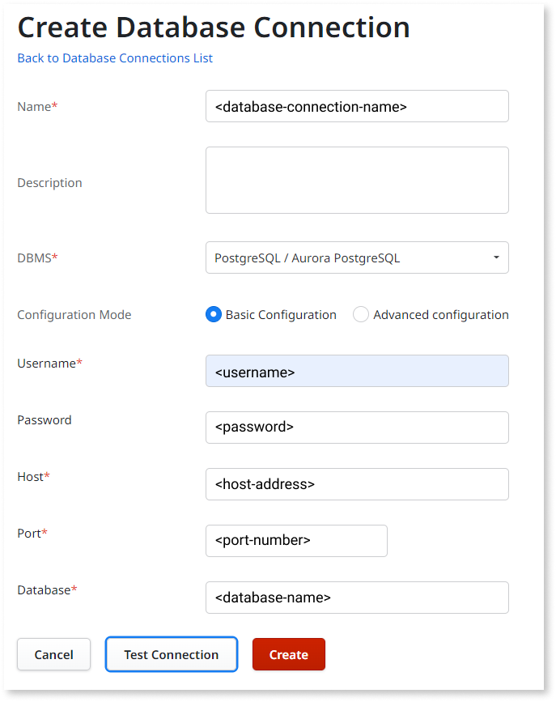

# Migrate from ardoPostgreSQL to supported PostgreSQL connector

Follow this guide to migrate from the third-party ardoPostgreSQL connector to the OutSystems supported PostgreSQL connector.

## Prerequisites

* Platform Server 11.15.0 or later.
* The PostgreSQL database is on one of the [supported versions](https://success.outsystems.com/documentation/11/setup_outsystems_infrastructure_and_platform/setting_up_outsystems/outsystems_system_requirements/#postgresql-database).

## Migrating to supported PostgreSQL connector

To migrate from the ardoPostgreSQL connector to the OutSystems supported PostgreSQL connector, you can follow different approaches:

1. Adapt your existing extensions to use the supported connector, then republish and test the consumer modules.

    This option is useful if you have a big number of consumers, but you must test each of the consumers to ensure they work properly with the new connector.

1. Create new extensions using the new database connector, and then update existing consumer modules to reference the new extensions.

    This options has an increased development effort, as you need to open each consumer module in Service Studio to ensure they use the new extensions. You must also test each of the consumers to ensure they work properly with the new connector.

1. Create new extensions using the new database connector, and then create new consumer modules with the same functionality as the existing consumers.

    This option has the highest development effort, as you need to re-create the functionality of each consumer module, but it's also the less risky one.

This article focuses on the **first option**, which includes the following key steps:

1. [Create new database connection](#create-db-connection)

1. [Update database connection for extensions](#update-extensions)

1. [Refresh entities in extensions](#refresh-extensions)

1. [Republish consumer modules](#republish-consumers)

1. [Test consumer modules](#test-consumers)

1. [Deploy the updated extensions and consumers to other environments](#deploy)

### Create database connection { #create-db-connection }

Start by creating a supported **PostgreSQL / Aurora PostgreSQL** database connection in the development environment by doing the following:

1. In the Service Center console of the development environment, go to **Administration tab** > **Database Connections**.

1. Select **New Database Connection**, set **DBMS** to **PostgreSQL / Aurora PostgreSQL**, and set the remaining fields.

    

1. Select **Test Connection** to check if the connection is working correctly, and then select **Create** to create the database connection.

### Update database connection for extensions { #update-extensions }

Update each extension that uses the ardoPostgreSQL database connection, ensuring they use the supported PostgreSQL database connection. Do the following:

1. In **Database Connections**, select the ardoPostgreSQL database connection. This database connection has **PostgreSQL** as the **Provider Name**.

    

1. In the **Extensions** tab of the database connection, select the first extension that uses the database connection.

1. In the **Operations** tab of the extension, change the **Database Connection** to the new database connection you previously created.

1. Repeat steps 2 and 3 for each extension that uses the ardoPostgreSQL database connection.

### Refresh entities in extensions { #refresh-extensions }

Refresh each of the extensions updated in the previous step by doing the following:

1. In Integration Studio, open one of the extensions you updated.

1. Select **Refresh Entity**, and then publish the extension to the development environment.

1. Repeat steps 1 and 2 for each extension you updated.

### Republish consumer modules { #republish-consumers }

Republish the consumer modules that have dependencies to the updated extensions, and also any other modules that have dependencies to those consumer modules, by doing one of the following:

* In Service Center, create and publish an ["all components" solution](https://success.outsystems.com/Support/Enterprise_Customers/Maintenance_and_Operations/Creating_and_using_an_%22All_Components%22_solution)

* In Service Center, create and publish a solution containing the consumer modules that have dependencies to the updated extensions, and also any other modules that have dependencies to those consumer modules.

### Test consumer modules { #test-consumers }

Test each of the modules that have dependencies to the updated extensions, and also any other modules that have dependencies to those consumer modules. Ensure each module has no runtime errors or unexpected behavior while showing or saving data.

It's **critical** that you pay special attention to the **data types** of saved data. The way both connectors handle the [data types mapping](https://success.outsystems.com/Documentation/11_x_platform/Reference/OutSystems_Language/Extensibility_and_Integration/Mapping_External_DB_Data_Types_to_OutSystems_Data_Types) may differ.

### Deploy the updated extensions and consumers to other environments { #deploy }

After updating the extensions and ensuring every consumer module works as expected, deploy them to the other environments by following [this how-to guide](https://success.outsystems.com/Documentation/11_x_platform/Managing_the_Applications_Lifecycle/Deploy_Applications/Deploy_an_Integration_With_an_External_Database).
