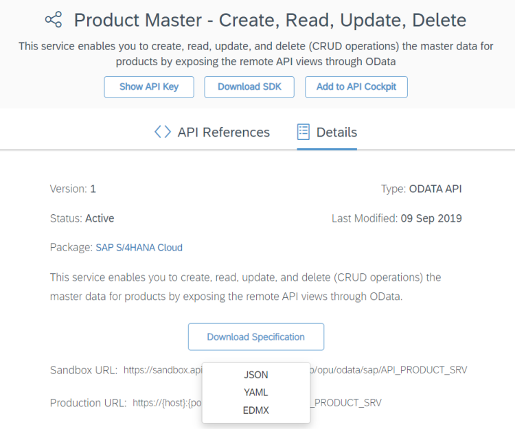
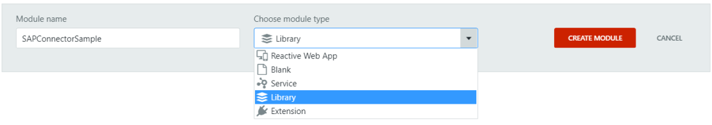
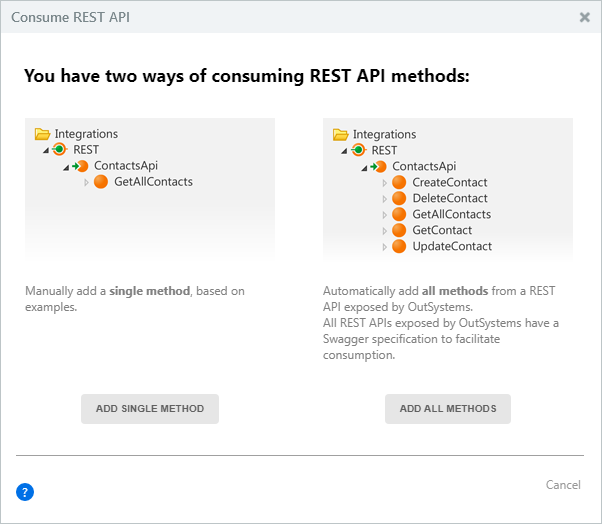
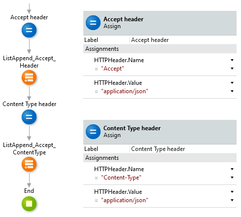
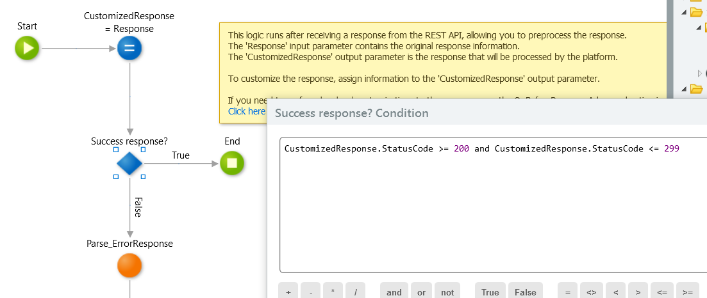
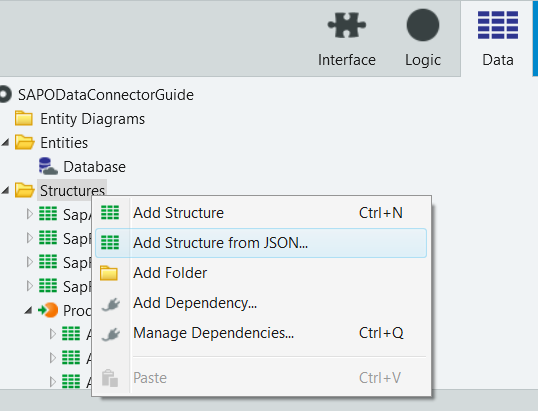
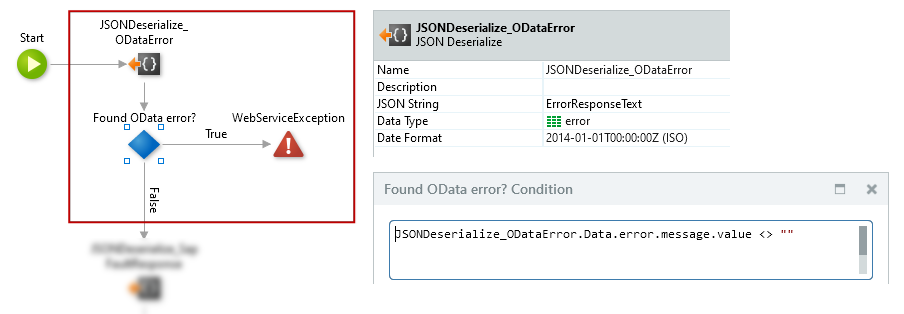
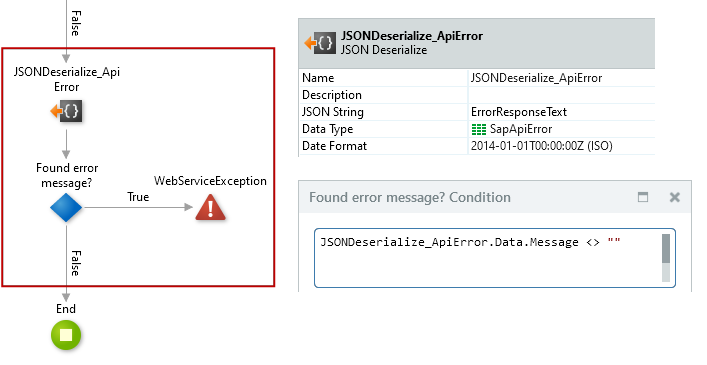

# How to consume an SAP OData service in OutSystems

We recommend [using **Integration Builder** to integrate with SAP OData](https://success.outsystems.com/Documentation/11/Extensibility_and_Integration/Integration_Builder) instead of following the current article and creating an integration from scratch. Check the [prerequisites to use Integration Builder to integrate with SAP OData](https://success.outsystems.com/Documentation/11/Extensibility_and_Integration/Integration_Builder/Use_Integration_Builder/SAP_OData_integration#Prerequisites), and [how to use Integration Builder](https://success.outsystems.com/Documentation/11/Extensibility_and_Integration/Integration_Builder/Use_Integration_Builder).

To consume an SAP OData service in OutSystems you need to:

1. Obtain the service specification file from SAP API Business Hub
1. Consume the service in Service Studio
1. Make some final adjustments

This document goes through each of these tasks.

You can find a [sample implementation](https://www.outsystems.com/forge/component-overview/7167/sap-odata-example) of the tasks described in this topic in the OutSystems Forge.

## Obtaining the service specification

In this first step, you must identify the service you want to consume and download the service specification.

Do the following:

1. Open the [SAP API Business Hub](https://api.sap.com/).

    

1. Search for the service in the search box.  
    In the example presented in this guide, we are using the "Product Master - Create, Read, Update, Delete" service from SAP S/4HANA Cloud.

1. Click the service name to go to the service page and then navigate to the **Details** tab.

    

1. Click **Download Specification** and select the **JSON** option, since Service Studio supports creating services from JSON Swagger file specifications.  
    _Note:_ To download the specification, you must sign in to your SAP account.

## Consuming the service in Service Studio

### Create a new module

You should isolate the consumed service in a separate module, created for this specific purpose, according to the following guidelines:

* If you only use the service in **Reactive Web** and **Mobile** Apps, create a "Library" module.
* If you need to use the service in a **Traditional Web** App, create a "Service" module.

### Create a service from the specification

In Service Studio, consume the service using the JSON Swagger specification file you previously downloaded.

Do the following:

1. In the **Logic** tab of your module, right-click the **REST** element under **Integrations** (not the SAP element) and choose **Consume REST API...**

    

1. Choose the **Add All Methods** option.

    

1. Click **Choose a File**, select the specification file you downloaded previously, and click **Finish**.

    _Note:_ A service specification in SAP may contain attributes with several types (example: Text, Integer, and Null), but this is not supported in OutSystems. In this case, the platform assumes the most permissive type for these attributes and shows a warning message about these changes.

    

    If this warning message appears, close it to proceed.

## Making some final adjustments

### Handling parameters containing a dollar sign ($) in its name

In the OData standard, GET methods returning lists of records have input parameters with reserved keywords, starting with a dollar sign ($). Those input parameters are:

$select
:   Allows you to define which fields we want the API to return. You'll probably want to delete this input parameter since OutSystems doesn't support dynamic output structures.

$orderby
:   Lets you specify the fields you want to use to sort the result set.

$filter
:   Allows you to filter the result set by specifying conditions in the format defined in section "10.2.3.1. The $filter System Query Option" of the [OData specification](https://www.odata.org/documentation/odata-version-3-0/odata-version-3-0-core-protocol/).

$expand
:   Allows you to expand child entities.

$inlinecount
:   The automatically generated structures do not take into account this inline count attribute. You can delete this input parameter.

$skip
:   Allows you to skip a certain number of results at the beginning of the result set.

$top
:   Allows you to define the maximum number of records in the result set.

Due to encoding issues, any outgoing requests made to the service do not include the "$" (dollar sign) character for these input parameters. You can overcome this issue by using an "OnBeforeRequest" handler. For more information on these handlers, check [Simple Customizations](https://success.outsystems.com/Documentation/11/Extensibility_and_Integration/REST/Consume_REST_APIs/Simple_Customizations).

To create the "OnBeforeRequest" handler do the following:

1. In Service Studio, select the tree element under the **REST** folder that corresponds to the imported service.

1. Add an "OnBeforeRequest" handler to your consumed service by setting the property "On Before Request" to `New OnBeforeRequest`.

    

1. Open the "OnBeforeRequest" callback action, now available under the REST API element, to define its flow.

In the "OnBeforeRequest" handler do the following:

1. Create a copy of the URL query parameters list.
1. Iterate through all the URL query parameters in the new list using a For Each.
    1. For each element, check if the query parameter matches one of the reserved names (minus the dollar sign).
    1. If it matches, add a "$" (dollar sign) at the beginning of its name.

For example, if we found a URL query parameter named "top" we would add a "$" at the beginning of its name so that it would become "$top".

Implementation example:

### Adding required headers to the requests

SAP OData services require two additional headers on each request to indicate the type of content of the request body as JSON and to ask for the same content type in the response. Add these headers to the "OnBeforeRequest" handler that you created previously to handle "$" characters in parameter names.

Do the following:

1. Add a local variable with "HTTPHeader" data type to the "OnBeforeRequest" handler.

    _Note:_ The "HTTPHeader" data type is a structure that was created by OutSystems when you consumed the SAP service in Service Studio.

    

1. Assign the following values to the "Name" and "Value" attributes of the local variable using an Assign element:

    &lt;LocalVariableName&gt;.Name = `"Accept"`  
    &lt;LocalVariableName&gt;.Value = `"application/json"`

1. Add this HTTPHeader structure to the headers list of the request (i.e. the "CustomizedRequest.Headers" list) using the ListAppend server action.

    

1. Repeat the two previous steps to add another HTTP header with the following "Name" and "Value". You should reuse the same local variable.

    &lt;LocalVariableName&gt;.Name = `"Content-Type"`  
    &lt;LocalVariableName&gt;.Value = `"application/json"`

Example implementation of adding the two headers:

### Handling error responses

Usually, when there's an error in an SAP OData service call, the service returns a response using a different structure from the usual success response. You need to add an ["OnAfterResponse" handler](https://success.outsystems.com/Documentation/11/Extensibility_and_Integration/REST/Consume_REST_APIs/Simple_Customizations) to the consumed service in OutSystems to parse this structure so that you have a more appropriate exception, both for throwing and logging purposes.

Unfortunately, error structures might be different depending on the level where the error occurred. This means that the instructions provided in this guide might not cover all possible error types that can occur in your specific use case.

Do the following:

1. In Service Studio, select the tree element under the **REST** folder that corresponds to the imported service.

1. Add an "OnAfterResponse" handler to your consumed service by setting the property "On After Response" to `New OnAfterResponse`.

    

In the "OnAfterResponse" handler you need to implement the following logic:

1. Check if the response has an error status code. An error status code is any status code that is **not** between 200 and 299.
    1. If the status code represents "success" (status code between 200 and 299) there's nothing to do; you can end the handler flow using an "End" element.
    1. If the code represents an "error", parse the response according to the type of error you received.  
        In the example below the parsing is done in a separate action called "Parse_ErrorResponse".  

Implementation example:

#### Parsing error responses

You should implement logic to handle different kinds of error responses, which use different response structures. For example, should handle at least the following kinds of errors:

* **Data errors**: Errors while fetching, updating, or inserting data, returned using the error structure usually defined in the service specification file.
* **Fault errors**: Errors in authentication and other unexpected errors, usually containing a "fault" element.
* **API errors**: Errors like "Service Unavailable" usually containing an HTTP status code and an error message.

We suggest the following approach to parse error responses in your logic:

1. **Handle data errors**: Try to deserialize the response text into the error structure defined in the service specification. If the resulting structure has a text value for the error message, throw an exception with that value.
1. **Handle fault errors**: Define a structure for these errors based on a sample fault and throw an exception with the text in the "fault" element.
1. **Handle API errors**: Define a structure for these errors based on a sample API error and throw an exception with the text in the "code" and "error" elements, if present.

Learn more about handling these kinds of error responses in the sections below.

_Tip:_ You can create a structure from a sample response in JSON by right-clicking the **Structures** tree element and then selecting **Add Structure from JSON...** option.

##### 1. Handle data errors

In most cases, OutSystems creates an error structure for data errors when importing the service specification. This is the structure that the service returns when there's an error while fetching, updating, or inserting data.
Start your error handling logic by trying to parse the error response into this data error structure.

Do the following:

1. In Service Studio, identify the structure used for data errors. This structure is available in the **Data** tab, in the **Structures** folder, under the element tree with the name of the service.  
    In our example, the error structure is called "error".

    

1. In your error parsing logic (the "Parse_ErrorResponse" action in our example), try to deserialize the response text into this error structure.

1. If the resulting structure has a text value for the error message, throw an exception with that value.

Implementation example:

##### 2. Handle fault errors

In fault errors like authentication errors or unexpected errors, the error response has a different format. If the error response is not a data error, try to parse the response text into the fault error structure next.

Do the following:

1. Create a structure from a sample fault error response by right-clicking the **Structures** tree element and then selecting **Add Structure from JSON...** option.

    Fault response example:

        {
            "fault": {
                "faultstring": "Failed to resolve API Key variable request.header.apikey",
                "detail": {
                    "errorcode": "steps.oauth.v2.FailedToResolveAPIKey"
                }
            }
        }

1. In your error parsing logic (i.e. in the "Parse_ErrorResponse" action in our example) add logic to parse the response text into this fault error structure.

1. If there's a "faultstring" value defined in the structure, throw an exception with the text of this element.

Implementation example:

##### 3. Handle API errors

This is the third kind of error that you should handle in your error logic. API errors occur, for example, when the service is unavailable. In this case, you get a response containing an HTTP status code and an error message.

Do the following:

1. Create a structure from a sample API error response by right-clicking the **Structures** tree element and then selecting **Add Structure from JSON...** option.

    API error example:

        {
            "code": "503",
            "message": "Service is temporarily unavailable for maintenance."
        }

1. In your error parsing logic (i.e. in the "Parse_ErrorResponse" action in our example) add logic to parse the response text into this API error structure.

1. If there's a "message" value defined in the structure, throw an exception with the text of this element.

Implementation example:

