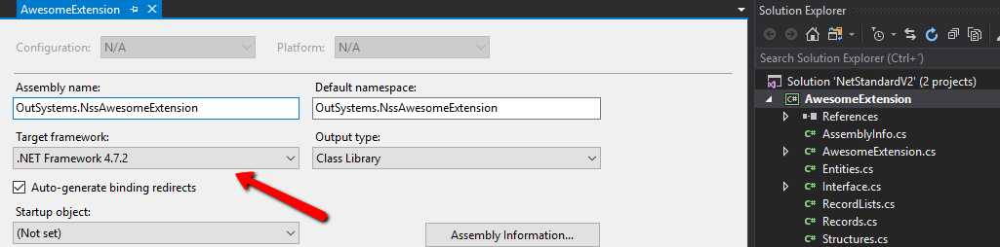
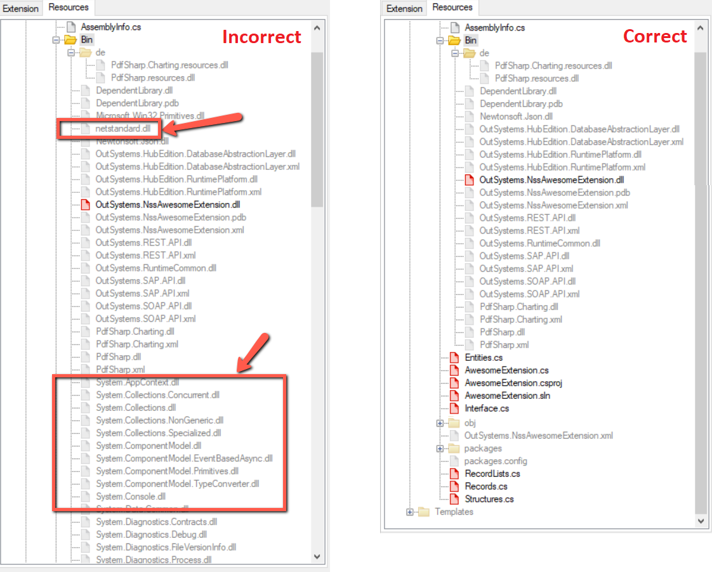

# How to use .NET Standard libraries in OutSystems extensions

## Requirements

* Microsoft Visual Studio 2017
* .NET Framework 4.7.2
* OutSystems Platform Server 11 - Release Apr.2019 or higher

## Use .NET Standard libraries in your extension

Windows improved .NET Standard support for .NET Framework applications in version 4.7.2. You can take advantage of this improvement and use .NET Standard libraries in your extensions.

If you don't follow the instructions on this page, your extensions will be in an **unsupported scenario** (using .NET 4.6.1 along with .NET Standard) that causes runtime issues.

Do the following:

1. Install .NET Framework 4.7.2 and Visual Studio 2017 in your development machine.

1. Change the Integration Studio options to start using Visual Studio 2017 and associated MSBuild to compile the extension.

    

1. Change the extension's main project target framework from ".NET Framework 4.6.1" to ".NET Framework 4.7.2".

    

1. Build your extension and reference the necessary libraries.

Before publishing the extension in Integration Studio, make sure that your extension **doesn't include** system built-in assemblies from .NET Standard:

**Note:** Sometimes you need to include a few system assemblies in your extension, for example `System.Runtime.CompilerServices.Unsafe.dll`. This won't cause any issues.

However, including a large list of system assemblies in an extension is a sign that you're including libraries that shouldn't be present in your extension.

For example, including the following system assemblies in extensions causes runtime issues:

* `netstandard.dll`
* `mscorlib.dll`
* `System.Runtime.InteropServices.RuntimeInformation.dll`
* `System.Net.Http.dll`

To remove the problematic assemblies do the following:

1. In Visual Studio, ensure that the target framework of all projects is `4.7.2`.

1. If necessary, uninstall and install again any third-party NuGet packages.

1. Delete the content of the `\Bin` folder.

1. In Integration Studio, right-click the `\Bin` folder in the **Resources** tab and choose **Exclude from extension**.

1. Click **Update Source Code** in the toolbar to regenerate the OutSystems assemblies inside the `\Bin` folder.

1. Back in Visual Studio, build the solution again and validate that the assemblies weren't added again.
