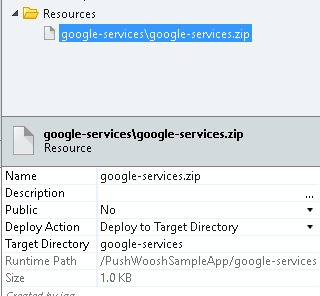

# How to Use Push Notifications with Pushwoosh

Pushwoosh is a service that enables push notifications to be sent to devices, abstracting details like the platform the device is running on. With the Pushwoosh plugin, OutSystems applications can use Pushwoosh to receive and send push notifications.

Note that you'll need a paid subscription of Pushwoosh in order to send push notifications.

## How it Works


1. To receive notifications, you start by using the plugin to register the device in Pushwoosh. 

1. Pushwoosh registers the device in the Apple Push Notification Service (APNS) and in Firebase Cloud Messaging (FCM).

1. Once the devices are registered, you can use the plugin to broadcast a message or send a message targeted to specific users. The plugin sends the message via Pushwoosh.

1. Pushwoosh then contacts the appropriate messaging service. 

1. It is then up to APNS or FCM to deliver the message to the device.

## Installing the Pushwoosh Plugin

Start by installing the Pushwoosh plugin from the OutSystems Forge. The fastest way to do this is to go to the OutSystems tab in your development environment and install from there. 
The plugin is also available [here](https://www.outsystems.com/forge/component-overview/1556/pushwoosh-plugin) on the OutSystems Community.

## Configuring Pushwoosh

You’ll need to configure Pushwoosh for each of the platforms you will be supporting. Once your configuration is done, you’ll have an Application Code from Pushwoosh that will be used with your plugin.

### For iOS

Learn how to [configure Pushwoosh for iOS](../config-pushwoosh-ios/faq.md "How to Configure Pushwoosh for iOS").

### For Android

Learn how to [configure Pushwoosh for Android](https://docs.pushwoosh.com/platform-docs/manage-projects/project-configuration/configure-android-platform).

## Adding the Pushwoosh Plugin to Your Application

1. In your application, use "Manage Dependencies…" to add a reference to the Pushwoosh plugin.

    

1. Add the "PushwooshNotifications" block to:
    * The "Layout" block if your application has no login 
    * The "LayoutBlank" block if your application has login 
    
    When adding the "PushwooshNotifications" block, avoid adding it inside placeholders, because some are only available at design time and, at runtime, Pushwoosh won't work.

1. Set the following parameters in the PushwooshNotifications:

    * **PushwooshApplicationCode:** The Pushwoosh Code that you obtained after creating the application in Pushwoosh. 
    * **FCMSenderId:** The identification number you obtained while configuring Android. You can leave this empty if your application will only be available for iOS. 
    * **NotificationReceivedEvent:** An event that is called when the user clicks a notification on his device, or when a notification is received while the application is open. 

If you're using the Pushwoosh plugin in your Android app, do the following:

1. [Obtain the `google-services.json`](https://support.google.com/firebase/answer/7015592) from Firebase. The package name from the Google services must match the app identifier of the OutSystems application being built.

1. Create a zip file containing the `google-services.json` in the root.

1. Upload the "google-services.zip" file from previous step to your OutSystems application and make sure to:
         
    * Set the "Name" as "google-services.zip"
    * Set "Deploy to Target Directory" as "google-services"



For your device to receive push notifications, you’ll need to register it. If your users need to login to use the application, go to the "Login" screen and edit the "Login" action.


Add the code to register the device after the "DoLogin" action. It should look something like this:


If your application does not have a login, you can add this code to the “OnInitializeOver” event in the “PushwooshNotifications” block.


In this event handler, call the “RegisterDevice” action.


If you’re generating an iOS mobile app using a developer certificate, you will need to add a preference to the Extensibility Configurations property of your OutSystems module:

```
{
    "preferences": {
        "global": [{
            "name": "aps-environment",
            "value": "development"
        }]
    }
}
```


This preference will be added to your entitlements file (learn more about entitlements in the [Apple Developer documentation](https://developer.apple.com/library/content/documentation/Miscellaneous/Reference/EntitlementKeyReference/Chapters/AboutEntitlements.html "https://developer.apple.com/library/content/documentation/Miscellaneous/Reference/EntitlementKeyReference/Chapters/AboutEntitlements.html")).

If you’re generating an iOS mobile app using a production certificate, you won’t need to specify any preference, since the default value of the `aps- environment` preference in OutSystems is `production`.

Your application is now ready to receive push notifications. [Configure and generate your mobile app](https://success.outsystems.com/Documentation/10/Delivering_Mobile_Apps/Generate_and_Distribute_Your_Mobile_App "Configure and Generate Your Mobile App") and install it on your device.
At this point, you can use the Pushwoosh interface to send notifications to your app and make sure that everything is properly configured. Note that you will not see a notification if the app is running. Instead, the event NotificationReceivedEvent is raised immediately.

## Sending Notifications

To send notifications, you need a Pushwoosh API Access Token. Create one by accessing the Pushwoosh console, go to "API Access" and click "Generate new access token".


To send a notification to all devices, use the "SendPushNotificationToAll" action.


This action takes the following parameters:

* **PushwooshApplicationCode:** The Pushwoosh Code that you obtained after creating the application in pushwoosh. 
* **ApiAccessToken:** The Pushwoosh API Access Token obtained earlier. 
* **Message:** The message text you wish to send. 
* **Badge:** A number that is displayed on the iOS application icon. 
* **Deeplink:** A deep link to send with the notification. Learn [how to define deep links](https://success.outsystems.com/Documentation/Development_FAQs/How_to_Define_Mobile_App_Deep_Links "How to Define Mobile App Deep Links"). 

For instance, if you use this action to send the message “Hello from OutSystems” to an application called “PushTest,” the following would be shown in iOS:


## Additional information

* If your app is running, the notification doesn't show on the device. Instead, it is sent to the app and the event NotificationReceivedEvent is raised. You'll need to define what you want the app to do in that situation. 
* Push notifications may take a while to become active. If you don't see the notifications coming through, wait some minutes before further troubleshooting. 
