# How to integrate OutSystems with Workato

The **OutSystems Workato Connector** allows you to take full advantage of Workato platform without any custom development.

Workato is an integration service that can connect to different services, including OutSystems, and set up triggers to kick off certain actions. For example, you can define a trigger in which every new or updated Account record in Salesforce will execute an "upsert" operation in an OutSystems entity.

After installing the connector and setting up access rules, you will be able to:

* Sync any Workato workflow you use with your OS environment.
* Build engaging user experiences with your own data, and external data such as a billing app, field services app, or a 360º customer view.

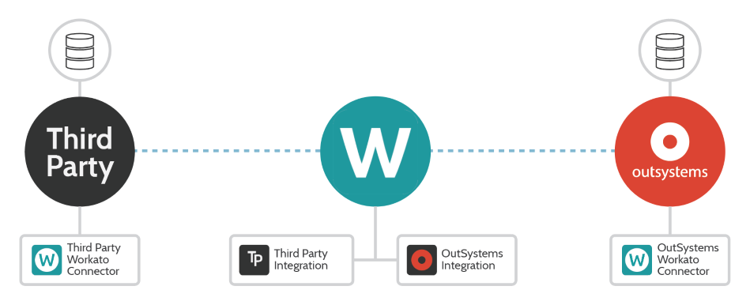

## Installation overview

Before being able to use the connector, you will need to perform several configurations:

**In your OutSystems environment:**

1. Install the OutSystems Workato Connector component from the Forge.
1. Create an API key, used to secure the available APIs, and define the rules for accessing OutSystems entities using the setup screens of the component.

**In Workato:**

1. Create an app connection in Workato using the OutSystems app.

## Installation and configuration in an OutSystems environment

### Install the component from Forge

[Download the OutSystems Workato Connector](https://www.outsystems.com/forge/component-overview/6845/outsystems-workato-connector) component from the OutSystems Forge and install it in your environment.

### Create API key and define rules for accessing OutSystems entities

The OutSystems Workato Connector relies on API Key authentication to secure the available APIs.

A user with the OutSystems "Administrator" role must create at least one API key that you will use later while connecting to OutSystems in Workato. Alternatively, the "WorkatoConnector" eSpace has a Site Property called `AllowDevelopersToConfigure` that will allow users with the OutSystems "Developer" role to also manage API Keys.

After installing the component in your OutSystems environment do the following:

1. In Service Center, navigate to Factory > Applications.

1. Search for the "Workato Connector" application in the list and click its name to navigate to the application detail screen.

1. Cick on **WorkatoConnector** in the modules screen.

1. Click **Open in Browser**. This will take you to the connector's security configuration screen.

1. Click **Add new key**.

    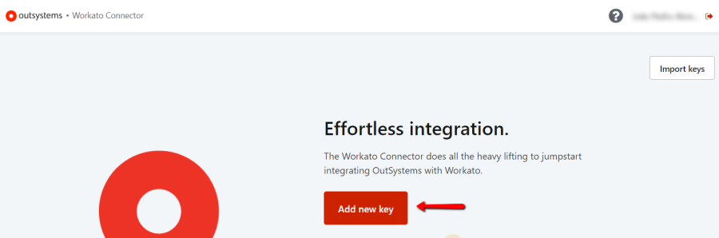

1. In the API key creation screen, enter a name for the key by clicking the first heading of the page.

1. Define the scope of this API key by selecting the OutSystems entities that the key will have access to.  
    Select the **Read**, **Write** or **Read / Write** checkboxes on the right side of the screen according to the kind of access you want to provide for each entity: **Read** for read-only access and **Write** for write access. The **Read / Write** checkbox is an accelerator that will automatically select both **Read** and **Write** checkboxes for an entity.

    

    _Notes:_  
    – You can only provide **read-only** access to Static Entities. The **Write** and **Read / Write** checkboxes are not available for these entities.  
    – If you don't select any of the available checkboxes for an entity, the API key you're creating or editing will not have access to it.

1. Click **Create API Key**.  

If the key is created successfully, you can copy its value to the clipboard directly from the success dialog message:

## Installation in the Workato environment { #installation-workato }

You must create an app connection and provide the connection parameters to connect Workato to OutSystems.

1. In Workato open the **App Connections** tab and click **Create a new connection**.

    

1. In the new connection, choose the **OutSystems** application.

1. Fill in the required fields:  
    **Connection Name** – A name of your choice that identifies the connection.  
    **API Key** – An API key created in the OutSystems Workato Connector.  
    **Environment URL** – The FQDN (fully qualified domain name) of your OutSystems environment, which must be publicly reachable.  

    

1. Click **Link your account** to test and save the connection.  

If the operation succeeds, the Status changes to **Connected**.

## Working with Workato and OutSystems

### Workato Basics

Workato **recipes** are automated workflows built by users that can span multiple integrations. Each recipe is composed of a **trigger** and one or more **actions** that are performed when a trigger event is triggered.

**Triggers** determine what event to listen to in order to execute the actions described in a recipe.

An **action** is executed after a trigger. The available actions depend on each connector (we'll be using the OutSystems Connector), and there are also some generic actions available.

In this document you will find example configurations for two different integration types between Workato and OutSystems:

* A trigger in Workato, fired when there is a change in an OutSystems entity, will cause the execution of one or more actions in another application.
* A trigger in Workato, fired when there is a change in a given application, will cause the execution of one or more actions in OutSystems (for example, updating an entity).

You can implement either just one of these integration types or both, depending on your use case requirements.

### Set up a Workato recipe triggered by changes in an OutSystems entity

**Requirements**

OutSystems entities must have the `UpdatedOn` attribute so that Workato is able to monitor record changes, for the New/Updated record trigger. Make sure you update this attribute every time a record is changed. The date/time value should be in UTC so that it is in sync with the Workato timezone.

OutSystems entities must have an auto-number `Id` attribute so that Workato is able to monitor record creation, for the New record trigger.

In the following example, we'll create a new Workato recipe with a trigger based on a new/updated record in the OutSystems "Account" entity that will cause the execution of one action (in this case, an "upsert" operation) in Salesforce.

#### A. Select and configure the trigger event for an OutSystems entity

1. In Workato open the **Recipes** tab and click **Create a new recipe**.

    

1. Select the **OutSystems** app.

1. Select the desired trigger event:  
    **New record**: New record in Entity. This trigger requires that the Id column is a sequential integer.  
    **New updated record**: New or updated record in Entity. This trigger requires that the entity has an `UpdatedOn` attribute with system updated time.

    In our example, we chose the **New updated record** trigger event.

    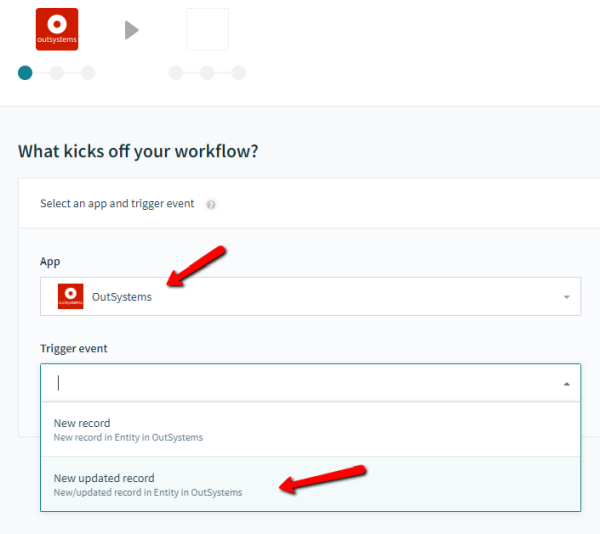

1. Choose the desired connection from the list of available connections to OutSystems accounts.

    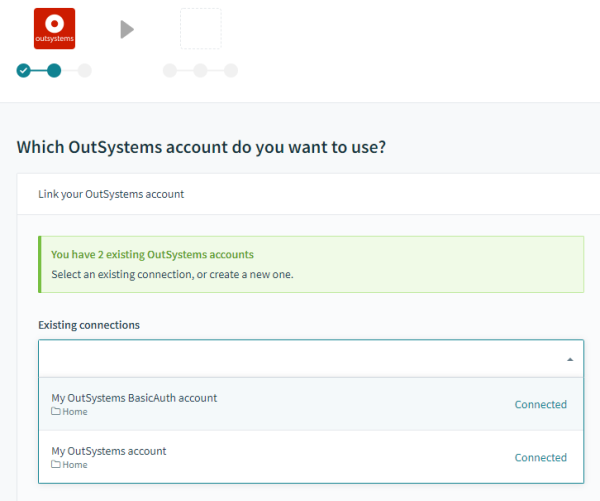

1. Select the OutSystems module and entity to connect to:  
    **Module**: Select one module from the list of all modules in the OutSystems environment.  
    **Entity**: Select an entity from the list of all entities in the selected module.

    In our example, we selected the "Order Management" module and the "Account" entity.

    

#### B. Define and configure the action to perform

1. Select the **action** that you wish to perform when the trigger occurs.  
    In our example, we chose to perform an "upsert" operation (updates an existing record, or creates a new record if it doesn't exist) of an Account in Salesforce.

    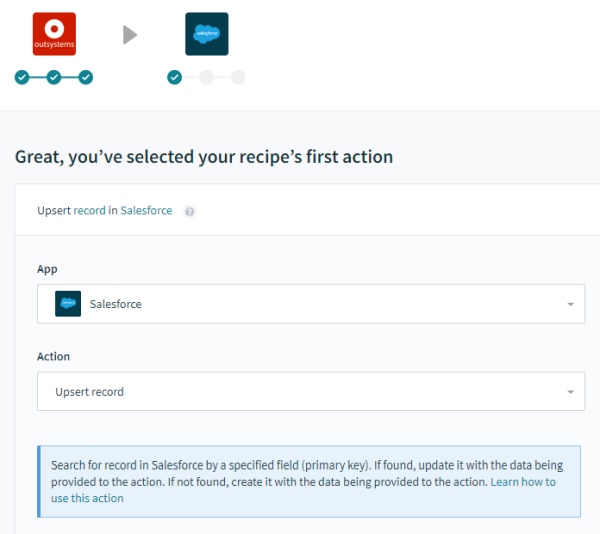

1. Define the mapping between OutSystems entity attributes and Salesforce fields.

    In our example, we defined the following mappings:  
    (_&lt;Salesforce field&gt;_ = _&lt;OS entity attribute&gt;_)  
    **Account Name** = Company name  
    **Account Phone** = Phone

    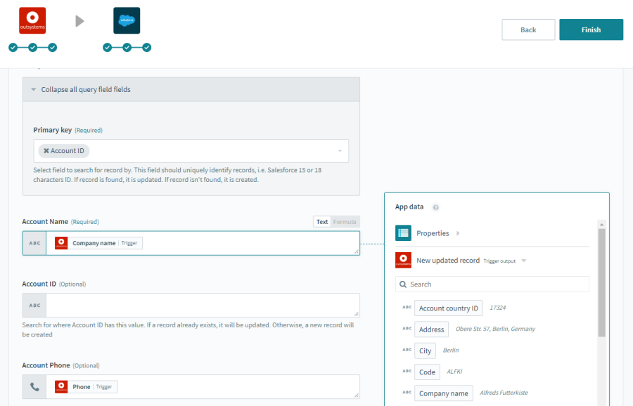

1. Click **Finish**.

This recipe will run every 30 minutes, checking for new or updated Account records in OutSystems.  
Note: Remember to test your recipe to make sure everything is working.

### Set up a Workato recipe that executes an action in an OutSystems entity

In the following example, we'll create a new Workato recipe with a trigger based on a new/updated Account record in Salesforce that will cause the execution of one action (in this case, an "upsert" operation) in an OutSystems entity.

Define this recipe by doing the following:

1. Define the trigger based on a new/updated "Account" record in Salesforce and press **Next**.  
    _Note:_ Setting up a connection between Workato and Salesforce is outside the scope of this guide. Check the documentation of Salesforce and Workato for more information.

    

1. Select the **OutSystems** app and then choose the **Upsert record** action. This action will create a new record in an OutSystems entity if the record does not exist yet, or it will update an existing record if it already exists.

    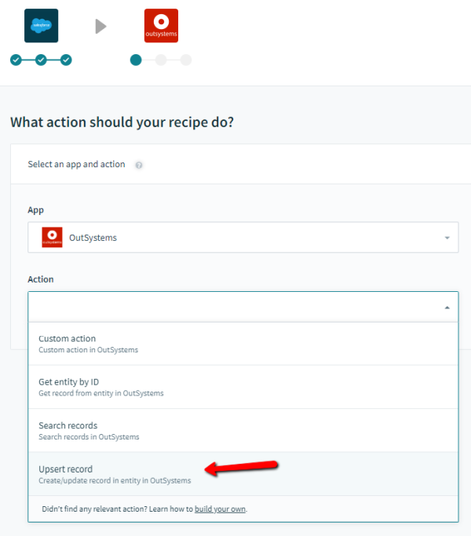

1. Choose the desired app connection (linking to an OutSystems account) from the list of available connections. For more information check [Installation in the Workato environment](#installation-workato).

1. Choose the OutSystems module and entity where the "upsert" operation will occur.  
    In our example, we selected the "Order management" module and the "Account" entity.

    

1. Define the mapping between OutSystems entity attributes and Salesforce fields.

    In our example, we defined the following mappings:  
    (_&lt;OS entity attribute&gt;_ = _&lt;Salesforce field&gt;_)  
    **Code** = Country code  
    **Company name** = Account Name

    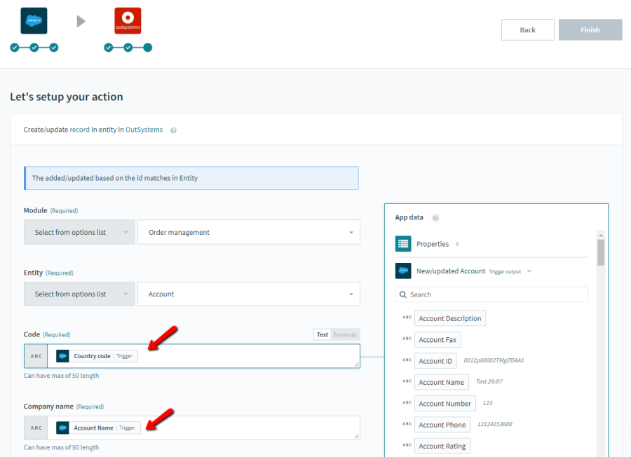

_Note:_ If the OutSystems entity has any foreign keys to other OutSystems entities, you will need to obtain that Id before calling the "upsert" action. **See the next section for more information**.  
However, in this kind of integration, it is recommended that you use a flat table structure in OutSystems, avoiding multiple calls to insert/update records.

#### Obtain an Id value for an OutSystems foreign key

In the following example, we need to fill in the `CountryId` attribute (a foreign key) of the "Account" entity with an Id obtained from the OutSystems "Country" entity.

To obtain the correct `Id` value of the "Country" entity, we will add a new action to the Workato recipe (before the existing action) to search for the "Country" record based on the Country Code value we already have.

We need to add an action before the **Create/Update record in entity in OutSystems** action. In this new action, we will call OutSystems from Workato to get the CountryId value to use in the "Account" entity.

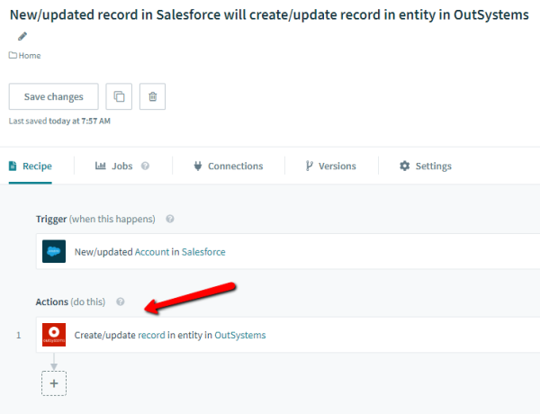

Do the following:

1. In Workato, click the "**+**" sign at the end of the recipe action list.

    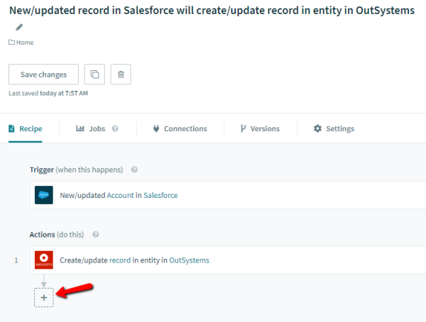

1. Select **Simple action**.

    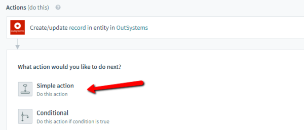

1. Select the **OutSystems** Workato app and the action to perform: **Search records**.

    

1. Select the OutSystems module and entity where the search will be performed.  
    In our example, we selected the "Location" module and the "Country" entity.

1. Add the parameter to search.  
    In our example, we set the search parameter **Code** (an attribute of the OutSystems entity "Country") to **Country code** (an attribute of the Salesforce "Account" record).

    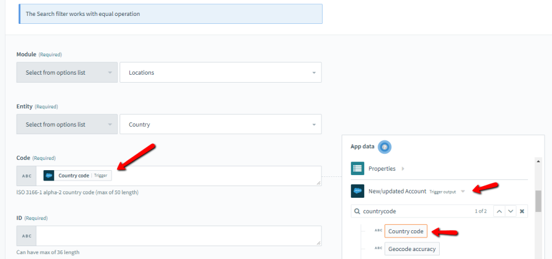

1. Drag the new action above the first action which is performing the "upsert" operation, so that the recipe gets the value for the `CountryId` attribute before executing the upsert action.

    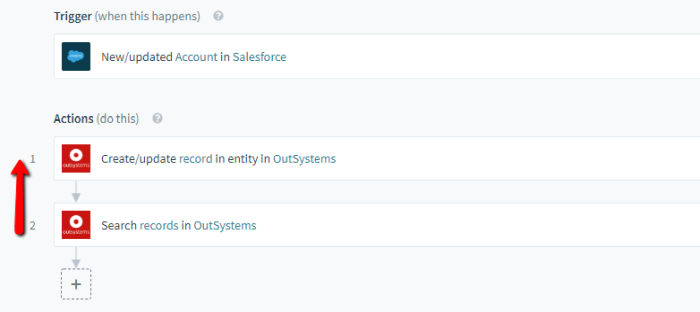

1. Edit the upsert action to include the `Country Id` value.  
    In our example, we set the "Account country ID" attribute to the "ID" value of the "Country" entity record obtained in the search action (first action of the recipe).

    

## Limitations

The current version of the OutSystems Workato Connector has the following limitations:

* Real-time triggers are not available in Workato when using the connector. It's only possible to configure jobs to run in 30-minute intervals.
* Entities imported into OutSystems from external databases won't be available in recipes.
* Only entities that have an auto-number `Id` column are available for the "New record" trigger.
* Only entities that have an `UpdatedOn` column are available for the "New/Updated record" trigger.
* The Workato connector doesn't work when exposing entities to environments using Multiple Database Catalogs and Oracle as the platform database.
