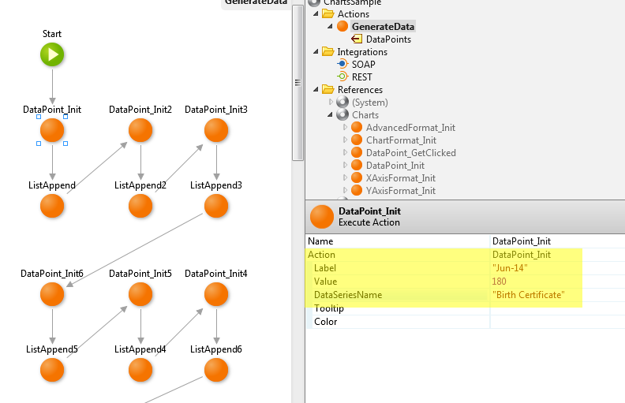
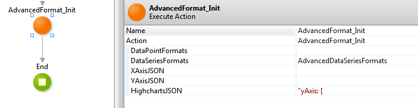

# How to combine a line graph with a bar chart

## Question

How do I create a chart that's a combination of line graph and bar chart?

## Answer

OutSystems relies on [Highcharts](http://www.highcharts.com/) to create charts. Craft custom JSON to customize the action `AdvancedFormat_Init` from Charts:

* Define the two Y axis in the property HighchartsJSON.
* Display a data series as a line associated with the second Y axis, using the property DataSeriesFormats.

The example below uses `DataPoint_Init` to generate data for a `ColumnChart`. Each point defines:

* The label in the X axis, for example "Jun-14".
* The value, for example 180.
* The data series of the data, for example "Birth Certificate".



The example JSON below defines two Y axis:

* A primary Y axis, untitled.
* A secondary Y axis, untitled, in the opposite side of the chart, with a different labels formatted as percentages.

```    
yAxis: [

  { // Primary yAxis
      title: { text: '' },
  },
  { // Secondary yAxis
       title: { text: '' },
       labels: { format: '{value} %' },
       opposite: true
  }
]
```

The example below initializes an `AdvandedDataSeriesFormat` to customize a data series.

* Defines the name of the data series as `% Self-service`.
* Displays the data series as a line.
* Associates the data series with the second Y axis.

The customization must then be packed into a list.


The sample action `AdvancedFormat_Init` sets the advanced customizations:



Finally, the ColumnChart refers to the AdvancedFormat:


## More Information

An [example](http://www.highcharts.com/demo/combo-dual-axes) of a combination line and bar chart in [Highcharts](http://www.highcharts.com/), the underlying for charts in OutSystems.
