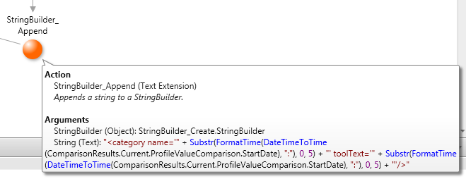
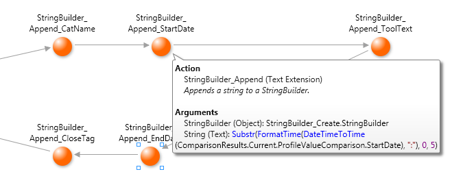

# How to create large strings with StringBuilder

## Question

What is the best way to concatenate lots of strings into a large string?

It takes 8 minutes to serialize a set of records into a 9 MB file.

## Answer

Use StringBuilders exclusively to concatenate many small strings into a large string, or even to concatenate a few large strings.

The [Text Extension](http://www.outsystems.com/NetworkSolutions/ProjectDetail.aspx?ProjectId=67) (a System Component starting with 6.0) provides an API for using StringBuilders.

Simple string concatenation, such as "ab" + "cd", is fast enough to build small strings, but should be completely avoided when processing big sets of data. In particular, beware of using string concatenation to build parts of larger strings.

The example below uses string concatenation to create a small string, which is then passed to StringBuilder_Append().

This means that the small string concatenation is called many times. In fact, we are doing 1 optimized Append and 4 simple string concatenations. For a specific use case, generating a 9 MB file took 8 minutes.

Instead, use only the optimized StringBuilder_Append() to build the large string, as shown below.

The specific use case that took 8 minutes now takes less than 30 seconds.

Beware of using string concatenation to build parts of larger strings. String concatenation can have a large impact on performance.

