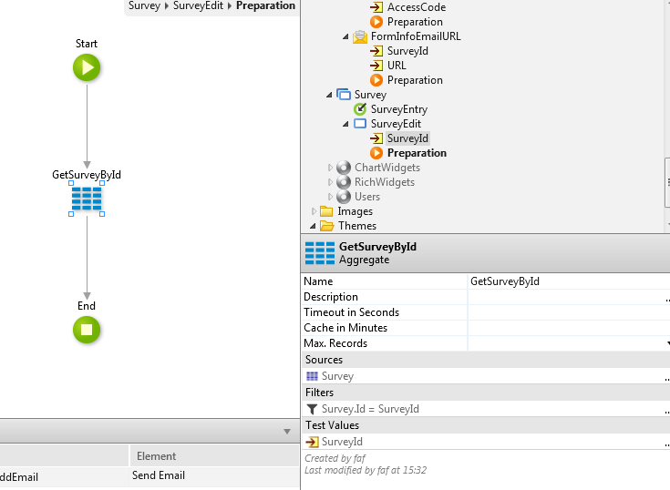

# How to make a link with a variable to send in an Email

Applies to Traditional Web Applications

We have a survey application on which you go a landing page with a list of open surveys, and click one which then does some logic which opens the correct Survey, but we want to bypass that with a direct link.

We want to be able to generate a link that goes directly to a particular survey.

## Answer

Let's see the above example where we exemplify what you are trying to achieve.

Imagine that we are sending an email related with a specific Survey and we have a link in our email so the user get's redirected to the Survey Edit page.

First, on the Preparation action of the email we are building the URL to use on that link.

Please notice that:

* We are using **GetEntryURL** action available on HTTPRequestHandler extension to build the link, based on an Entry point of our eSpace;

* We are already setting the SurveyId as an Input Parameter of that link.

At the end of this execution the URL should look like `www.[URL].com/SurveyEdit?SurveyId=1`.

Now that we already have the URL that we need we are going to set the link on the email to use that URL. We just set the On Click Destination of our link to an External URL and then on the URL we use the URL that we have just build on our Preparation action, like shown on the image below.

Now, when anyone clicks on that link that's inside of the email that will take the user to our SurveyEdit page, and because the web screen already have SurveyId as an input parameter and our link also, you can now use the SurveyId input parameter to provide info for that specific Survey.

