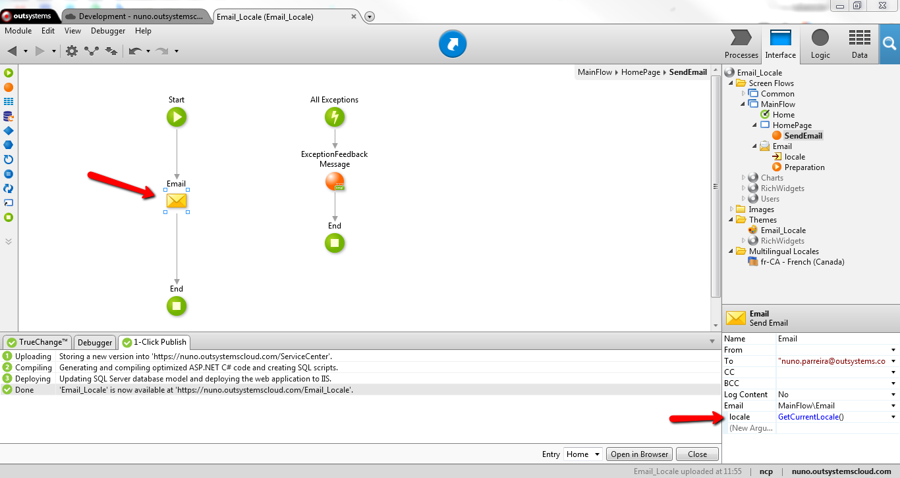

# How to translate an email

## Question

I'm trying to translate an email via a Screen Action. The language Fr is well defined because the Web Screen is translated to Fr, but the email is send in the default language (en). Should I add logic for translation to be supported?

## Answer

On the OutSystems Platform, the emails are sent using a distinct session from the one your users have when accessing Web Screens.

In order for you to get the email on with the desired translation, you need to set the appropriate locale on the Preparation action of the email Web Screen. You can do it by using the [SetCurrentLocale](http://www.outsystems.com/help/servicestudio/9.0/Language_Reference/System_Actions_and_Functions/SetCurrentLocale_Action.htm) action. If you want to keep the same locale of the previous page your users had on their browser, then you can also get it from the built in function [GetCurrentLocale](http://www.outsystems.com/help/servicestudio/9.0/Language_Reference/Built_in_Functions/Environment_Functions/GetCurrentLocale_Function.htm).

