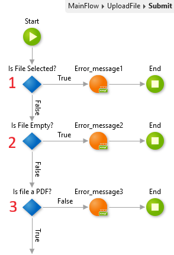

# How to validate file input on a File Upload Widget in a Web App

The Upload Widget enables your users to browse and select a file that they want to upload into an app.

This widget doesn't include built-in validations  such as if a file uploaded or if the size or type of file is valid. Therefore, to have validation, you can create a custom validation.

Adding validation properties helps solve simple issues, such as an empty file. This helps to make your apps more user-friendly.

The following example, shows a snippet of three different custom validations. This snippet uses the runtime properties of the Upload Widget, named **UploadFile**.

* **Row 1**: Use to verify the end user chose a file in the **Upload widget** before submitting.
    * Add an **If** with the Condition set to `UploadFile.Filename = ""`
    * Make the True Branch show an error message and end the Action.
* **Row 2**: Use to verify that the end user didn't select an empty file to upload.
    * Add an **If** with the Condition set to `UploadFile.Content = NullBinary()`
    * Make the True Branch show an error message and end the Action.
* **Row 3** Use to verify the end user selected a valid file type (PDF in this example).
    * Add an **If** with the Condition set to `UploadFile.Type = "application/pdf"`
    * Make the False Branch show an error message and end the Action.
  