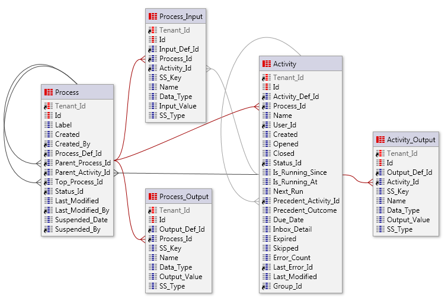

---
tags:
summary: With processes accumulating over time, queries may become slower. Check how to arquive old processes before deleting them.
guid: 4cfbcd3c-113b-4d91-a92d-b1aef4584115
locale: en-us
app_type: traditional web apps, mobile apps, reactive web apps
platform-version: o11
figma: https://www.figma.com/file/qdZmVuCDqCHvhakBTOLZcI/Processes?type=design&node-id=147%3A325&mode=design&t=RJVgJk7HezcStPje-1
---

# How to archive old Processes - BPT

How can I archive old closed BPT Processes?

For example: queries on BPT Processes have become slower, because so many Processes have accumulated over time. I would like to archive these old processes before deleting them.

## Answer

Business Process Technology relies on a set of meta-model Entities to record data required by your business Processes. When using BPT intensively, these Entities can have a high growth rate and affect the performance of BPT queries.

To archive old Processes follow these steps:

1. Create a separate set of Entities that mirror the BPT meta-model. Use this mirror set of Entities to store old Processes before deleting them. 

    

    
    
    If you have any Entities that reference parts of the BPT meta-model you also need to archive them or to keep track of the changes in the Entities and Foreign Keys of the archived Processes.  
    If the Foreign Keys that reference the BPT meta-model have the `Delete Rule` Property set to `Protect` you need to archive/delete them before archiving the BPT Process.
    

1. To delete top level BPT Processes use the actions **Process\_Delete** or **Process\_BulkDelete** from the **BPT_API** extension.

    * **Process\_Delete** deletes processes individually.
    * **Process\_BulkDelete** deletes processes in bulk (with or without limitation on the number of Processes to delete) filtered by Date and/or by Process Definition. 
