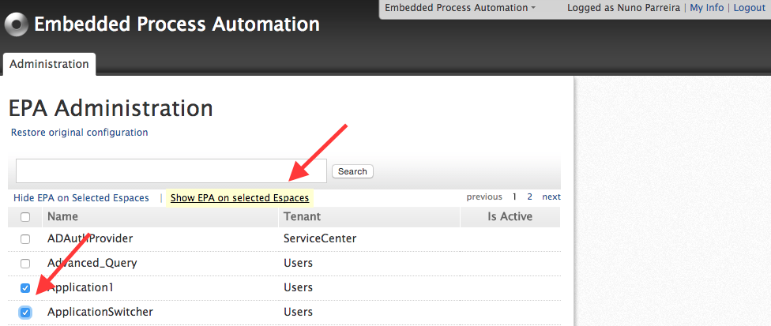

# How to configure EPA taskbox preferences

By default, EPA Taskbox is displayed in all screens in all applications. It is however possible to have EPA not show up in particular eSpaces by using the administration backoffice.

You can configure EPA Taskbox preferences on your server by going to `http://<server url>/EPA_Taskbox/`. There, you'll find the EPA administration web screen where you can activate the EPA administration:

After activating the EPA Administration, you'll have a configuration page where you can set the applications where you want to have EPA taskbox to be shown:

