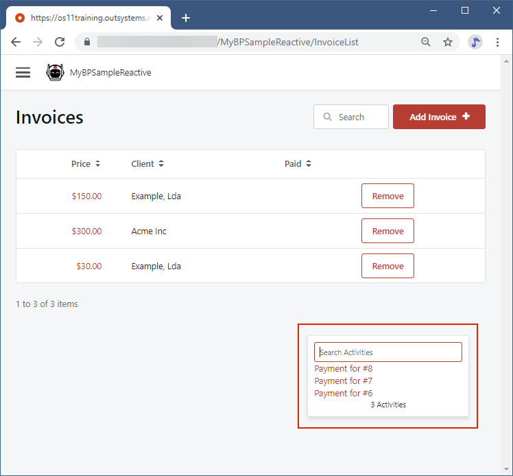
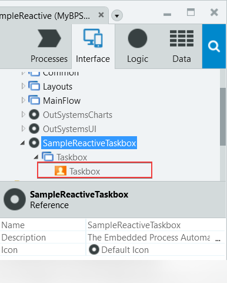
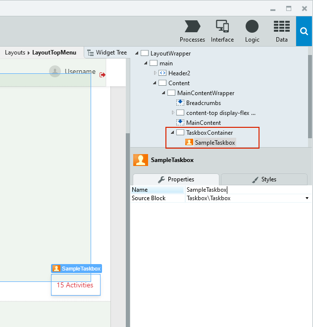
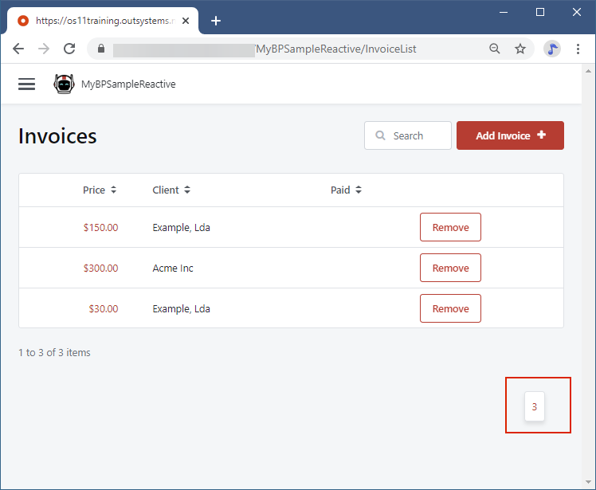

# Using Taskbox in Reactive Web Apps

Taskbox is part of the user interface that lets your users handle tasks issued by Business Process Technology (BPT). To show a taskbox in Reactive Web Apps, use the Taskbox Block from the [Sample Reactive Taskbox component](https://www.outsystems.com/forge/component-overview/8355/sample-reactive-taskbox). 

Install the component and reference it in your app, then navigate to **Interface** > **UI Flows** > **SampleReactiveTaskbox** > **Taskbox** >  **Taskbox**. We recommend that you drag the Taskbox Block to one of the layout Block, to ensure the tasks show in all screens of the app.

## Create an example Process and show Taskbox

To follow this example, create an Invoice Entity, with fields Price, Client, and isPaid. Also, create Screens to view all the invoices and create a new invoice.

Follow the steps to create an example Process to handle invoices. Once a new invoice is created, the user needs to process the payment and manually set the status as paid.

1. Go to the **Process** tab > right-click the **Processes** folder > select **Add Process**. In the Process properties:
    
    * Enter "InvoiceProcessing" in the **Name** field.
    * Double-click the **Launch On** field and select Server Action that creates invoices. Now a new task is created every time there's a new invoice.
    * Enter `"Invoices and payments"` in the **Detail** field.

1. From the Process toolbox, drag Human Activity node and drop below the **Start** node of the Process flow. In the Human Activities properties set the following values:

    * In the **Name** field enter `HumanActivityPayment`.
    * In the **Label** field enter `Process the invoice payment`.
    * In the **User** field enter `GetUserId()`. Now the signed in user who loads the app can work on a task.
    * In the **Destination** list select the Screen for editing invoices and set the correct identifier. In this example we use `MainFlow\InvoiceDetail` in **Destination** and `InvoiceId` as the identifier. In the app users navigate to the InvoiceDetail Screen after they click the task.
    * In the **Detail** field: `"Payment for #" + InvoiceId`.

    

1. Go back to the **Interface** tab. Navigate to **UI Flows** > **SampleReactiveTaskbox** > **Taskbox** >  **Taskbox**. Drag the Taskbox Block to:

    * The Screen, if you want the Taskbox to show in that Screen only.
    * A Layout Block, if you want the Taskbox to show in all Screens of the app. In our example we put Taskbox in the main content section of LayoutTopMenu, as that is the layout the app is using.
  
        

1. Publish the app and add some sample invoices. The number of tasks shows in the widget. Click the widget to expand the list.
     
     

## Customizing the Taskbox

To customize the Taskbox, edit the Taskbox Block. Right-click the Taskbox Block and select **Open in eSpace**. Edit the component and publish it. Then, refresh the references in the main app and publish the main app.
